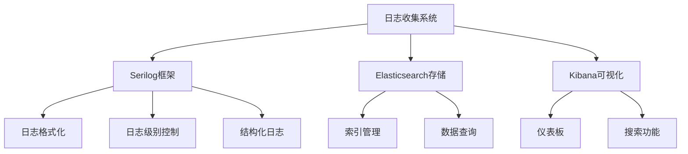
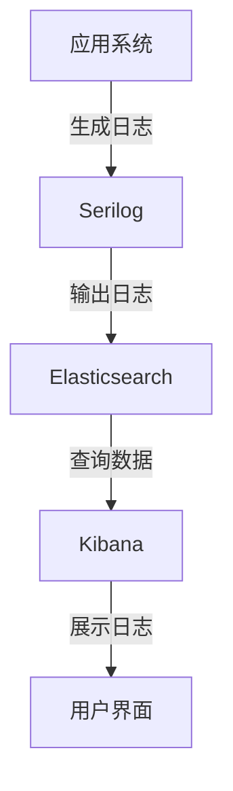
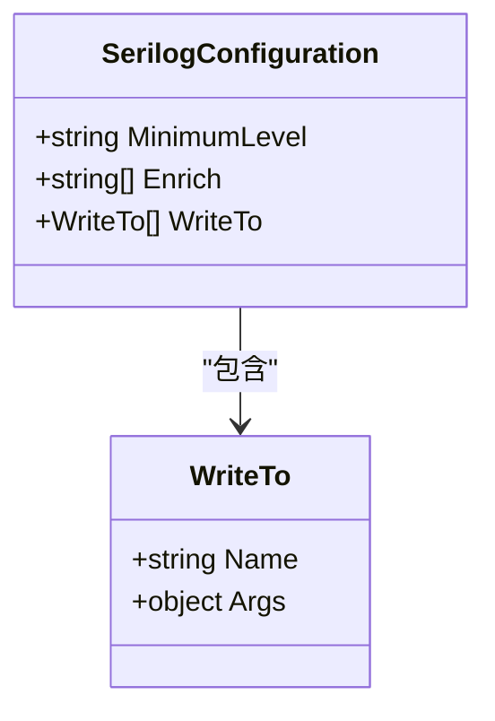
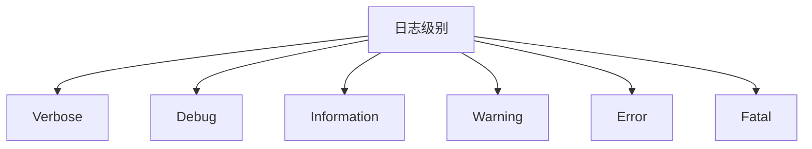
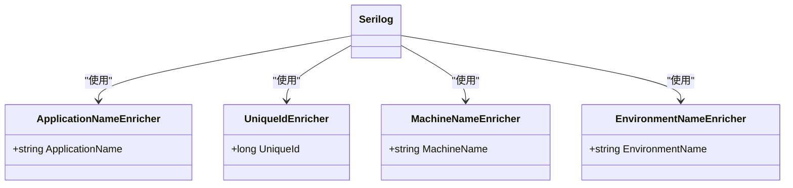
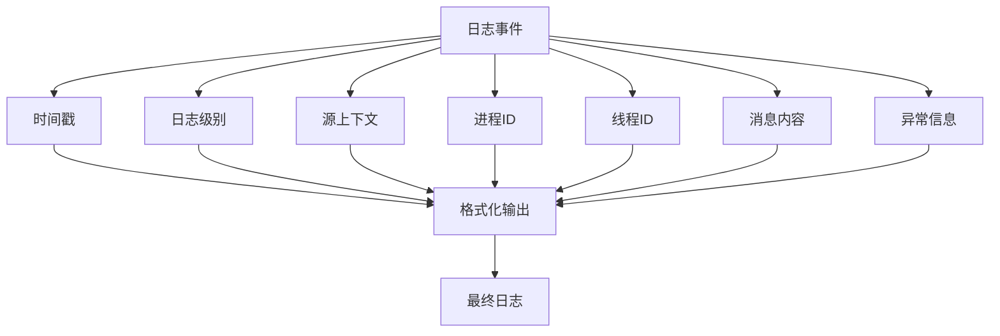
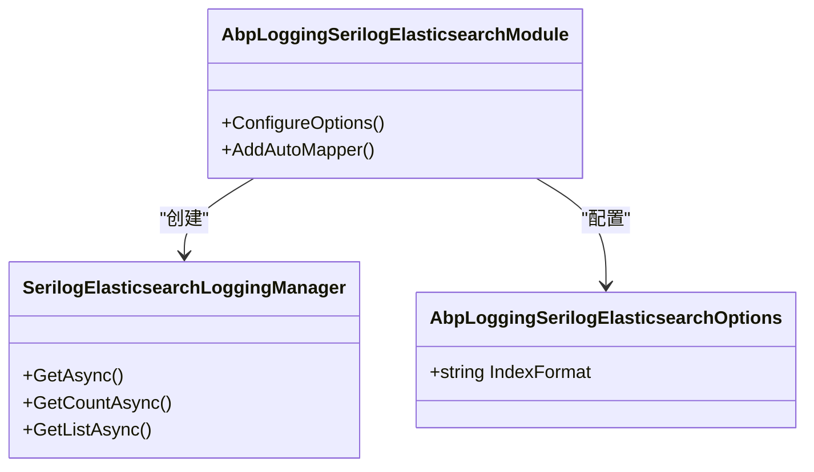
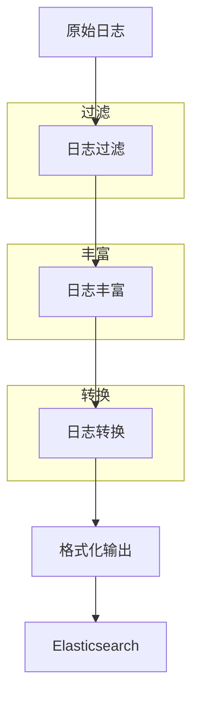

# 日志收集

<cite>
**本文档引用的文件**   
- [AbpLoggingSerilogElasticsearchOptions.cs](file://aspnet-core/framework/logging/LINGYUN.Abp.Logging.Serilog.Elasticsearch/LINGYUN/Abp/AuditLogging/Serilog/Elasticsearch/AbpLoggingSerilogElasticsearchOptions.cs)
- [SerilogElasticsearchLoggingManager.cs](file://aspnet-core/framework/logging/LINGYUN.Abp.Logging.Serilog.Elasticsearch/LINGYUN/Abp/AuditLogging/Serilog/Elasticsearch/SerilogElasticsearchLoggingManager.cs)
- [SerilogField.cs](file://aspnet-core/framework/logging/LINGYUN.Abp.Logging.Serilog.Elasticsearch/LINGYUN/Abp/AuditLogging/Serilog/Elasticsearch/SerilogField.cs)
- [AbpLoggingSerilogElasticsearchModule.cs](file://aspnet-core/framework/logging/LINGYUN.Abp.Logging.Serilog.Elasticsearch/LINGYUN/Abp/AuditLogging/Serilog/Elasticsearch/AbpLoggingSerilogElasticsearchModule.cs)
- [AbpSerilogEnrichersUniqueIdModule.cs](file://aspnet-core/framework/logging/LINGYUN.Abp.Serilog.Enrichers.UniqueId/LINGYUN/Abp/Serilog/Enrichers/UniqueId/AbpSerilogEnrichersUniqueIdModule.cs)
- [ApplicationLoggerConfigurationExtensions.cs](file://aspnet-core/framework/logging/LINGYUN.Abp.Serilog.Enrichers.Application/Serilog/ApplicationLoggerConfigurationExtensions.cs)
- [UniqueIdLoggerConfigurationExtensions.cs](file://aspnet-core/framework/logging/LINGYUN.Abp.Serilog.Enrichers.UniqueId/Serilog/UniqueIdLoggerConfigurationExtensions.cs)
- [appsettings.json](file://aspnet-core/services/LY.MicroService.WebhooksManagement.HttpApi.Host/appsettings.json)
- [Program.cs](file://aspnet-core/services/LY.MicroService.WebhooksManagement.HttpApi.Host/Program.cs)
- [AbpAuditLoggingElasticsearchModule.cs](file://aspnet-core/framework/auditing/LINGYUN.Abp.AuditLogging.Elasticsearch/LINGYUN/Abp/AuditLogging/Elasticsearch/AbpAuditLoggingElasticsearchModule.cs)
- [IndexInitializer.cs](file://aspnet-core/framework/auditing/LINGYUN.Abp.AuditLogging.Elasticsearch/LINGYUN/Abp/AuditLogging/Elasticsearch/IndexInitializer.cs)
- [AbpLoggingEnricherPropertyNames.cs](file://aspnet-core/framework/logging/LINGYUN.Abp.Logging/LINGYUN/Abp/AuditLogging/AbpLoggingEnricherPropertyNames.cs)
- [AbpSerilogEnrichersConsts.cs](file://aspnet-core/framework/logging/LINGYUN.Abp.Serilog.Enrichers.Application/LINGYUN/Abp/Serilog/Enrichers/Application/AbpSerilogEnrichersConsts.cs)
- [AbpSerilogUniqueIdConsts.cs](file://aspnet-core/framework/logging/LINGYUN.Abp.Serilog.Enrichers.UniqueId/LINGYUN/Abp/Serilog/Enrichers/UniqueId/AbpSerilogUniqueIdConsts.cs)
</cite>

## 目录
1. [简介](#简介)
2. [项目结构](#项目结构)
3. [核心组件](#核心组件)
4. [架构概述](#架构概述)
5. [详细组件分析](#详细组件分析)
6. [依赖分析](#依赖分析)
7. [性能考虑](#性能考虑)
8. [故障排除指南](#故障排除指南)
9. [结论](#结论)

## 简介
本文档详细介绍了基于Serilog的日志框架配置和使用方法，包括结构化日志记录、日志级别控制和日志格式化。文档还详细说明了如何将日志输出到Elasticsearch进行集中存储和分析，以及如何通过Kibana进行可视化查询。此外，文档描述了日志管道的构建过程，包括日志过滤、丰富和转换机制，并提供了实际代码示例展示在不同场景下的日志记录最佳实践，以及如何处理敏感信息的脱敏。

## 项目结构
本项目采用模块化设计，日志相关功能主要分布在`aspnet-core/framework/logging`和`aspnet-core/framework/auditing`目录下。日志框架基于Serilog实现，支持将日志输出到Elasticsearch进行集中存储和分析。项目结构清晰，各模块职责明确，便于维护和扩展。

**Diagram sources**
- [AbpLoggingSerilogElasticsearchOptions.cs](file://aspnet-core/framework/logging/LINGYUN.Abp.Logging.Serilog.Elasticsearch/LINGYUN/Abp/AuditLogging/Serilog/Elasticsearch/AbpLoggingSerilogElasticsearchOptions.cs)
- [SerilogElasticsearchLoggingManager.cs](file://aspnet-core/framework/logging/LINGYUN.Abp.Logging.Serilog.Elasticsearch/LINGYUN/Abp/AuditLogging/Serilog/Elasticsearch/SerilogElasticsearchLoggingManager.cs)

**Section sources**
- [AbpLoggingSerilogElasticsearchOptions.cs](file://aspnet-core/framework/logging/LINGYUN.Abp.Logging.Serilog.Elasticsearch/LINGYUN/Abp/AuditLogging/Serilog/Elasticsearch/AbpLoggingSerilogElasticsearchOptions.cs)
- [SerilogElasticsearchLoggingManager.cs](file://aspnet-core/framework/logging/LINGYUN.Abp.Logging.Serilog.Elasticsearch/LINGYUN/Abp/AuditLogging/Serilog/Elasticsearch/SerilogElasticsearchLoggingManager.cs)

## 核心组件
日志收集系统的核心组件包括Serilog日志框架、Elasticsearch存储和Kibana可视化工具。Serilog负责日志的生成和格式化，Elasticsearch负责日志的存储和查询，Kibana负责日志的可视化展示。这些组件协同工作，实现了完整的日志收集和分析功能。

**Section sources**
- [AbpLoggingSerilogElasticsearchOptions.cs](file://aspnet-core/framework/logging/LINGYUN.Abp.Logging.Serilog.Elasticsearch/LINGYUN/Abp/AuditLogging/Serilog/Elasticsearch/AbpLoggingSerilogElasticsearchOptions.cs)
- [SerilogElasticsearchLoggingManager.cs](file://aspnet-core/framework/logging/LINGYUN.Abp.Logging.Serilog.Elasticsearch/LINGYUN/Abp/AuditLogging/Serilog/Elasticsearch/SerilogElasticsearchLoggingManager.cs)

## 架构概述
日志收集系统的架构分为三层：日志生成层、日志存储层和日志展示层。日志生成层使用Serilog框架生成结构化日志；日志存储层使用Elasticsearch存储日志数据；日志展示层使用Kibana进行日志的可视化查询和分析。

**Diagram sources**
- [AbpLoggingSerilogElasticsearchModule.cs](file://aspnet-core/framework/logging/LINGYUN.Abp.Logging.Serilog.Elasticsearch/LINGYUN/Abp/AuditLogging/Serilog/Elasticsearch/AbpLoggingSerilogElasticsearchModule.cs)
- [Program.cs](file://aspnet-core/services/LY.MicroService.WebhooksManagement.HttpApi.Host/Program.cs)

## 详细组件分析

### Serilog配置分析
Serilog的配置主要通过`appsettings.json`文件和代码配置两种方式实现。配置内容包括日志级别、输出目标、格式化模板等。

#### 配置选项

**Diagram sources**
- [appsettings.json](file://aspnet-core/services/LY.MicroService.WebhooksManagement.HttpApi.Host/appsettings.json)
- [Program.cs](file://aspnet-core/services/LY.MicroService.WebhooksManagement.HttpApi.Host/Program.cs)

**Section sources**
- [appsettings.json](file://aspnet-core/services/LY.MicroService.WebhooksManagement.HttpApi.Host/appsettings.json)
- [Program.cs](file://aspnet-core/services/LY.MicroService.WebhooksManagement.HttpApi.Host/Program.cs)

### 日志级别控制
日志级别控制通过Serilog的MinimumLevel配置实现，支持从Verbose到Fatal的多个级别。

**Diagram sources**
- [appsettings.json](file://aspnet-core/services/LY.MicroService.WebhooksManagement.HttpApi.Host/appsettings.json)

**Section sources**
- [appsettings.json](file://aspnet-core/services/LY.MicroService.WebhooksManagement.HttpApi.Host/appsettings.json)

### 结构化日志记录
结构化日志记录通过Serilog的丰富器（Enricher）实现，添加了应用名称、机器名称、唯一ID等上下文信息。

#### 丰富器配置

**Diagram sources**
- [ApplicationLoggerConfigurationExtensions.cs](file://aspnet-core/framework/logging/LINGYUN.Abp.Serilog.Enrichers.Application/Serilog/ApplicationLoggerConfigurationExtensions.cs)
- [UniqueIdLoggerConfigurationExtensions.cs](file://aspnet-core/framework/logging/LINGYUN.Abp.Serilog.Enrichers.UniqueId/Serilog/UniqueIdLoggerConfigurationExtensions.cs)
- [AbpSerilogEnrichersConsts.cs](file://aspnet-core/framework/logging/LINGYUN.Abp.Serilog.Enrichers.Application/LINGYUN/Abp/Serilog/Enrichers/Application/AbpSerilogEnrichersConsts.cs)
- [AbpSerilogUniqueIdConsts.cs](file://aspnet-core/framework/logging/LINGYUN.Abp.Serilog.Enrichers.UniqueId/LINGYUN/Abp/Serilog/Enrichers/UniqueId/AbpSerilogUniqueIdConsts.cs)

**Section sources**
- [ApplicationLoggerConfigurationExtensions.cs](file://aspnet-core/framework/logging/LINGYUN.Abp.Serilog.Enrichers.Application/Serilog/ApplicationLoggerConfigurationExtensions.cs)
- [UniqueIdLoggerConfigurationExtensions.cs](file://aspnet-core/framework/logging/LINGYUN.Abp.Serilog.Enrichers.UniqueId/Serilog/UniqueIdLoggerConfigurationExtensions.cs)

### 日志格式化
日志格式化通过Serilog的outputTemplate配置实现，定义了日志输出的格式。

**Diagram sources**
- [appsettings.json](file://aspnet-core/services/LY.MicroService.WebhooksManagement.HttpApi.Host/appsettings.json)

**Section sources**
- [appsettings.json](file://aspnet-core/services/LY.MicroService.WebhooksManagement.HttpApi.Host/appsettings.json)

### Elasticsearch集成
Elasticsearch集成通过AbpLoggingSerilogElasticsearch模块实现，负责将日志写入Elasticsearch并提供查询功能。

#### 集成组件

**Diagram sources**
- [AbpLoggingSerilogElasticsearchModule.cs](file://aspnet-core/framework/logging/LINGYUN.Abp.Logging.Serilog.Elasticsearch/LINGYUN/Abp/AuditLogging/Serilog/Elasticsearch/AbpLoggingSerilogElasticsearchModule.cs)
- [SerilogElasticsearchLoggingManager.cs](file://aspnet-core/framework/logging/LINGYUN.Abp.Logging.Serilog.Elasticsearch/LINGYUN/Abp/AuditLogging/Serilog/Elasticsearch/SerilogElasticsearchLoggingManager.cs)
- [AbpLoggingSerilogElasticsearchOptions.cs](file://aspnet-core/framework/logging/LINGYUN.Abp.Logging.Serilog.Elasticsearch/LINGYUN/Abp/AuditLogging/Serilog/Elasticsearch/AbpLoggingSerilogElasticsearchOptions.cs)

**Section sources**
- [AbpLoggingSerilogElasticsearchModule.cs](file://aspnet-core/framework/logging/LINGYUN.Abp.Logging.Serilog.Elasticsearch/LINGYUN/Abp/AuditLogging/Serilog/Elasticsearch/AbpLoggingSerilogElasticsearchModule.cs)
- [SerilogElasticsearchLoggingManager.cs](file://aspnet-core/framework/logging/LINGYUN.Abp.Logging.Serilog.Elasticsearch/LINGYUN/Abp/AuditLogging/Serilog/Elasticsearch/SerilogElasticsearchLoggingManager.cs)

### 日志管道构建
日志管道的构建包括日志过滤、丰富和转换三个主要环节。

#### 日志管道流程

**Diagram sources**
- [SerilogElasticsearchLoggingManager.cs](file://aspnet-core/framework/logging/LINGYUN.Abp.Logging.Serilog.Elasticsearch/LINGYUN/Abp/AuditLogging/Serilog/Elasticsearch/SerilogElasticsearchLoggingManager.cs)
- [AbpLoggingSerilogElasticsearchModule.cs](file://aspnet-core/framework/logging/LINGYUN.Abp.Logging.Serilog.Elasticsearch/LINGYUN/Abp/AuditLogging/Serilog/Elasticsearch/AbpLoggingSerilogElasticsearchModule.cs)

**Section sources**
- [SerilogElasticsearchLoggingManager.cs](file://aspnet-core/framework/logging/LINGYUN.Abp.Logging.Serilog.Elasticsearch/LINGYUN/Abp/AuditLogging/Serilog/Elasticsearch/SerilogElasticsearchLoggingManager.cs)

### 敏感信息脱敏
敏感信息脱敏通过日志过滤和