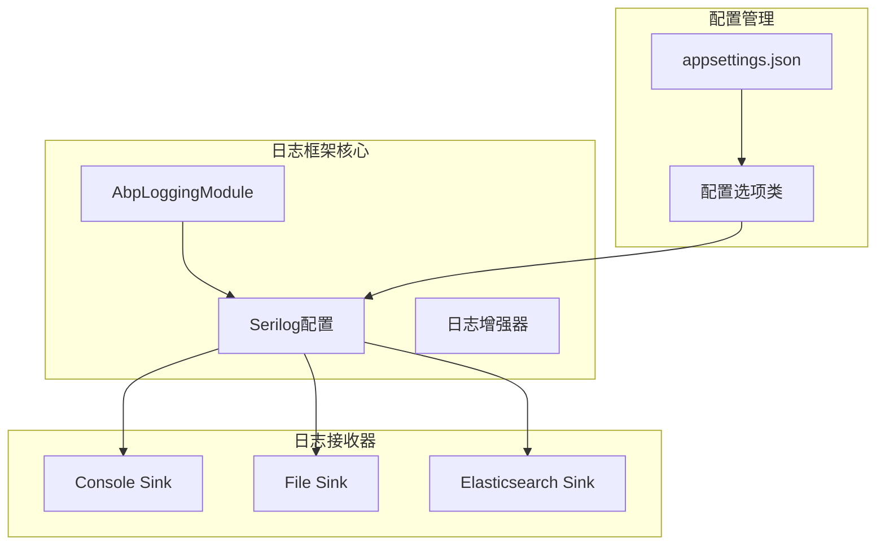
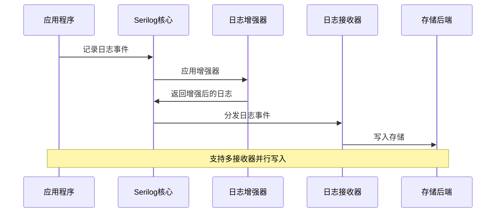
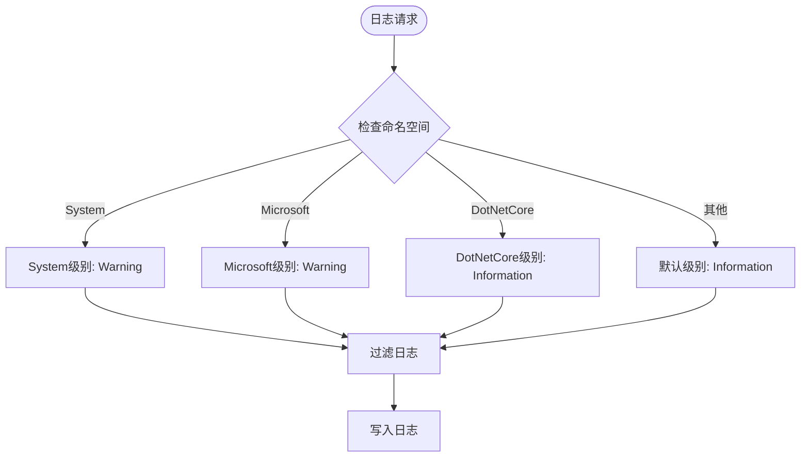
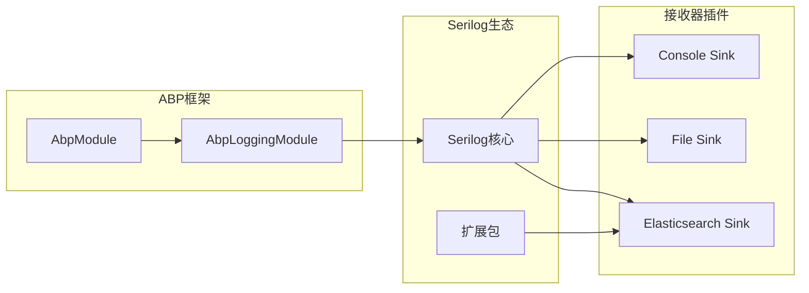

# ABP日志框架基础配置

<cite>
**本文档中引用的文件**
- [appsettings.json](file://aspnet-core/services/LY.MicroService.Applications.Single/appsettings.json)
- [appsettings.Development.json](file://aspnet-core/services/LY.MicroService.Applications.Single/appsettings.Development.json)
- [AbpLoggingModule.cs](file://aspnet-core/framework/logging/LINGYUN.Abp.Logging/LINGYUN/Abp/AuditLogging/AbpLoggingModule.cs)
- [AbpLoggingSerilogElasticsearchOptions.cs](file://aspnet-core/framework/logging/LINGYUN.Abp.Logging.Serilog.Elasticsearch/LINGYUN/Abp/AuditLogging/Serilog/Elasticsearch/AbpLoggingSerilogElasticsearchOptions.cs)
- [AbpLoggingSerilogElasticsearchModule.cs](file://aspnet-core/framework/logging/LINGYUN.Abp.Logging.Serilog.Elasticsearch/LINGYUN/Abp/AuditLogging/Serilog/Elasticsearch/AbpLoggingSerilogElasticsearchModule.cs)
- [SerilogElasticsearchLoggingManager.cs](file://aspnet-core/framework/logging/LINGYUN.Abp.Logging.Serilog.Elasticsearch/LINGYUN/Abp/AuditLogging/Serilog/Elasticsearch/SerilogElasticsearchLoggingManager.cs)
- [SerilogInfo.cs](file://aspnet-core/framework/logging/LINGYUN.Abp.Logging.Serilog.Elasticsearch/LINGYUN/Abp/AuditLogging/Serilog/Elasticsearch/SerilogInfo.cs)
- [SerilogException.cs](file://aspnet-core/framework/logging/LINGYUN.Abp.Logging.Serilog.Elasticsearch/LINGYUN/Abp/AuditLogging/Serilog/Elasticsearch/SerilogException.cs)
</cite>

## 目录
1. [简介](#简介)
2. [项目结构](#项目结构)
3. [核心组件](#核心组件)
4. [架构概览](#架构概览)
5. [详细组件分析](#详细组件分析)
6. [依赖关系分析](#依赖关系分析)
7. [性能考虑](#性能考虑)
8. [故障排除指南](#故障排除指南)
9. [结论](#结论)

## 简介

ABP日志框架是一个基于Serilog的强大日志系统，提供了灵活的配置选项和多种日志接收器支持。该框架支持控制台输出、文件输出、Elasticsearch等多种日志接收方式，并提供了丰富的日志增强功能。

本文档将详细介绍如何通过appsettings.json配置文件设置Serilog的基本参数，包括日志级别、日志输出目标、日志格式化模板等配置选项。

## 项目结构

ABP日志框架采用模块化设计，主要包含以下核心组件：



**图表来源**
- [AbpLoggingModule.cs](file://aspnet-core/framework/logging/LINGYUN.Abp.Logging/LINGYUN/Abp/AuditLogging/AbpLoggingModule.cs#L1-L15)
- [AbpLoggingSerilogElasticsearchModule.cs](file://aspnet-core/framework/logging/LINGYUN.Abp.Logging.Serilog.Elasticsearch/LINGYUN/Abp/AuditLogging/Serilog/Elasticsearch/AbpLoggingSerilogElasticsearchModule.cs#L1-L28)

**章节来源**
- [AbpLoggingModule.cs](file://aspnet-core/framework/logging/LINGYUN.Abp.Logging/LINGYUN/Abp/AuditLogging/AbpLoggingModule.cs#L1-L15)

## 核心组件

### Serilog配置结构

ABP日志框架的核心配置位于`Serilog`节点下，包含以下主要部分：

1. **MinimumLevel**: 设置最低日志级别
2. **Enrich**: 日志增强器配置
3. **WriteTo**: 日志接收器配置

### 基本配置示例

以下是标准的Serilog配置结构：

```json
{
  "Serilog": {
    "MinimumLevel": {
      "Default": "Information",
      "Override": {
        "System": "Warning",
        "Microsoft": "Warning",
        "DotNetCore": "Information"
      }
    },
    "Enrich": [ 
      "FromLogContext", 
      "WithProcessId", 
      "WithThreadId", 
      "WithEnvironmentName", 
      "WithMachineName", 
      "WithApplicationName", 
      "WithUniqueId" 
    ],
    "WriteTo": [
      // 接收器配置
    ]
  }
}
```

**章节来源**
- [appsettings.json](file://aspnet-core/services/LY.MicroService.Applications.Single/appsettings.json#L25-L46)

## 架构概览

ABP日志框架采用分层架构设计，支持多种日志接收器和增强功能：



**图表来源**
- [appsettings.json](file://aspnet-core/services/LY.MicroService.Applications.Single/appsettings.json#L30-L95)

## 详细组件分析

### 日志级别配置

#### MinimumLevel配置

日志级别配置决定了哪些日志消息会被处理和记录：

```json
"MinimumLevel": {
  "Default": "Information",
  "Override": {
    "System": "Warning",
    "Microsoft": "Warning",
    "DotNetCore": "Information"
  }
}
```

可用的日志级别（按严重程度递增）：
- **Fatal**: 致命错误，应用程序无法继续运行
- **Error**: 错误，通常表示操作失败
- **Warning**: 警告，可能影响正常功能但不会导致失败
- **Information**: 信息性消息，用于记录应用程序运行状态
- **Debug**: 调试信息，仅在开发环境中使用
- **Trace**: 最详细的跟踪信息

#### 级别覆盖机制

通过`Override`节点可以为特定命名空间或组件设置不同的日志级别：



**图表来源**
- [appsettings.json](file://aspnet-core/services/LY.MicroService.Applications.Single/appsettings.json#L28-L33)

### 日志增强器配置

日志增强器为日志消息添加额外的上下文信息：

```json
"Enrich": [ 
  "FromLogContext", 
  "WithProcessId", 
  "WithThreadId", 
  "WithEnvironmentName", 
  "WithMachineName", 
  "WithApplicationName", 
  "WithUniqueId" 
]
```

增强器功能说明：
- **FromLogContext**: 从当前线程上下文中提取信息
- **WithProcessId**: 添加进程ID
- **WithThreadId**: 添加线程ID
- **WithEnvironmentName**: 添加环境名称
- **WithMachineName**: 添加机器名称
- **WithApplicationName**: 添加应用程序名称
- **WithUniqueId**: 添加唯一标识符

### 日志接收器配置

#### 控制台输出配置

控制台接收器是最常用的日志输出方式：

```json
{
  "Name": "Console",
  "Args": {
    "restrictedToMinimumLevel": "Debug",
    "outputTemplate": "{Timestamp:yyyy-MM-dd HH:mm:ss} [{Level:u3}] [{SourceContext}] [{ProcessId}] [{ThreadId}] - {Message:lj}{NewLine}{Exception}"
  }
}
```

输出模板说明：
- `{Timestamp}`: 时间戳
- `{Level}`: 日志级别
- `{SourceContext}`: 源上下文
- `{ProcessId}`: 进程ID
- `{ThreadId}`: 线程ID
- `{Message}`: 日志消息
- `{Exception}`: 异常信息

#### 文件输出配置

文件接收器支持按日志级别分离存储：

```json
{
  "Name": "File",
  "Args": {
    "path": "Logs/Debug-.log",
    "restrictedToMinimumLevel": "Debug",
    "rollingInterval": "Day",
    "outputTemplate": "{Timestamp:yyyy-MM-dd HH:mm:ss} [{Level:u3}] [{SourceContext}] [{ProcessId}] [{ThreadId}] - {Message:lj}{NewLine}{Exception}"
  }
}
```

支持的滚动间隔：
- **Day**: 按天滚动
- **Hour**: 按小时滚动
- **Month**: 按月滚动
- **Year**: 按年滚动

#### Elasticsearch输出配置

Elasticsearch接收器用于集中式日志管理和分析：

```json
{
  "Name": "Elasticsearch",
  "Args": {
    "nodeUris": "http://127.0.0.1:9200",
    "indexFormat": "abp.dev.logging-{0:yyyy.MM.dd}",
    "autoRegisterTemplate": true,
    "autoRegisterTemplateVersion": "ESv7"
  }
}
```

Elasticsearch配置选项：
- **nodeUris**: Elasticsearch节点地址
- **indexFormat**: 索引格式模板
- **autoRegisterTemplate**: 是否自动注册映射模板
- **autoRegisterTemplateVersion**: Elasticsearch版本

**章节来源**
- [appsettings.json](file://aspnet-core/services/LY.MicroService.Applications.Single/appsettings.json#L30-L95)
- [appsettings.Development.json](file://aspnet-core/services/LY.MicroService.Applications.Single/appsettings.Development.json#L250-L270)

### 多接收器配置示例

以下是一个完整的多接收器配置示例：

```json
"Serilog": {
  "MinimumLevel": {
    "Default": "Information",
    "Override": {
      "System": "Warning",
      "Microsoft": "Warning",
      "DotNetCore": "Information"
    }
  },
  "Enrich": [ 
    "FromLogContext", 
    "WithProcessId", 
    "WithThreadId", 
    "WithEnvironmentName", 
    "WithMachineName", 
    "WithApplicationName", 
    "WithUniqueId" 
  ],
  "WriteTo": [
    {
      "Name": "Console",
      "Args": {
        "restrictedToMinimumLevel": "Debug",
        "outputTemplate": "{Timestamp:yyyy-MM-dd HH:mm:ss} [{Level:u3}] [{SourceContext}] [{ProcessId}] [{ThreadId}] - {Message:lj}{NewLine}{Exception}"
      }
    },
    {
      "Name": "File",
      "Args": {
        "path": "Logs/Debug-.log",
        "restrictedToMinimumLevel": "Debug",
        "rollingInterval": "Day",
        "outputTemplate": "{Timestamp:yyyy-MM-dd HH:mm:ss} [{Level:u3}] [{SourceContext}] [{ProcessId}] [{ThreadId}] - {Message:lj}{NewLine}{Exception}"
      }
    },
    {
      "Name": "File",
      "Args": {
        "path": "Logs/Info-.log",
        "restrictedToMinimumLevel": "Information",
        "rollingInterval": "Day",
        "outputTemplate": "{Timestamp:yyyy-MM-dd HH:mm:ss} [{Level:u3}] [{SourceContext}] [{ProcessId}] [{ThreadId}] - {Message:lj}{NewLine}{Exception}"
      }
    },
    {
      "Name": "Elasticsearch",
      "Args": {
        "nodeUris": "http://127.0.0.1:9200",
        "indexFormat": "abp.dev.logging-{0:yyyy.MM.dd}",
        "autoRegisterTemplate": true,
        "autoRegisterTemplateVersion": "ESv7"
      }
    }
  ]
}
```

**章节来源**
- [appsettings.json](file://aspnet-core/services/LY.MicroService.Applications.Single/appsettings.json#L30-L95)

## 依赖关系分析

ABP日志框架的依赖关系如下：



**图表来源**
- [AbpLoggingModule.cs](file://aspnet-core/framework/logging/LINGYUN.Abp.Logging/LINGYUN/Abp/AuditLogging/AbpLoggingModule.cs#L1-L15)
- [AbpLoggingSerilogElasticsearchModule.cs](file://aspnet-core/framework/logging/LINGYUN.Abp.Logging.Serilog.Elasticsearch/LINGYUN/Abp/AuditLogging/Serilog/Elasticsearch/AbpLoggingSerilogElasticsearchModule.cs#L1-L28)

**章节来源**
- [AbpLoggingModule.cs](file://aspnet-core/framework/logging/LINGYUN.Abp.Logging/LINGYUN/Abp/AuditLogging/AbpLoggingModule.cs#L1-L15)
- [AbpLoggingSerilogElasticsearchModule.cs](file://aspnet-core/framework/logging/LINGYUN.Abp.Logging.Serilog.Elasticsearch/LINGYUN/Abp/AuditLogging/Serilog/Elasticsearch/AbpLoggingSerilogElasticsearchModule.cs#L1-L28)

## 性能考虑

### 日志级别优化

合理设置日志级别可以显著提升性能：

1. **生产环境建议**: 使用`Information`或更高级别
2. **开发环境建议**: 使用`Debug`级别以便调试
3. **避免过度记录**: 不要在循环中记录大量日志

### 接收器选择策略

不同接收器对性能的影响：

- **Console**: 最快，适合开发环境
- **File**: 中等速度，适合本地存储
- **Elasticsearch**: 较慢，但支持集中管理和分析

### 异步写入

建议启用异步写入以减少对主线程的影响：

```json
{
  "Name": "Async",
  "Args": {
    "configure": [
      {
        "Name": "File",
        "Args": {
          "path": "Logs/app.log"
        }
      }
    ]
  }
}
```

## 故障排除指南

### 常见问题及解决方案

#### 1. 日志不输出

**问题**: 配置了日志但没有看到输出

**解决方案**:
- 检查日志级别设置是否正确
- 确认接收器配置是否有效
- 验证文件路径权限

#### 2. Elasticsearch连接失败

**问题**: Elasticsearch接收器无法连接

**解决方案**:
- 检查Elasticsearch服务是否运行
- 验证节点URI配置
- 确认网络连接和防火墙设置

#### 3. 日志文件过大

**问题**: 日志文件增长过快

**解决方案**:
- 调整滚动策略
- 限制日志级别
- 定期清理旧日志

### 调试技巧

1. **启用详细日志**: 在开发环境中使用`Debug`级别
2. **检查配置加载**: 确认appsettings.json被正确加载
3. **监控资源使用**: 注意磁盘空间和内存使用情况

**章节来源**
- [appsettings.Development.json](file://aspnet-core/services/LY.MicroService.Applications.Single/appsettings.Development.json#L250-L270)

## 结论

ABP日志框架提供了强大而灵活的日志配置能力，通过合理的配置可以满足各种应用场景的需求。关键要点包括：

1. **分层配置**: 通过`MinimumLevel`和`Override`实现灵活的日志级别控制
2. **多样化接收器**: 支持控制台、文件、Elasticsearch等多种输出方式
3. **丰富增强器**: 提供进程、线程、环境等上下文信息
4. **性能优化**: 合理选择接收器和配置参数

建议根据实际需求选择合适的配置方案，并在生产环境中注意性能和安全方面的考虑。