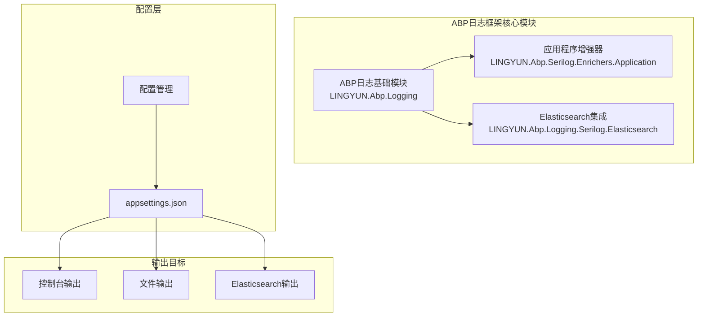
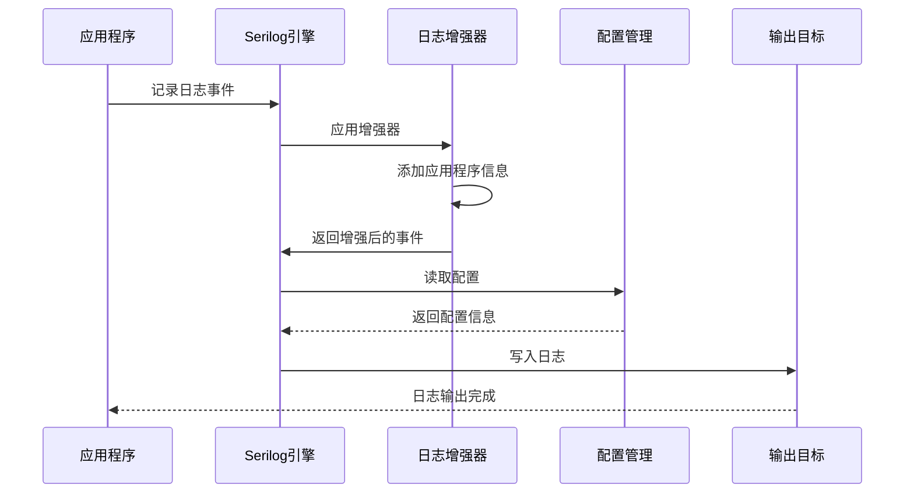
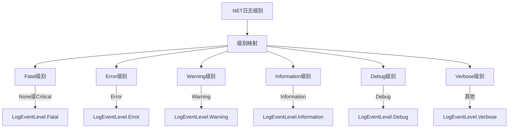
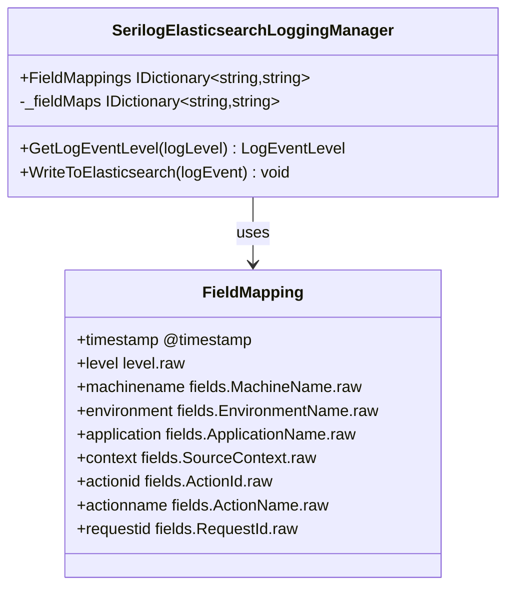
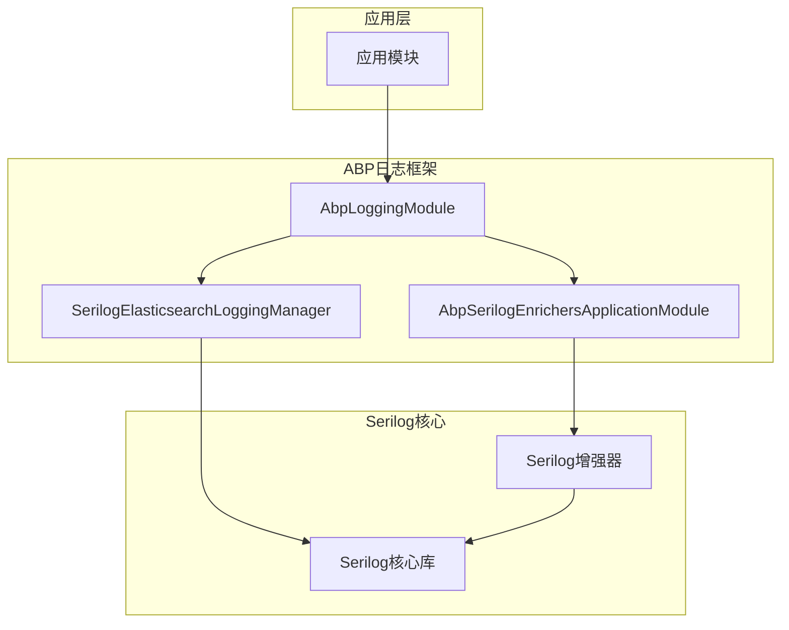

# ABP日志框架配置详细文档

<cite>
**本文档中引用的文件**
- [appsettings.json](file://gateways/web/LY.MicroService.ApiGateway/appsettings.json)
- [AbpLoggingModule.cs](file://aspnet-core/framework/logging/LINGYUN.Abp.Logging/LINGYUN/Abp/AuditLogging/AbpLoggingModule.cs)
- [AbpLoggingEnricherPropertyNames.cs](file://aspnet-core/framework/logging/LINGYUN.Abp.Logging/LINGYUN/Abp/AuditLogging/AbpLoggingEnricherPropertyNames.cs)
- [AbpSerilogEnrichersApplicationModule.cs](file://aspnet-core/framework/logging/LINGYUN.Abp.Serilog.Enrichers.Application/LINGYUN/Abp/Serilog/Enrichers/Application/AbpSerilogEnrichersApplicationModule.cs)
- [AbpSerilogEnrichersConsts.cs](file://aspnet-core/framework/logging/LINGYUN.Abp.Serilog.Enrichers.Application/LINGYUN/Abp/Serilog/Enrichers/Application/AbpSerilogEnrichersConsts.cs)
- [ApplicationNameEnricher.cs](file://aspnet-core/framework/logging/LINGYUN.Abp.Serilog.Enrichers.Application/LINGYUN/Abp/Serilog/Enrichers/Application/ApplicationNameEnricher.cs)
- [ApplicationLoggerConfigurationExtensions.cs](file://aspnet-core/framework/logging/LINGYUN.Abp.Serilog.Enrichers.Application/Serilog/ApplicationLoggerConfigurationExtensions.cs)
- [README.md](file://aspnet-core/framework/logging/LINGYUN.Abp.Logging/README.md)
- [README.md](file://aspnet-core/framework/logging/LINGYUN.Abp.Serilog.Enrichers.Application/README.md)
- [SerilogElasticsearchLoggingManager.cs](file://aspnet-core/framework/logging/LINGYUN.Abp.Logging.Serilog.Elasticsearch/LINGYUN/Abp/AuditLogging/Serilog/Elasticsearch/SerilogElasticsearchLoggingManager.cs)
</cite>

## 目录
1. [简介](#简介)
2. [项目结构](#项目结构)
3. [核心组件](#核心组件)
4. [架构概览](#架构概览)
5. [详细组件分析](#详细组件分析)
6. [依赖关系分析](#依赖关系分析)
7. [性能考虑](#性能考虑)
8. [故障排除指南](#故障排除指南)
9. [结论](#结论)

## 简介

ABP日志框架是一个基于Serilog的强大日志系统，专为ABP框架生态系统设计。它提供了结构化日志记录、灵活的日志级别控制、多目标输出以及丰富的日志增强功能。该框架支持从简单的控制台输出到复杂的分布式日志聚合，是构建企业级应用程序的理想选择。

ABP日志框架的主要特点包括：
- 基于Serilog的高性能日志记录引擎
- 结构化日志格式，便于数据分析和检索
- 多种日志输出目标（控制台、文件、Elasticsearch等）
- 自动化的日志级别管理和覆盖机制
- 可扩展的日志增强器系统
- 与ABP框架深度集成

## 项目结构

ABP日志框架采用模块化设计，主要分为以下几个核心模块：



**图表来源**
- [AbpLoggingModule.cs](file://aspnet-core/framework/logging/LINGYUN.Abp.Logging/LINGYUN/Abp/AuditLogging/AbpLoggingModule.cs#L1-L15)
- [AbpSerilogEnrichersApplicationModule.cs](file://aspnet-core/framework/logging/LINGYUN.Abp.Serilog.Enrichers.Application/LINGYUN/Abp/Serilog/Enrichers/Application/AbpSerilogEnrichersApplicationModule.cs#L1-L6)

**章节来源**
- [README.md](file://aspnet-core/framework/logging/LINGYUN.Abp.Logging/README.md#L1-L97)
- [README.md](file://aspnet-core/framework/logging/LINGYUN.Abp.Serilog.Enrichers.Application/README.md#L1-L60)

## 核心组件

### ABP日志基础模块

ABP日志基础模块（LINGYUN.Abp.Logging）是整个日志框架的核心，提供了统一的日志查询接口和基本配置管理。

```csharp
public class AbpLoggingModule : AbpModule
{
    public override void ConfigureServices(ServiceConfigurationContext context)
    {
        var configuration = context.Services.GetConfiguration();
        Configure<AbpLoggingEnricherPropertyNames>(configuration.GetSection("Logging"));
    }
}
```

该模块的主要职责：
- 提供ILoggingManager接口用于日志查询
- 管理日志增强器属性配置
- 支持结构化日志字段管理
- 集成ABP框架的服务容器

### 应用程序增强器

应用程序增强器（ApplicationNameEnricher）负责为每条日志事件添加应用程序标识信息，确保日志的可追溯性。

```csharp
public class ApplicationNameEnricher : ILogEventEnricher
{
    LogEventProperty _cachedProperty;
    
    public void Enrich(LogEvent logEvent, ILogEventPropertyFactory propertyFactory)
    {
        logEvent.AddPropertyIfAbsent(GetLogEventProperty(propertyFactory));
    }
}
```

增强器特性：
- 缓存机制提高性能
- 支持自定义字段名称
- 与Serilog无缝集成
- 静态应用程序名称设置

**章节来源**
- [AbpLoggingModule.cs](file://aspnet-core/framework/logging/LINGYUN.Abp.Logging/LINGYUN/Abp/AuditLogging/AbpLoggingModule.cs#L1-L15)
- [ApplicationNameEnricher.cs](file://aspnet-core/framework/logging/LINGYUN.Abp.Serilog.Enrichers.Application/LINGYUN/Abp/Serilog/Enrichers/Application/ApplicationNameEnricher.cs#L1-L27)

## 架构概览

ABP日志框架采用分层架构设计，从配置层到输出层形成完整的日志处理链路：



**图表来源**
- [ApplicationNameEnricher.cs](file://aspnet-core/framework/logging/LINGYUN.Abp.Serilog.Enrichers.Application/LINGYUN/Abp/Serilog/Enrichers/Application/ApplicationNameEnricher.cs#L6-L12)
- [appsettings.json](file://gateways/web/LY.MicroService.ApiGateway/appsettings.json#L1-L73)

## 详细组件分析

### Serilog配置详解

ABP日志框架使用JSON配置文件进行Serilog的初始化和配置。以下是一个完整的配置示例：

```json
{
  "Serilog": {
    "MinimumLevel": {
      "Default": "Information",
      "Override": {
        "System": "Warning",
        "Microsoft": "Warning",
        "DotNetCore": "Information"
      }
    },
    "Enrich": [ 
      "FromLogContext", 
      "WithProcessId", 
      "WithThreadId", 
      "WithEnvironmentName", 
      "WithMachineName", 
      "WithApplicationName", 
      "WithUniqueId" 
    ],
    "WriteTo": [
      {
        "Name": "Console",
        "Args": {
          "restrictedToMinimumLevel": "Debug",
          "outputTemplate": "{Timestamp:yyyy-MM-dd HH:mm:ss} [{Level:u3}] [{SourceContext}] [{ProcessId}] [{ThreadId}] - {Message:lj}{NewLine}{Exception}"
        }
      },
      {
        "Name": "File",
        "Args": {
          "path": "Logs/Debug-.log",
          "restrictedToMinimumLevel": "Debug",
          "rollingInterval": "Day",
          "outputTemplate": "{Timestamp:yyyy-MM-dd HH:mm:ss} [{Level:u3}] [{SourceContext}] [{ProcessId}] [{ThreadId}] - {Message:lj}{NewLine}{Exception}"
        }
      }
    ]
  }
}
```

#### 配置参数说明

**MinimumLevel配置**：
- `Default`: 默认日志级别，控制全局日志输出
- `Override`: 特定命名空间的级别覆盖，用于降低系统噪音

**Enrich配置**：
- `FromLogContext`: 从日志上下文中提取信息
- `WithProcessId`: 添加进程ID信息
- `WithThreadId`: 添加线程ID信息
- `WithEnvironmentName`: 添加环境名称
- `WithMachineName`: 添加机器名称
- `WithApplicationName`: 添加应用程序名称（由ABP增强器提供）
- `WithUniqueId`: 添加唯一标识符

**WriteTo配置**：
支持多种输出目标，包括控制台、文件、Elasticsearch等。

### 日志级别映射

ABP框架实现了.NET日志级别到Serilog级别的自动映射：



**图表来源**
- [SerilogElasticsearchLoggingManager.cs](file://aspnet-core/framework/logging/LINGYUN.Abp.Logging.Serilog.Elasticsearch/LINGYUN/Abp/AuditLogging/Serilog/Elasticsearch/SerilogElasticsearchLoggingManager.cs#L381-L392)

### 输出模板配置

ABP日志框架使用标准化的输出模板，确保日志的一致性和可解析性：

```
{Timestamp:yyyy-MM-dd HH:mm:ss} [{Level:u3}] [{SourceContext}] [{ProcessId}] [{ThreadId}] - {Message:lj}{NewLine}{Exception}
```

模板字段说明：
- `{Timestamp}`: 标准化的时间戳格式
- `{Level:u3}`: 缩写的日志级别（如INF、ERR）
- `{SourceContext}`: 源代码上下文信息
- `{ProcessId}`: 进程ID
- `{ThreadId}`: 线程ID
- `{Message:lj}`: 结构化消息内容
- `{NewLine}`: 新行分隔符
- `{Exception}`: 异常堆栈信息

**章节来源**
- [appsettings.json](file://gateways/web/LY.MicroService.ApiGateway/appsettings.json#L1-L73)
- [SerilogElasticsearchLoggingManager.cs](file://aspnet-core/framework/logging/LINGYUN.Abp.Logging.Serilog.Elasticsearch/LINGYUN/Abp/AuditLogging/Serilog/Elasticsearch/SerilogElasticsearchLoggingManager.cs#L381-L406)

### Elasticsearch集成

ABP日志框架提供了与Elasticsearch的深度集成，支持实时日志存储和分析：



**图表来源**
- [SerilogElasticsearchLoggingManager.cs](file://aspnet-core/framework/logging/LINGYUN.Abp.Logging.Serilog.Elasticsearch/LINGYUN/Abp/AuditLogging/Serilog/Elasticsearch/SerilogElasticsearchLoggingManager.cs#L381-L406)

**章节来源**
- [SerilogElasticsearchLoggingManager.cs](file://aspnet-core/framework/logging/LINGYUN.Abp.Logging.Serilog.Elasticsearch/LINGYUN/Abp/AuditLogging/Serilog/Elasticsearch/SerilogElasticsearchLoggingManager.cs#L381-L406)

## 依赖关系分析

ABP日志框架的模块间依赖关系清晰明确，形成了层次化的架构：



**图表来源**
- [AbpLoggingModule.cs](file://aspnet-core/framework/logging/LINGYUN.Abp.Logging/LINGYUN/Abp/AuditLogging/AbpLoggingModule.cs#L1-L15)
- [AbpSerilogEnrichersApplicationModule.cs](file://aspnet-core/framework/logging/LINGYUN.Abp.Serilog.Enrichers.Application/LINGYUN/Abp/Serilog/Enrichers/Application/AbpSerilogEnrichersApplicationModule.cs#L1-L6)

**章节来源**
- [AbpLoggingModule.cs](file://aspnet-core/framework/logging/LINGYUN.Abp.Logging/LINGYUN/Abp/AuditLogging/AbpLoggingModule.cs#L1-L15)
- [AbpSerilogEnrichersApplicationModule.cs](file://aspnet-core/framework/logging/LINGYUN.Abp.Serilog.Enrichers.Application/LINGYUN/Abp/Serilog/Enrichers/Application/AbpSerilogEnrichersApplicationModule.cs#L1-L6)

## 性能考虑

### 缓存机制

ABP日志框架在多个层面实现了性能优化：

1. **应用程序名称缓存**：
```csharp
private LogEventProperty _cachedProperty;
```
应用程序名称在首次计算后会被缓存，避免重复计算开销。

2. **字段映射缓存**：
Elasticsearch集成中的字段映射使用静态字典，减少运行时查找成本。

3. **日志级别预计算**：
.NET日志级别到Serilog级别的映射使用switch表达式，编译时优化。

### 最佳实践建议

1. **合理设置日志级别**：
   - 生产环境推荐使用Information级别
   - 开发环境可以使用Debug级别获取更多调试信息
   - 使用Override配置降低系统噪音

2. **选择合适的输出目标**：
   - 控制台输出适合开发和调试
   - 文件输出适合长期存储和分析
   - Elasticsearch适合大规模分布式系统

3. **优化输出模板**：
   - 避免过多的字段信息
   - 使用简洁的格式化字符串
   - 合理利用结构化数据

## 故障排除指南

### 常见问题及解决方案

**问题1：日志不输出**
- 检查MinimumLevel配置是否正确
- 验证WriteTo配置的目标是否存在权限
- 确认应用程序名称是否正确设置

**问题2：Elasticsearch连接失败**
- 检查节点URI配置是否正确
- 验证网络连接和防火墙设置
- 确认Elasticsearch服务是否正常运行

**问题3：日志格式异常**
- 检查outputTemplate配置语法
- 验证字段名称是否符合Serilog规范
- 确认编码格式是否正确

### 调试技巧

1. **启用Serilog调试模式**：
```json
{
  "Serilog": {
    "MinimumLevel": {
      "Default": "Debug"
    }
  }
}
```

2. **检查配置加载**：
```csharp
var configuration = context.Services.GetConfiguration();
var serilogConfig = configuration.GetSection("Serilog");
```

3. **验证增强器工作状态**：
```csharp
Log.Logger = new LoggerConfiguration()
    .Enrich.WithApplicationName()
    .WriteTo.Console()
    .CreateLogger();
```

**章节来源**
- [ApplicationNameEnricher.cs](file://aspnet-core/framework/logging/LINGYUN.Abp.Serilog.Enrichers.Application/LINGYUN/Abp/Serilog/Enrichers/Application/ApplicationNameEnricher.cs#L6-L12)
- [SerilogElasticsearchLoggingManager.cs](file://aspnet-core/framework/logging/LINGYUN.Abp.Logging.Serilog.Elasticsearch/LINGYUN/Abp/AuditLogging/Serilog/Elasticsearch/SerilogElasticsearchLoggingManager.cs#L381-L392)

## 结论

ABP日志框架是一个功能强大、设计精良的日志系统，为ABP框架生态系统提供了完整的日志解决方案。通过模块化的设计、丰富的配置选项和优秀的性能表现，它能够满足从简单应用到复杂分布式系统的各种需求。

### 主要优势

1. **高度可配置**：支持多种配置方式和输出目标
2. **性能优异**：多层缓存机制和优化策略
3. **易于集成**：与ABP框架深度集成，开箱即用
4. **扩展性强**：模块化设计便于功能扩展
5. **标准兼容**：遵循Serilog标准，生态丰富

### 使用建议

1. **根据环境选择配置**：开发、测试、生产环境使用不同的配置策略
2. **合理设置日志级别**：平衡信息完整性和性能影响
3. **充分利用增强器**：结合业务需求选择合适的日志增强功能
4. **监控日志系统**：定期检查日志输出质量和系统性能

ABP日志框架将继续演进，为开发者提供更加强大和易用的日志记录能力，助力构建高质量的企业级应用程序。