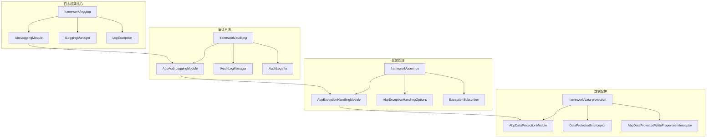
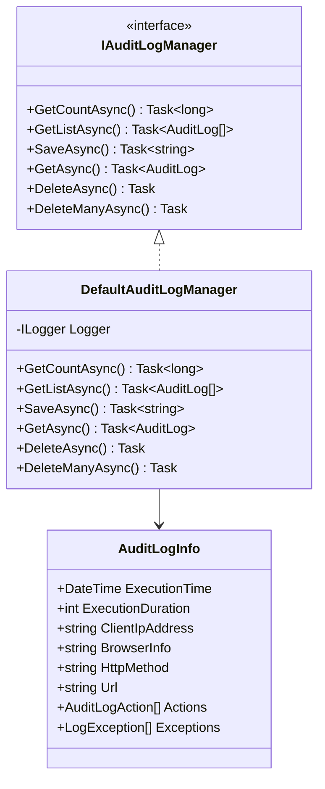
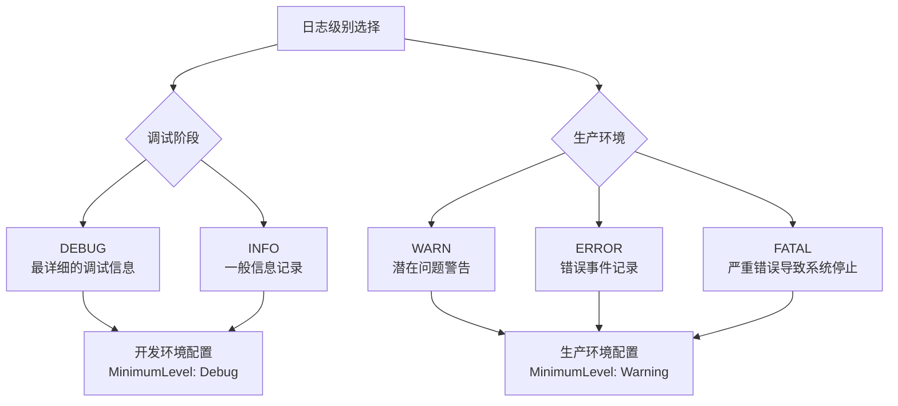
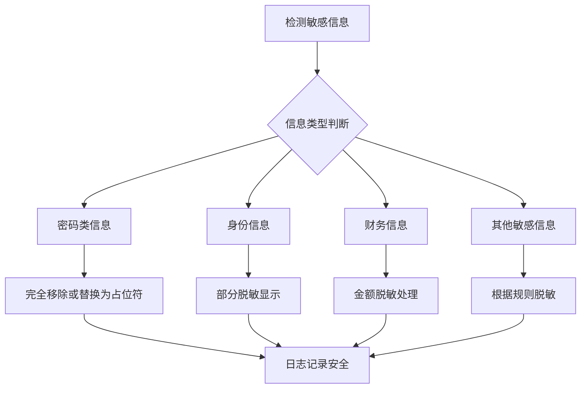
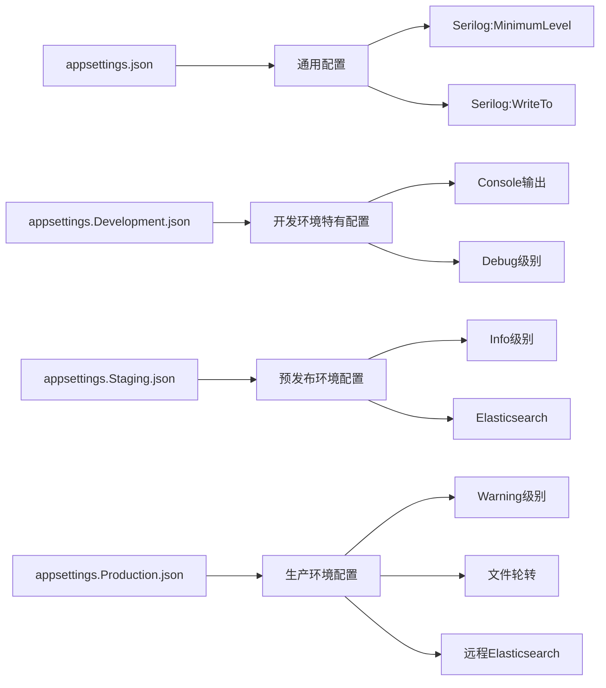
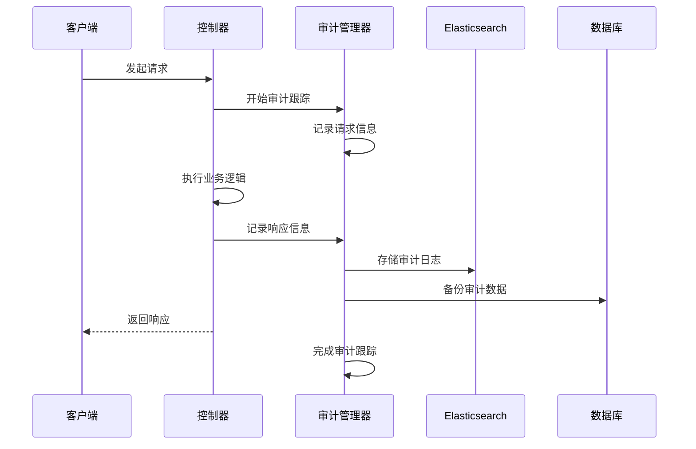
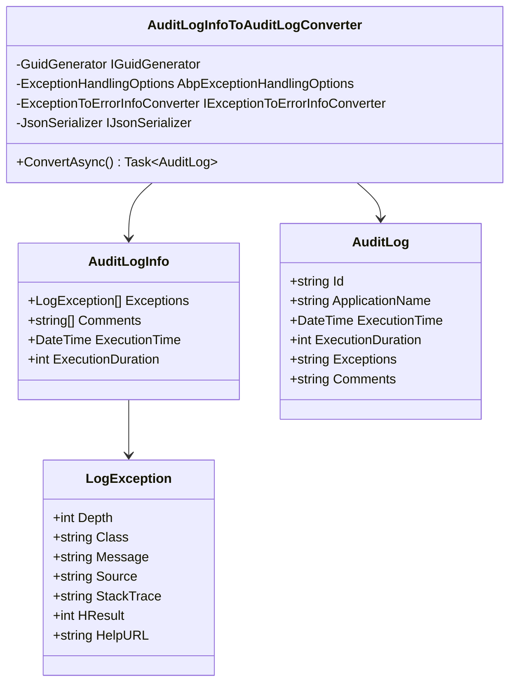
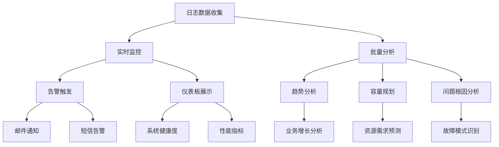
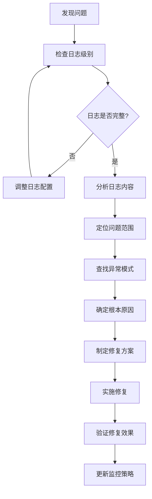

# ABP框架日志记录最佳实践

<cite>
**本文档中引用的文件**
- [AbpLoggingModule.cs](file://aspnet-core/framework/logging/LINGYUN.Abp.Logging/LINGYUN/Abp/AuditLogging/AbpLoggingModule.cs)
- [README.md](file://aspnet-core/framework/logging/LINGYUN.Abp.Logging/README.md)
- [abp.js](file://aspnet-core/services/LY.MicroService.AuthServer/wwwroot/libs/abp/core/abp.js)
- [appsettings.Development.json](file://aspnet-core/services/LY.MicroService.AuthServer/appsettings.Development.json)
- [DefaultAuditLogManager.cs](file://aspnet-core/framework/auditing/LINGYUN.Abp.AuditLogging/LINGYUN/Abp/AuditLogging/DefaultAuditLogManager.cs)
- [AuditLogInfoToAuditLogConverter.cs](file://aspnet-core/framework/auditing/LINGYUN.Abp.AuditLogging.Elasticsearch/LINGYUN/Abp/AuditLogging/Elasticsearch/AuditLogInfoToAuditLogConverter.cs)
- [AbpExceptionHandlingOptions.cs](file://aspnet-core/framework/common/LINGYUN.Abp.ExceptionHandling/LINGYUN/Abp/ExceptionHandling/AbpExceptionHandlingOptions.cs)
- [AbpDataProtectedWritePropertiesInterceptor.cs](file://aspnet-core/framework/data-protection/LINGYUN.Abp.DataProtection.EntityFrameworkCore/LINGYUN/Abp/DataProtection/EntityFrameworkCore/AbpDataProtectedWritePropertiesInterceptor.cs)
</cite>

## 目录
1. [简介](#简介)
2. [项目结构概览](#项目结构概览)
3. [核心日志组件](#核心日志组件)
4. [日志级别最佳实践](#日志级别最佳实践)
5. [日志消息编写规范](#日志消息编写规范)
6. [敏感信息处理](#敏感信息处理)
7. [多环境日志配置](#多环境日志配置)
8. [审计日志与异常处理](#审计日志与异常处理)
9. [性能监控与分析](#性能监控与分析)
10. [故障排除指南](#故障排除指南)
11. [结论](#结论)

## 简介

ABP框架提供了完整的日志记录解决方案，包括基础日志模块、审计日志、异常处理和数据保护等功能。本文档将系统性地介绍在ABP框架中进行日志记录的最佳实践，涵盖从基本配置到高级应用场景的各个方面。

ABP框架的日志系统基于Serilog构建，支持多种输出目标（控制台、Elasticsearch、文件等），并提供了丰富的日志字段和查询功能。通过合理的日志配置和使用，可以有效地进行问题排查、性能监控和系统维护。

## 项目结构概览

ABP框架的日志相关模块主要分布在以下目录结构中：



**图表来源**
- [AbpLoggingModule.cs](file://aspnet-core/framework/logging/LINGYUN.Abp.Logging/LINGYUN/Abp/AuditLogging/AbpLoggingModule.cs#L1-L15)
- [DefaultAuditLogManager.cs](file://aspnet-core/framework/auditing/LINGYUN.Abp.AuditLogging/LINGYUN/Abp/AuditLogging/DefaultAuditLogManager.cs#L1-L42)

## 核心日志组件

### 基础日志模块 (AbpLoggingModule)

基础日志模块是整个日志系统的起点，提供了统一的日志查询接口：

```csharp
[DependsOn(typeof(AbpLoggingModule))]
public class YouProjectModule : AbpModule
{
    // 其他配置
}
```

该模块的主要功能包括：
- 提供ILoggingManager接口用于日志查询
- 支持多种日志字段查询（时间戳、日志级别、消息等）
- 支持异常信息记录和查询
- 支持丰富的日志字段信息（机器名称、环境名称、应用名称等）

### 审计日志管理器 (IAuditLogManager)

审计日志管理器负责记录和查询系统操作的审计信息：



**图表来源**
- [DefaultAuditLogManager.cs](file://aspnet-core/framework/auditing/LINGYUN.Abp.AuditLogging/LINGYUN/Abp/AuditLogging/DefaultAuditLogManager.cs#L15-L42)

**章节来源**
- [AbpLoggingModule.cs](file://aspnet-core/framework/logging/LINGYUN.Abp.Logging/LINGYUN/Abp/AuditLogging/AbpLoggingModule.cs#L1-L15)
- [README.md](file://aspnet-core/framework/logging/LINGYUN.Abp.Logging/README.md#L1-L96)

## 日志级别最佳实践

ABP框架支持五种标准的日志级别，每种级别都有其特定的使用场景：

### 日志级别详解



### 各级别使用场景

1. **DEBUG级别**
   - 用于开发阶段的详细调试信息
   - 记录方法入口、出口参数和返回值
   - 包含变量状态和中间计算结果
   - 示例：`Logger.LogDebug("用户登录成功，用户名: {UserName}", user.Name);`

2. **INFO级别**
   - 记录系统正常运行的关键事件
   - 用户操作记录、业务流程开始结束
   - 系统启动、关闭等生命周期事件
   - 示例：`Logger.LogInformation("用户 {UserName} 执行了 {Operation} 操作", user.Name, operation);`

3. **WARN级别**
   - 记录可能影响系统正常运行的问题
   - 资源不足、配置不正确等情况
   - 可能导致部分功能受限的情况
   - 示例：`Logger.LogWarning("数据库连接池已达到上限: {PoolSize}/{MaxPoolSize}", currentSize, maxSize);`

4. **ERROR级别**
   - 记录系统错误但可恢复的异常
   - 方法执行失败、外部服务调用异常
   - 业务逻辑验证失败等
   - 示例：`Logger.LogError(ex, "用户注册失败: {UserName}", userName);`

5. **FATAL级别**
   - 记录严重错误导致系统无法继续运行
   - 数据库连接失败、关键服务不可用
   - 需要立即人工干预的紧急情况
   - 示例：`Logger.LogCritical(ex, "系统初始化失败，无法启动");`

### 日志级别配置示例

```json
{
  "Serilog": {
    "MinimumLevel": {
      "Default": "Debug",
      "Override": {
        "System": "Warning",
        "Microsoft": "Warning",
        "DotNetCore": "Debug"
      }
    }
  }
}
```

**章节来源**
- [abp.js](file://aspnet-core/services/LY.MicroService.AuthServer/wwwroot/libs/abp/core/abp.js#L32-L48)
- [appsettings.Development.json](file://aspnet-core/services/LY.MicroService.AuthServer/appsettings.Development.json#L84-L113)

## 日志消息编写规范

### 清晰性和具体性原则

良好的日志消息应该具备以下特征：

1. **明确的上下文信息**
   - 包含操作类型、对象标识、用户信息
   - 提供足够的背景信息以便理解事件
   - 使用结构化日志格式

2. **适当的详细程度**
   - 开发环境：详细的技术信息
   - 生产环境：简洁的业务信息

3. **一致的格式风格**
   - 统一的消息模板
   - 标准化的字段命名
   - 适当的日志级别匹配

### 结构化日志示例

```csharp
// 好的示例
Logger.LogInformation("用户 {UserId} 在 {Timestamp} 执行了 {Operation} 操作，耗时 {Duration}ms",
    userId, DateTime.UtcNow, "订单创建", duration);

Logger.LogError(ex, "订单 {OrderId} 创建失败，原因: {Reason}",
    orderId, failureReason);

// 避免的示例
Logger.LogInformation("操作完成"); // 太模糊
Logger.LogError("出错了"); // 缺少上下文
```

### 日志字段最佳实践

ABP框架支持丰富的日志字段，建议充分利用这些字段来增强日志的可查询性：

```csharp
// 使用结构化日志字段
Logger.LogInformation("用户 {UserId} 执行了 {Operation} 操作",
    userId: user.Id,
    operation: "订单创建",
    duration: stopwatch.ElapsedMilliseconds,
    ipAddress: HttpContext.Connection.RemoteIpAddress?.ToString(),
    userAgent: HttpContext.Request.Headers.UserAgent
);
```

## 敏感信息处理

### 数据脱敏策略

在日志记录中处理敏感信息是至关重要的安全实践：



### 敏感信息脱敏实现

ABP框架提供了数据保护拦截器来自动处理敏感信息：

```csharp
public class AbpDataProtectedWritePropertiesInterceptor : SaveChangesInterceptor
{
    public async override ValueTask<InterceptionResult<int>> SavingChangesAsync(
        DbContextEventData eventData, 
        InterceptionResult<int> result, 
        CancellationToken cancellationToken = default)
    {
        if (DataFilter.IsEnabled<IDataProtected>() && eventData.Context != null)
        {
            foreach (var entry in eventData.Context.ChangeTracker.Entries().ToList())
            {
                if (entry.State.IsIn(EntityState.Modified))
                {
                    // 自动处理敏感属性的脱敏
                    foreach (var property in entry.Properties.Where(p => p.IsModified))
                    {
                        if (IsSensitiveProperty(property.Metadata.Name))
                        {
                            property.CurrentValue = MaskSensitiveValue(property.CurrentValue);
                        }
                    }
                }
            }
        }
        
        return await base.SavingChangesAsync(eventData, result, cancellationToken);
    }
}
```

### 脱敏规则示例

1. **身份证号脱敏**
   ```csharp
   // 输入: 110105199003071234
   // 输出: 110105********1234
   ```

2. **手机号脱敏**
   ```csharp
   // 输入: 13812345678
   // 输出: 138****5678
   ```

3. **银行卡号脱敏**
   ```csharp
   // 输入: 6228480012345678901
   // 输出: 622848******5678901
   ```

4. **密码处理**
   ```csharp
   // 输入: plainTextPassword
   // 输出: [REDACTED]
   ```

**章节来源**
- [AbpDataProtectedWritePropertiesInterceptor.cs](file://aspnet-core/framework/data-protection/LINGYUN.Abp.DataProtection.EntityFrameworkCore/LINGYUN/Abp/DataProtection/EntityFrameworkCore/AbpDataProtectedWritePropertiesInterceptor.cs#L1-L27)

## 多环境日志配置

### 开发环境配置

开发环境需要详细的日志信息以便于调试：

```json
{
  "Serilog": {
    "MinimumLevel": {
      "Default": "Debug",
      "Override": {
        "System": "Warning",
        "Microsoft": "Warning",
        "DotNetCore": "Debug"
      }
    },
    "WriteTo": [
      {
        "Name": "Console",
        "Args": {
          "restrictedToMinimumLevel": "Debug",
          "outputTemplate": "{Timestamp:yyyy-MM-dd HH:mm:ss} [{Level:u3}] [{SourceContext}] [{ProcessId}] [{ThreadId}] - {Message:lj}{NewLine}{Exception}"
        }
      },
      {
        "Name": "Elasticsearch",
        "Args": {
          "nodeUris": "http://127.0.0.1:9200",
          "indexFormat": "abp.dev.logging-{0:yyyy.MM.dd}",
          "autoRegisterTemplate": true,
          "autoRegisterTemplateVersion": "ESv7"
        }
      }
    ]
  }
}
```

### 测试环境配置

测试环境需要平衡详细性和性能：

```json
{
  "Serilog": {
    "MinimumLevel": {
      "Default": "Information",
      "Override": {
        "System": "Warning",
        "Microsoft": "Warning",
        "DotNetCore": "Warning"
      }
    }
  }
}
```

### 生产环境配置

生产环境应注重性能和安全性：

```json
{
  "Serilog": {
    "MinimumLevel": {
      "Default": "Warning",
      "Override": {
        "System": "Error",
        "Microsoft": "Error"
      }
    },
    "WriteTo": [
      {
        "Name": "File",
        "Args": {
          "path": "Logs/prod-.log",
          "restrictedToMinimumLevel": "Warning",
          "rollingInterval": "Day",
          "retainedFileCountLimit": 30
        }
      },
      {
        "Name": "Elasticsearch",
        "Args": {
          "nodeUris": "https://elasticsearch-prod:9200",
          "indexFormat": "abp.prod.logging-{0:yyyy.MM.dd}",
          "autoRegisterTemplate": true,
          "batchPostingLimit": 1000,
          "period": 2000
        }
      }
    ]
  }
}
```

### 环境特定配置



**章节来源**
- [appsettings.Development.json](file://aspnet-core/services/LY.MicroService.AuthServer/appsettings.Development.json#L84-L113)

## 审计日志与异常处理

### 审计日志架构

ABP框架的审计日志系统提供了完整的操作追踪能力：



**图表来源**
- [DefaultAuditLogManager.cs](file://aspnet-core/framework/auditing/LINGYUN.Abp.AuditLogging/LINGYUN/Abp/AuditLogging/DefaultAuditLogManager.cs#L50-L77)

### 异常处理机制

ABP框架提供了完善的异常处理和通知机制：

```csharp
public class AbpExceptionHandlingOptions
{
    public ITypeList<Exception> Handlers { get; }
    
    public bool HasNotifierError(Exception ex)
    {
        if (typeof(IHasNotifierErrorMessage).IsAssignableFrom(ex.GetType()))
        {
            return true;
        }
        return Handlers.Any(x => x.IsAssignableFrom(ex.GetType()));
    }
}
```

### 异常日志转换



**图表来源**
- [AuditLogInfoToAuditLogConverter.cs](file://aspnet-core/framework/auditing/LINGYUN.Abp.AuditLogging.Elasticsearch/LINGYUN/Abp/AuditLogging/Elasticsearch/AuditLogInfoToAuditLogConverter.cs#L1-L37)

**章节来源**
- [AbpExceptionHandlingOptions.cs](file://aspnet-core/framework/common/LINGYUN.Abp.ExceptionHandling/LINGYUN/Abp/ExceptionHandling/AbpExceptionHandlingOptions.cs#L1-L22)
- [AuditLogInfoToAuditLogConverter.cs](file://aspnet-core/framework/auditing/LINGYUN.Abp.AuditLogging.Elasticsearch/LINGYUN/Abp/AuditLogging/Elasticsearch/AuditLogInfoToAuditLogConverter.cs#L1-L37)

## 性能监控与分析

### 性能指标收集

ABP框架的日志系统可以有效支持性能监控：

```csharp
// 性能监控示例
public async Task<T> MonitorPerformance<T>(
    Func<Task<T>> operation, 
    string operationName)
{
    var stopwatch = Stopwatch.StartNew();
    try
    {
        var result = await operation();
        Logger.LogInformation("操作 {OperationName} 成功完成，耗时 {Duration}ms",
            operationName, stopwatch.ElapsedMilliseconds);
        return result;
    }
    catch (Exception ex)
    {
        Logger.LogError(ex, "操作 {OperationName} 失败，耗时 {Duration}ms",
            operationName, stopwatch.ElapsedMilliseconds);
        throw;
    }
    finally
    {
        stopwatch.Stop();
    }
}
```

### 日志分析模式



### 性能优化建议

1. **异步日志写入**
   ```csharp
   // 使用异步日志写入避免阻塞主线程
   Logger.LogInformationAsync("异步日志记录");
   ```

2. **批量日志处理**
   ```csharp
   // 批量处理减少I/O开销
   var batchLogs = logs.Take(100);
   await LogBatchAsync(batchLogs);
   ```

3. **条件日志记录**
   ```csharp
   // 只在需要时才进行昂贵的日志操作
   if (Logger.IsEnabled(LogLevel.Debug))
   {
       Logger.LogDebug("详细调试信息: {ExpensiveData}", GetExpensiveData());
   }
   ```

## 故障排除指南

### 常见问题诊断

#### 1. 日志级别配置问题

**问题症状**: 日志信息没有按预期显示
**解决方案**:
```json
{
  "Serilog": {
    "MinimumLevel": {
      "Default": "Debug",  // 确保设置了合适的默认级别
      "Override": {
        "YourNamespace": "Debug"  // 特定命名空间的级别覆盖
      }
    }
  }
}
```

#### 2. 敏感信息泄露

**问题症状**: 敏感数据出现在日志中
**解决方案**:
```csharp
// 使用结构化日志避免直接拼接敏感信息
Logger.LogInformation("用户 {UserId} 执行了 {Operation} 操作",
    userId: user.Id,  // 不直接暴露原始值
    operation: operation);
```

#### 3. 性能问题

**问题症状**: 日志记录影响系统性能
**解决方案**:
- 使用异步日志写入
- 减少DEBUG级别的日志输出
- 合理设置日志缓冲区大小

### 日志查询技巧

```csharp
// 使用ILoggingManager进行高效查询
public class LogAnalyzer
{
    private readonly ILoggingManager _loggingManager;
    
    public async Task<LogAnalysisResult> AnalyzeLogsAsync(DateTime startTime, DateTime endTime)
    {
        // 按级别统计
        var errorCount = await _loggingManager.GetCountAsync(
            startTime: startTime,
            endTime: endTime,
            level: LogLevel.Error
        );
        
        // 按时间段分析
        var hourlyStats = await GetHourlyStatisticsAsync(startTime, endTime);
        
        // 分析异常模式
        var exceptionPatterns = await AnalyzeExceptionPatternsAsync(startTime, endTime);
        
        return new LogAnalysisResult
        {
            TotalErrors = errorCount,
            HourlyStatistics = hourlyStats,
            ExceptionPatterns = exceptionPatterns
        };
    }
}
```

### 故障排查流程



**章节来源**
- [DefaultAuditLogManager.cs](file://aspnet-core/framework/auditing/LINGYUN.Abp.AuditLogging/LINGYUN/Abp/AuditLogging/DefaultAuditLogManager.cs#L15-L42)

## 结论

ABP框架的日志记录系统提供了完整的解决方案，涵盖了从基础配置到高级应用场景的各个方面。通过遵循本文档中的最佳实践，可以实现：

1. **有效的日志管理**: 合理的日志级别使用和消息编写规范
2. **安全保障**: 敏感信息的适当处理和脱敏
3. **环境适配**: 不同环境下的最优配置策略
4. **性能优化**: 高效的日志记录和查询机制
5. **问题诊断**: 快速定位和解决系统问题的能力

持续改进日志实践，结合具体的业务需求和技术环境，将有助于构建更加稳定、可维护的应用系统。记住，好的日志不仅是技术工具，更是系统运维和问题排查的重要资产。