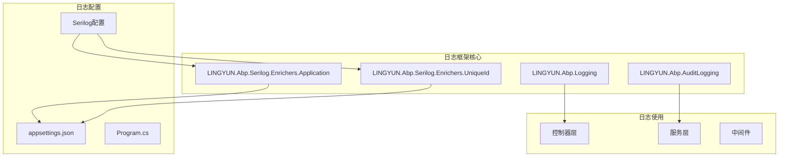
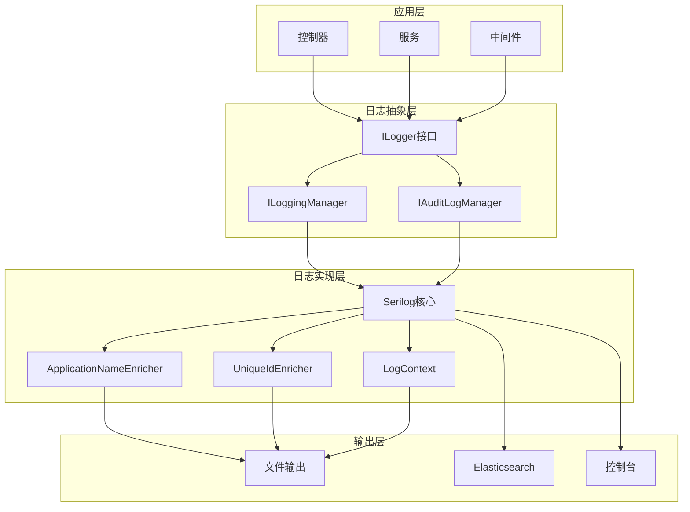
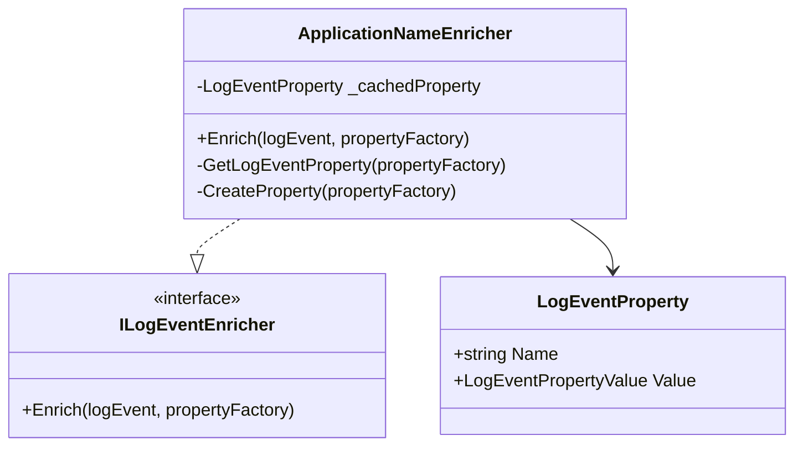
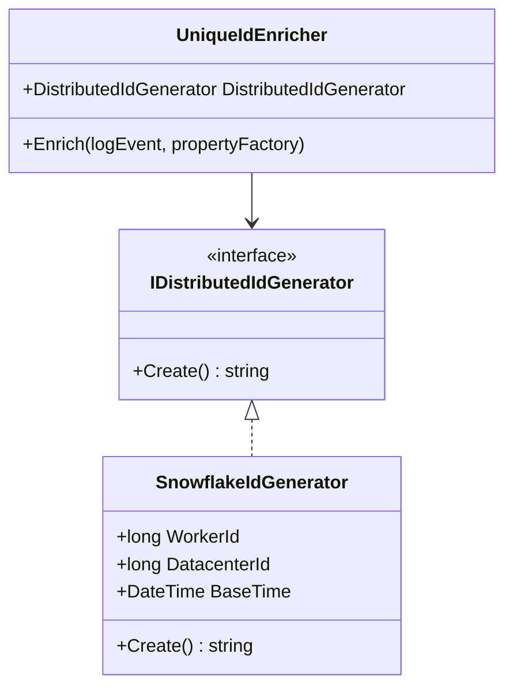
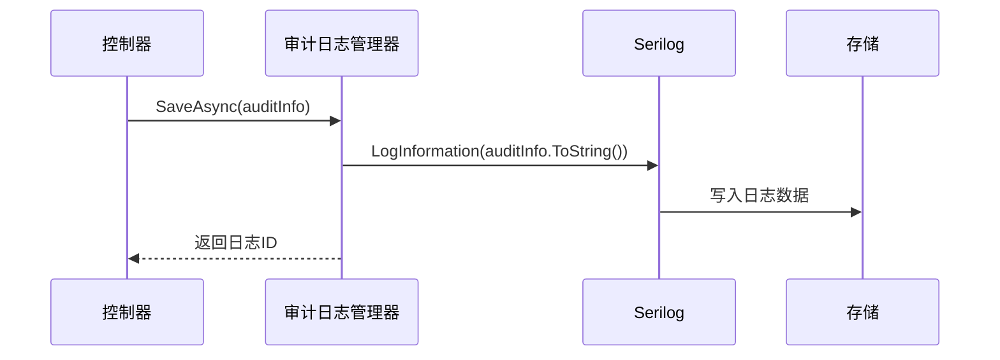
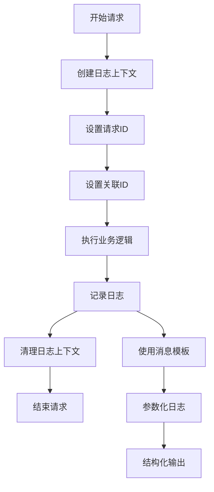
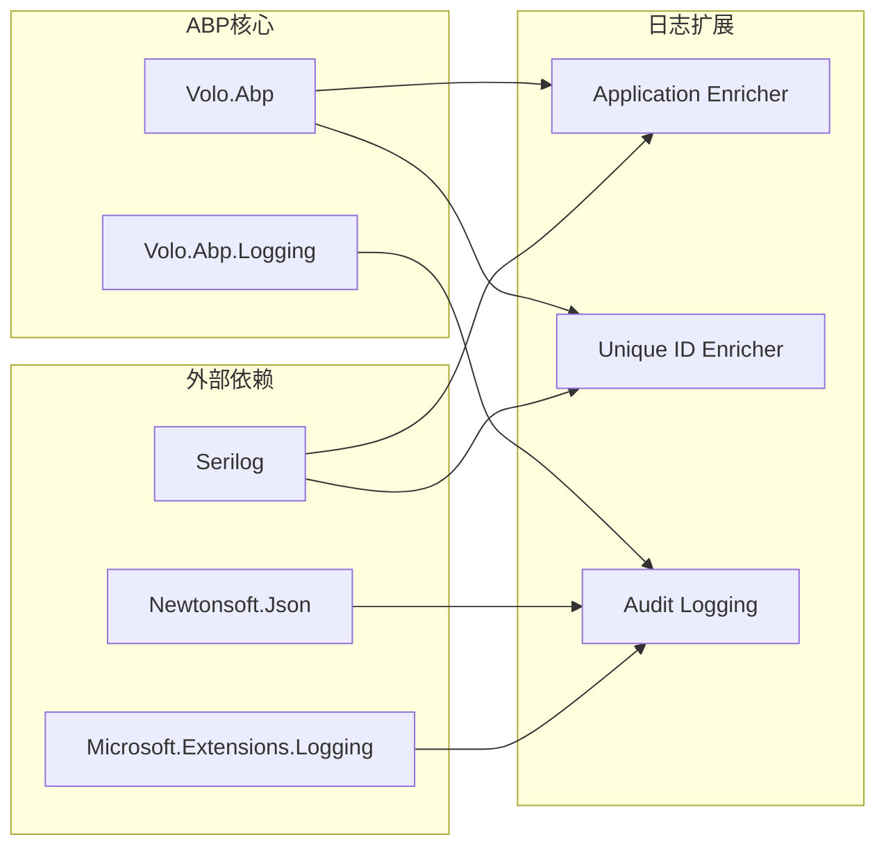

# ABP日志框架高级特性

<cite>
**本文档中引用的文件**
- [README.md](file://aspnet-core/framework/logging/LINGYUN.Abp.Serilog.Enrichers.Application/README.md)
- [README.md](file://aspnet-core/framework/logging/LINGYUN.Abp.Serilog.Enrichers.UniqueId/README.md)
- [ApplicationNameEnricher.cs](file://aspnet-core/framework/logging/LINGYUN.Abp.Serilog.Enrichers.Application/LINGYUN/Abp/Serilog/Enrichers/Application/ApplicationNameEnricher.cs)
- [UniqueIdEnricher.cs](file://aspnet-core/framework/logging/LINGYUN.Abp.Serilog.Enrichers.UniqueId/LINGYUN/Abp/Serilog/Enrichers/UniqueId/UniqueIdEnricher.cs)
- [ApplicationLoggerConfigurationExtensions.cs](file://aspnet-core/framework/logging/LINGYUN.Abp.Serilog.Enrichers.Application/Serilog/ApplicationLoggerConfigurationExtensions.cs)
- [UniqueIdLoggerConfigurationExtensions.cs](file://aspnet-core/framework/logging/LINGYUN.Abp.Serilog.Enrichers.UniqueId/Serilog/UniqueIdLoggerConfigurationExtensions.cs)
- [LogAppService.cs](file://aspnet-core/modules/auditing/LINGYUN.Abp.Auditing.Application/LINGYUN/Abp/Auditing/Logging/LogAppService.cs)
- [LogController.cs](file://aspnet-core/modules/auditing/LINGYUN.Abp.Auditing.HttpApi/LINGYUN/Abp/Auditing/Logging/LogController.cs)
- [DefaultAuditLogManager.cs](file://aspnet-core/framework/auditing/LINGYUN.Abp.AuditLogging/LINGYUN/Abp/AuditLogging/DefaultAuditLogManager.cs)
</cite>

## 目录
1. [简介](#简介)
2. [项目结构](#项目结构)
3. [核心组件](#核心组件)
4. [架构概览](#架构概览)
5. [详细组件分析](#详细组件分析)
6. [依赖关系分析](#依赖关系分析)
7. [性能考虑](#性能考虑)
8. [故障排除指南](#故障排除指南)
9. [结论](#结论)

## 简介

ABP日志框架提供了强大的高级日志功能，包括结构化日志记录、日志丰富器（Enrichers）、日志上下文管理和消息模板等功能。本文档深入探讨了ABP框架中Serilog的高级特性，特别是如何实现结构化日志记录和使用各种日志丰富器来增强日志的可读性和可查询性。

ABP框架的日志系统基于Serilog构建，提供了丰富的扩展功能，包括：
- 结构化日志记录
- 应用程序名称丰富器
- 唯一标识符丰富器
- 日志上下文管理
- 消息模板支持

## 项目结构

ABP日志框架的核心组件分布在以下目录结构中：



**图表来源**
- [README.md](file://aspnet-core/framework/logging/LINGYUN.Abp.Serilog.Enrichers.Application/README.md#L1-L91)
- [README.md](file://aspnet-core/framework/logging/LINGYUN.Abp.Serilog.Enrichers.UniqueId/README.md#L1-L114)

## 核心组件

ABP日志框架包含以下核心组件：

### 1. 应用程序名称丰富器（Application Enricher）
为每条日志事件添加应用程序名称，支持自定义字段名称和缓存机制。

### 2. 唯一标识符丰富器（Unique ID Enricher）
基于雪花算法生成分布式唯一ID，支持自定义配置参数。

### 3. 审计日志管理器
提供完整的审计日志记录和查询功能。

### 4. 日志应用服务
实现日志的增删改查操作。

**章节来源**
- [ApplicationNameEnricher.cs](file://aspnet-core/framework/logging/LINGYUN.Abp.Serilog.Enrichers.Application/LINGYUN/Abp/Serilog/Enrichers/Application/ApplicationNameEnricher.cs#L1-L29)
- [UniqueIdEnricher.cs](file://aspnet-core/framework/logging/LINGYUN.Abp.Serilog.Enrichers.UniqueId/LINGYUN/Abp/Serilog/Enrichers/UniqueId/UniqueIdEnricher.cs#L1-L19)

## 架构概览

ABP日志框架采用分层架构设计，通过Serilog作为底层日志库，提供了丰富的扩展功能：



**图表来源**
- [LogAppService.cs](file://aspnet-core/modules/auditing/LINGYUN.Abp.Auditing.Application/LINGYUN/Abp/Auditing/Logging/LogAppService.cs#L1-L39)
- [DefaultAuditLogManager.cs](file://aspnet-core/framework/auditing/LINGYUN.Abp.AuditLogging/LINGYUN/Abp/AuditLogging/DefaultAuditLogManager.cs#L1-L42)

## 详细组件分析

### 应用程序名称丰富器（Application Enricher）

应用程序名称丰富器是ABP日志框架的重要组成部分，它为每条日志事件自动添加应用程序名称信息。

#### 核心实现



**图表来源**
- [ApplicationNameEnricher.cs](file://aspnet-core/framework/logging/LINGYUN.Abp.Serilog.Enrichers.Application/LINGYUN/Abp/Serilog/Enrichers/Application/ApplicationNameEnricher.cs#L1-L29)

#### 配置和使用

应用程序名称丰富器支持两种配置方式：

1. **代码配置方式**：
```csharp
Log.Logger = new LoggerConfiguration()
    .Enrich.WithApplicationName()
    // ...其他配置...
    .CreateLogger();
```

2. **JSON配置方式**：
```json
{
   "Serilog": {
    "MinimumLevel": {
      "Default": "Information"
    },
    "Enrich": [ "WithApplicationName" ]
  }
}
```

#### 性能优化

应用程序名称丰富器采用了缓存机制来提高性能：
- 属性缓存：避免重复创建相同的日志属性
- 条件添加：只有在日志事件中不存在该属性时才添加
- 静态名称：应用程序名称一旦设置就保持不变

**章节来源**
- [README.md](file://aspnet-core/framework/logging/LINGYUN.Abp.Serilog.Enrichers.Application/README.md#L1-L91)
- [ApplicationNameEnricher.cs](file://aspnet-core/framework/logging/LINGYUN.Abp.Serilog.Enrichers.Application/LINGYUN/Abp/Serilog/Enrichers/Application/ApplicationNameEnricher.cs#L1-L29)

### 唯一标识符丰富器（Unique ID Enricher）

唯一标识符丰富器基于雪花算法生成分布式唯一ID，确保每条日志都有唯一的标识符。

#### 核心实现



**图表来源**
- [UniqueIdEnricher.cs](file://aspnet-core/framework/logging/LINGYUN.Abp.Serilog.Enrichers.UniqueId/LINGYUN/Abp/Serilog/Enrichers/UniqueId/UniqueIdEnricher.cs#L1-L19)

#### 配置选项

唯一标识符丰富器支持以下配置参数：

```json
{
  "UniqueId": {
    "Snowflake": {
      "WorkerId": 1,
      "DatacenterId": 1,
      "Sequence": 0,
      "BaseTime": "2020-01-01 00:00:00"
    }
  }
}
```

#### 雪花算法特点

- 64位长整型ID
- 包含时间戳、数据中心ID、工作机器ID和序列号
- 分布式环境下保证唯一性
- 基于时间戳的有序性

**章节来源**
- [README.md](file://aspnet-core/framework/logging/LINGYUN.Abp.Serilog.Enrichers.UniqueId/README.md#L1-L114)
- [UniqueIdEnricher.cs](file://aspnet-core/framework/logging/LINGYUN.Abp.Serilog.Enrichers.UniqueId/LINGYUN/Abp/Serilog/Enrichers/UniqueId/UniqueIdEnricher.cs#L1-L19)

### 审计日志管理器

审计日志管理器提供了完整的审计日志记录和查询功能。

#### 核心功能



**图表来源**
- [DefaultAuditLogManager.cs](file://aspnet-core/framework/auditing/LINGYUN.Abp.AuditLogging/LINGYUN/Abp/AuditLogging/DefaultAuditLogManager.cs#L38-L77)

#### 日志查询功能

审计日志管理器支持多种查询条件：
- 时间范围查询
- 应用程序名称过滤
- 用户ID和用户名过滤
- 请求ID和关联ID过滤
- 异常状态过滤

**章节来源**
- [DefaultAuditLogManager.cs](file://aspnet-core/framework/auditing/LINGYUN.Abp.AuditLogging/LINGYUN/Abp/AuditLogging/DefaultAuditLogManager.cs#L1-L77)

### 结构化日志记录

ABP框架支持结构化日志记录，通过消息模板和参数化日志来提高日志的可读性和可查询性。

#### 消息模板使用

```csharp
// 使用结构化日志记录
_logger.LogInformation("用户认证失败: {ErrorDescription}", errorDescription ?? "未知错误");
_logger.LogInformation("验证凭据成功: {Username}", user.UserName);
_logger.LogWarning("认证失败: {Username}, 原因: {Reason}", user.UserName, "访问受限");
```

#### 日志上下文管理



## 依赖关系分析

ABP日志框架的依赖关系如下：



**图表来源**
- [ApplicationLoggerConfigurationExtensions.cs](file://aspnet-core/framework/logging/LINGYUN.Abp.Serilog.Enrichers.Application/Serilog/ApplicationLoggerConfigurationExtensions.cs#L1-L14)
- [UniqueIdLoggerConfigurationExtensions.cs](file://aspnet-core/framework/logging/LINGYUN.Abp.Serilog.Enrichers.UniqueId/Serilog/UniqueIdLoggerConfigurationExtensions.cs#L1-L14)

**章节来源**
- [ApplicationLoggerConfigurationExtensions.cs](file://aspnet-core/framework/logging/LINGYUN.Abp.Serilog.Enrichers.Application/Serilog/ApplicationLoggerConfigurationExtensions.cs#L1-L14)
- [UniqueIdLoggerConfigurationExtensions.cs](file://aspnet-core/framework/logging/LINGYUN.Abp.Serilog.Enrichers.UniqueId/Serilog/UniqueIdLoggerConfigurationExtensions.cs#L1-L14)

## 性能考虑

ABP日志框架在设计时充分考虑了性能因素：

### 1. 缓存机制
- 应用程序名称丰富器使用属性缓存
- 避免重复计算和内存分配

### 2. 条件添加
- 只有在日志事件中不存在属性时才添加
- 减少不必要的对象创建

### 3. 异步处理
- 审计日志记录采用异步方式
- 不阻塞主线程执行

### 4. 输出优化
- 支持多种输出格式
- 可配置日志级别和过滤规则

## 故障排除指南

### 常见问题及解决方案

#### 1. 日志未显示应用程序名称
**问题**：日志中缺少ApplicationName字段
**解决方案**：
- 确保正确配置了ApplicationNameEnricher
- 检查AbpSerilogEnrichersConsts.ApplicationName是否已设置

#### 2. 唯一ID生成异常
**问题**：日志中缺少UniqueId字段或生成异常
**解决方案**：
- 检查雪花算法配置参数
- 确保WorkerId和DatacenterId唯一
- 验证基准时间设置

#### 3. 审计日志记录失败
**问题**：审计日志无法保存到数据库
**解决方案**：
- 检查数据库连接配置
- 确认审计日志模块已正确注册
- 查看异常日志获取详细错误信息

**章节来源**
- [README.md](file://aspnet-core/framework/logging/LINGYUN.Abp.Serilog.Enrichers.Application/README.md#L86-L91)
- [README.md](file://aspnet-core/framework/logging/LINGYUN.Abp.Serilog.Enrichers.UniqueId/README.md#L95-L114)

## 结论

ABP日志框架提供了强大而灵活的日志功能，通过结构化日志记录、丰富的日志丰富器和完善的审计功能，为企业级应用提供了全面的日志解决方案。

### 主要优势

1. **结构化日志**：支持消息模板和参数化日志，提高日志可读性和可查询性
2. **丰富器扩展**：提供应用程序名称和唯一ID丰富器，增强日志上下文信息
3. **审计功能**：完整的审计日志记录和查询功能
4. **性能优化**：采用缓存机制和异步处理，确保高性能
5. **易于配置**：支持代码和JSON两种配置方式

### 最佳实践建议

1. **合理配置日志级别**：根据环境选择合适的日志级别
2. **使用消息模板**：避免字符串拼接，使用结构化日志模板
3. **设置唯一标识**：为每个请求设置唯一的请求ID和关联ID
4. **定期清理日志**：配置日志轮转和清理策略
5. **监控日志质量**：定期检查日志质量和完整性

通过合理使用ABP日志框架的高级特性，可以显著提升应用程序的可观测性和运维效率。