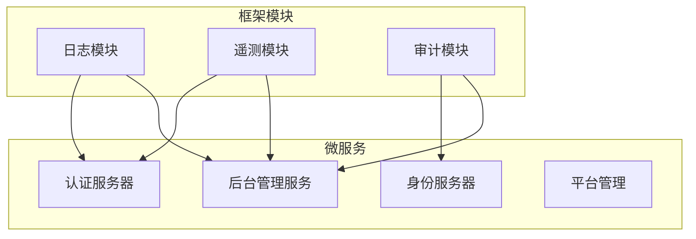
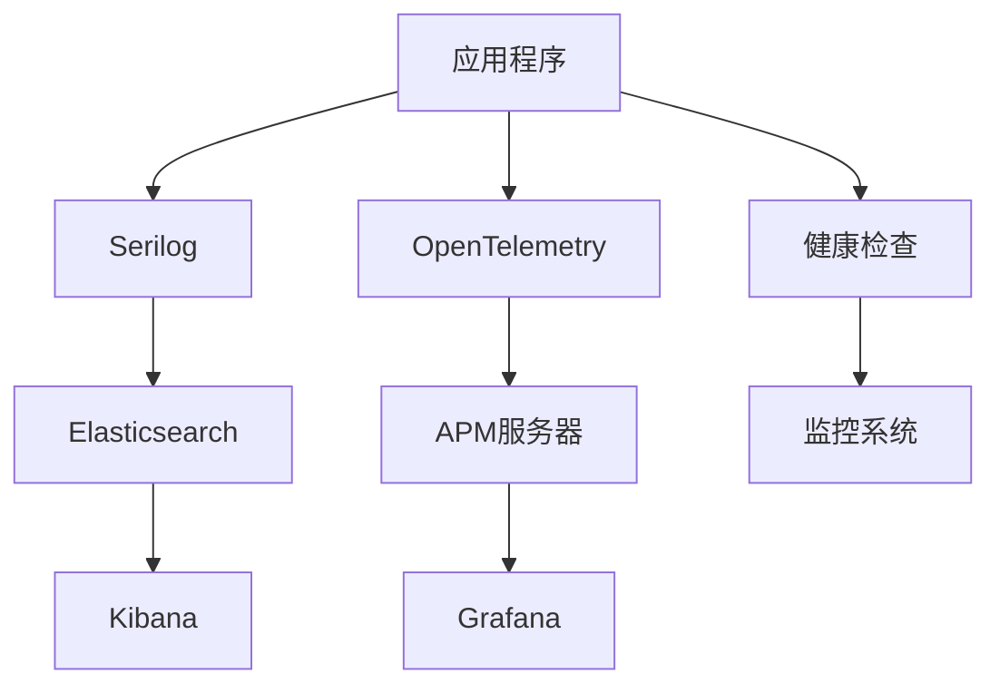
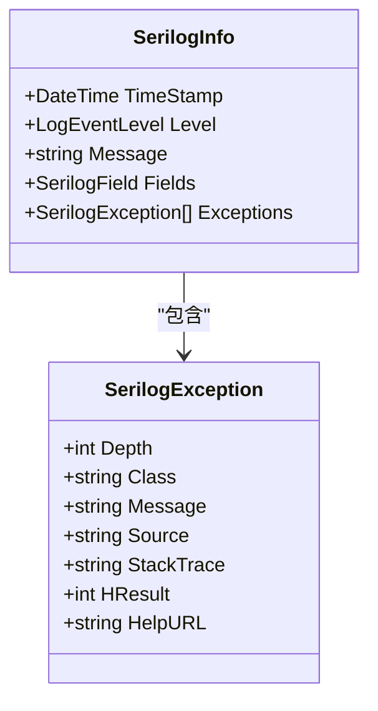
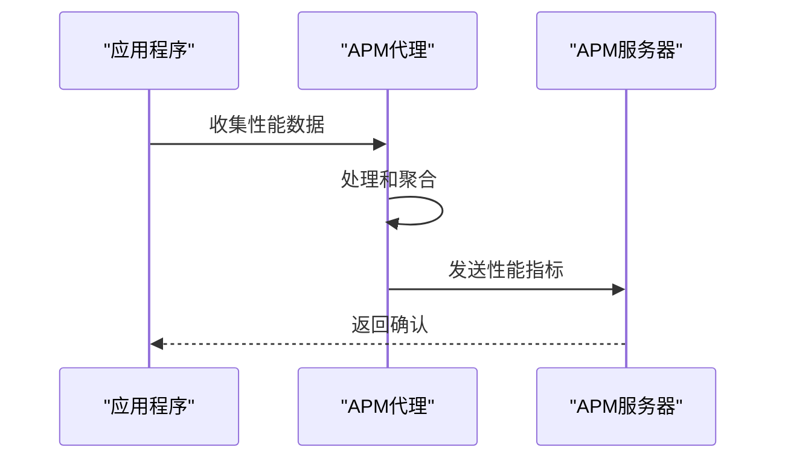
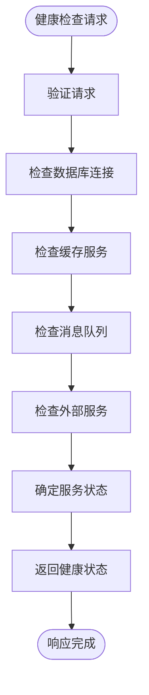
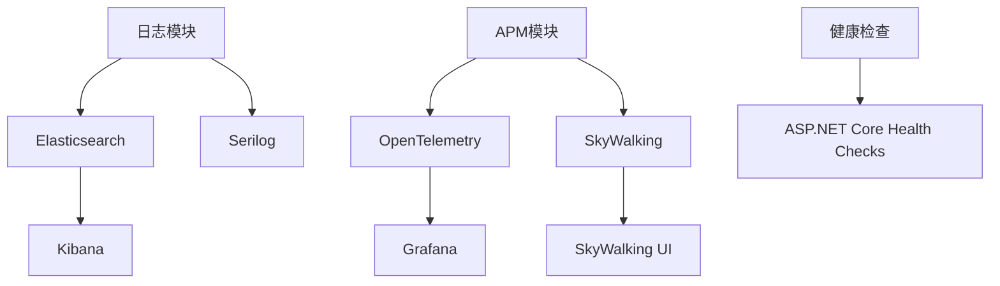

# 监控与日志

<cite>
**本文档引用的文件**
- [AbpLoggingSerilogElasticsearchModule.cs](file://aspnet-core/framework/logging/LINGYUN.Abp.Logging.Serilog.Elasticsearch/LINGYUN/Abp/AuditLogging/Serilog/Elasticsearch/AbpLoggingSerilogElasticsearchModule.cs)
- [AbpLoggingSerilogElasticsearchOptions.cs](file://aspnet-core/framework/logging/LINGYUN.Abp.Logging.Serilog.Elasticsearch/LINGYUN/Abp/AuditLogging/Serilog/Elasticsearch/AbpLoggingSerilogElasticsearchOptions.cs)
- [AbpTelemetryAPMModule.cs](file://aspnet-core/framework/telemetry/LINGYUN.Abp.Telemetry.APM/LINGYUNG/Abp/Telemetry/APM/AbpTelemetryAPMModule.cs)
- [AbpTelemetryOpenTelemetryModule.cs](file://aspnet-core/framework/telemetry/LINGYUN.Abp.Telemetry.OpenTelemetry/LINGYUN/Abp/Telemetry/OpenTelemetry/AbpTelemetryOpenTelemetryModule.cs)
- [AbpTelemetrySkyWalkingModule.cs](file://aspnet-core/framework/telemetry/LINGYUN.Abp.Telemetry.SkyWalking/LINGYUN/Abp/Telemetry/SkyWalking/AbpTelemetrySkyWalkingModule.cs)
- [AbpTelemetryOpenTelemetryOptions.cs](file://aspnet-core/framework/telemetry/LINGYUN.Abp.Telemetry.OpenTelemetry/LINGYUN/Abp/Telemetry/OpenTelemetry/AbpTelemetryOpenTelemetryOptions.cs)
- [AbpLoggingModule.cs](file://aspnet-core/framework/logging/LINGYUN.Abp.Logging/LINGYUN/Abp/AuditLogging/AbpLoggingModule.cs)
- [SerilogInfo.cs](file://aspnet-core/framework/logging/LINGYUN.Abp.Logging.Serilog.Elasticsearch/LINGYUN/Abp/AuditLogging/Serilog/Elasticsearch/SerilogInfo.cs)
- [SerilogException.cs](file://aspnet-core/framework/logging/LINGYUN.Abp.Logging.Serilog.Elasticsearch/LINGYUN/Abp/AuditLogging/Serilog/Elasticsearch/SerilogException.cs)
- [appsettings.Development.json](file://aspnet-core/services/LY.MicroService.BackendAdmin.HttpApi.Host/appsettings.Development.json)
- [README.md](file://aspnet-core/framework/auditing/LINGYUN.Abp.AuditLogging.Elasticsearch/README.md)
</cite>

## 目录
1. [引言](#引言)
2. [项目结构](#项目结构)
3. [核心组件](#核心组件)
4. [架构概述](#架构概述)
5. [详细组件分析](#详细组件分析)
6. [依赖分析](#依赖分析)
7. [性能考虑](#性能考虑)
8. [故障排除指南](#故障排除指南)
9. [结论](#结论)

## 引言
本文档详细介绍了ABP微服务架构中的监控与日志系统设计。系统采用Serilog作为日志框架，将日志输出到Elasticsearch进行集中分析，并实现了应用性能监控(APM)和健康检查机制。文档为运维团队提供了系统监控和故障诊断的工具和方法。

## 项目结构
系统采用模块化设计，监控与日志功能分布在多个框架模块中。主要模块包括日志记录、性能监控和健康检查，这些模块通过依赖注入集成到各个微服务中。

**图表来源**
- [AbpLoggingSerilogElasticsearchModule.cs](file://aspnet-core/framework/logging/LINGYUN.Abp.Logging.Serilog.Elasticsearch/LINGYUN/Abp/AuditLogging/Serilog/Elasticsearch/AbpLoggingSerilogElasticsearchModule.cs)
- [AbpTelemetryAPMModule.cs](file://aspnet-core/framework/telemetry/LINGYUN.Abp.Telemetry.APM/LINGYUNG/Abp/Telemetry/APM/AbpTelemetryAPMModule.cs)

**章节来源**
- [AbpLoggingSerilogElasticsearchModule.cs](file://aspnet-core/framework/logging/LINGYUN.Abp.Logging.Serilog.Elasticsearch/LINGYUN/Abp/AuditLogging/Serilog/Elasticsearch/AbpLoggingSerilogElasticsearchModule.cs)
- [AbpTelemetryAPMModule.cs](file://aspnet-core/framework/telemetry/LINGYUN.Abp.Telemetry.APM/LINGYUNG/Abp/Telemetry/APM/AbpTelemetryAPMModule.cs)

## 核心组件
系统的核心监控与日志组件包括Serilog日志框架、Elasticsearch集成、APM监控和健康检查。这些组件共同构成了系统的可观测性基础。

**章节来源**
- [AbpLoggingSerilogElasticsearchOptions.cs](file://aspnet-core/framework/logging/LINGYUN.Abp.Logging.Serilog.Elasticsearch/LINGYUN/Abp/AuditLogging/Serilog/Elasticsearch/AbpLoggingSerilogElasticsearchOptions.cs)
- [AbpTelemetryOpenTelemetryOptions.cs](file://aspnet-core/framework/telemetry/LINGYUN.Abp.Telemetry.OpenTelemetry/LINGYUN/Abp/Telemetry/OpenTelemetry/AbpTelemetryOpenTelemetryOptions.cs)

## 架构概述
系统采用分层架构，将日志记录、性能监控和健康检查功能分离但又相互协作。日志数据通过Serilog收集并发送到Elasticsearch，性能数据通过APM工具收集，健康检查提供服务状态监控。

**图表来源**
- [AbpTelemetryOpenTelemetryModule.cs](file://aspnet-core/framework/telemetry/LINGYUN.Abp.Telemetry.OpenTelemetry/LINGYUN/Abp/Telemetry/OpenTelemetry/AbpTelemetryOpenTelemetryModule.cs)
- [AbpTelemetrySkyWalkingModule.cs](file://aspnet-core/framework/telemetry/LINGYUN.Abp.Telemetry.SkyWalking/LINGYUN/Abp/Telemetry/SkyWalking/AbpTelemetrySkyWalkingModule.cs)

## 详细组件分析

### 日志组件分析
日志组件基于Serilog框架，通过Elasticsearch扩展将日志输出到Elasticsearch集群。系统配置了详细的日志格式和索引策略。

#### 日志数据结构

**图表来源**
- [SerilogInfo.cs](file://aspnet-core/framework/logging/LINGYUN.Abp.Logging.Serilog.Elasticsearch/LINGYUN/Abp/AuditLogging/Serilog/Elasticsearch/SerilogInfo.cs)
- [SerilogException.cs](file://aspnet-core/framework/logging/LINGYUN.Abp.Logging.Serilog.Elasticsearch/LINGYUN/Abp/AuditLogging/Serilog/Elasticsearch/SerilogException.cs)

#### 日志配置
系统通过`AbpLoggingSerilogElasticsearchOptions`类配置日志输出，主要配置项包括索引格式等。

**章节来源**
- [AbpLoggingSerilogElasticsearchOptions.cs](file://aspnet-core/framework/logging/LINGYUN.Abp.Logging.Serilog.Elasticsearch/LINGYUN/Abp/AuditLogging/Serilog/Elasticsearch/AbpLoggingSerilogElasticsearchOptions.cs)
- [appsettings.Development.json](file://aspnet-core/services/LY.MicroService.BackendAdmin.HttpApi.Host/appsettings.Development.json)

### 性能监控分析
性能监控组件支持多种APM解决方案，包括Elastic APM、OpenTelemetry和SkyWalking，为系统提供全面的性能指标监控。

#### APM集成

**图表来源**
- [AbpTelemetryAPMModule.cs](file://aspnet-core/framework/telemetry/LINGYUN.Abp.Telemetry.APM/LINGYUNG/Abp/Telemetry/APM/AbpTelemetryAPMModule.cs)
- [AbpTelemetryOpenTelemetryModule.cs](file://aspnet-core/framework/telemetry/LINGYUN.Abp.Telemetry.OpenTelemetry/LINGYUN/Abp/Telemetry/OpenTelemetry/AbpTelemetryOpenTelemetryModule.cs)

#### 监控配置
系统通过`AbpTelemetryOpenTelemetryOptions`类配置APM行为，包括忽略特定URL的监控等。

**章节来源**
- [AbpTelemetryOpenTelemetryOptions.cs](file://aspnet-core/framework/telemetry/LINGYUN.Abp.Telemetry.OpenTelemetry/LINGYUN/Abp/Telemetry/OpenTelemetry/AbpTelemetryOpenTelemetryOptions.cs)
- [AbpTelemetryOpenTelemetryModule.cs](file://aspnet-core/framework/telemetry/LINGYUN.Abp.Telemetry.OpenTelemetry/LINGYUN/Abp/Telemetry/OpenTelemetry/AbpTelemetryOpenTelemetryModule.cs)

### 健康检查机制
系统实现了标准化的健康检查机制，所有微服务都暴露了健康检查端点，便于监控系统检测服务状态。

#### 健康检查流程

**图表来源**
- [AbpTelemetryOpenTelemetryOptions.cs](file://aspnet-core/framework/telemetry/LINGYUN.Abp.Telemetry.OpenTelemetry/LINGYUN/Abp/Telemetry/OpenTelemetry/AbpTelemetryOpenTelemetryOptions.cs)
- [BackendAdminHttpApiHostModule.Configure.cs](file://aspnet-core/services/LY.MicroService.BackendAdmin.HttpApi.Host/BackendAdminHttpApiHostModule.Configure.cs)

## 依赖分析
监控与日志系统依赖于多个外部组件和服务，这些依赖关系确保了系统的完整性和功能性。

**图表来源**
- [AbpLoggingSerilogElasticsearchModule.cs](file://aspnet-core/framework/logging/LINGYUN.Abp.Logging.Serilog.Elasticsearch/LINGYUN/Abp/AuditLogging/Serilog/Elasticsearch/AbpLoggingSerilogElasticsearchModule.cs)
- [AbpTelemetryOpenTelemetryModule.cs](file://aspnet-core/framework/telemetry/LINGYUN.Abp.Telemetry.OpenTelemetry/LINGYUN/Abp/Telemetry/OpenTelemetry/AbpTelemetryOpenTelemetryModule.cs)

**章节来源**
- [AbpLoggingSerilogElasticsearchModule.cs](file://aspnet-core/framework/logging/LINGYUN.Abp.Logging.Serilog.Elasticsearch/LINGYUN/Abp/AuditLogging/Serilog/Elasticsearch/AbpLoggingSerilogElasticsearchModule.cs)
- [AbpTelemetryOpenTelemetryModule.cs](file://aspnet-core/framework/telemetry/LINGYUN.Abp.Telemetry.OpenTelemetry/LINGYUN/Abp/Telemetry/OpenTelemetry/AbpTelemetryOpenTelemetryModule.cs)

## 性能考虑
在设计监控与日志系统时，需要考虑性能影响，避免监控本身成为系统瓶颈。

- 日志级别配置为Debug级别，生产环境建议调整为Information或Warning级别
- APM监控可以配置忽略特定URL，减少不必要的性能数据收集
- 健康检查请求被排除在APM监控之外，避免循环监控
- Elasticsearch索引采用日期格式，便于数据管理和查询优化

## 故障排除指南
当监控与日志系统出现问题时，可以按照以下步骤进行排查：

1. 检查Elasticsearch连接是否正常
2. 验证Serilog配置是否正确
3. 确认APM代理是否正常运行
4. 检查健康检查端点是否可访问
5. 查看应用程序日志中的错误信息

**章节来源**
- [appsettings.Development.json](file://aspnet-core/services/LY.MicroService.BackendAdmin.HttpApi.Host/appsettings.Development.json)
- [AbpTelemetryOpenTelemetryOptions.cs](file://aspnet-core/framework/telemetry/LINGYUN.Abp.Telemetry.OpenTelemetry/LINGYUN/Abp/Telemetry/OpenTelemetry/AbpTelemetryOpenTelemetryOptions.cs)

## 结论
本系统提供了全面的监控与日志解决方案，通过Serilog+Elasticsearch实现日志集中管理，通过APM工具实现性能监控，通过健康检查实现服务状态监控。这些功能共同构成了系统的可观测性基础，为运维团队提供了强大的工具来确保系统稳定运行。