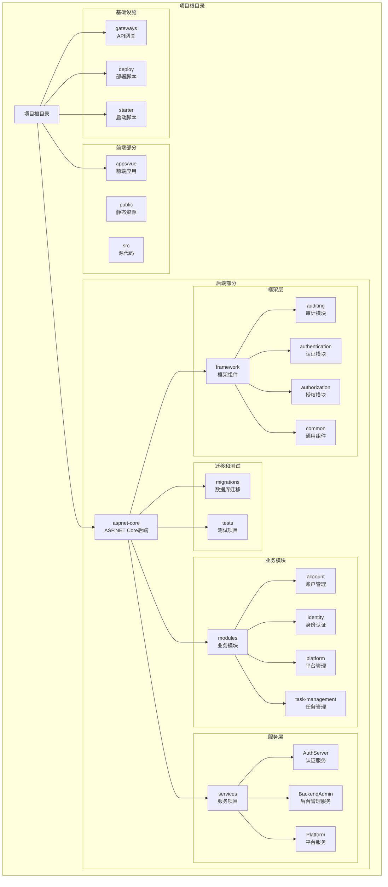
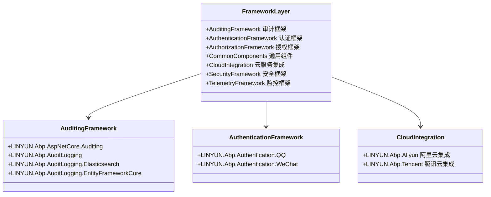
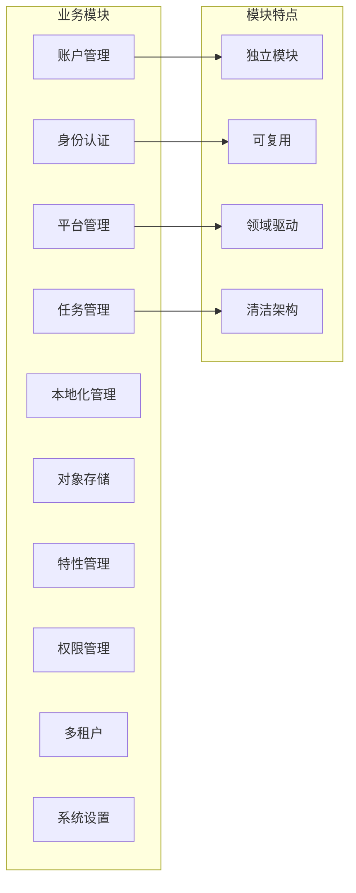
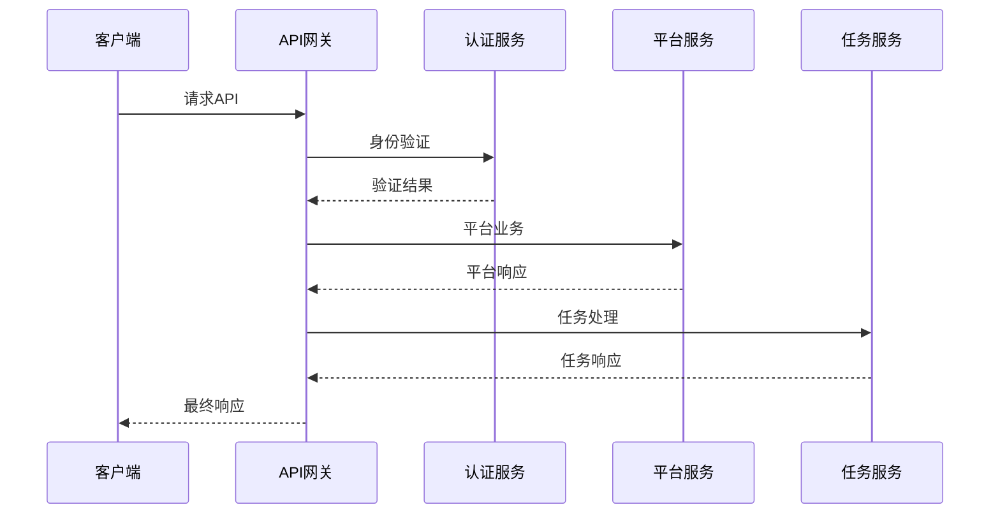
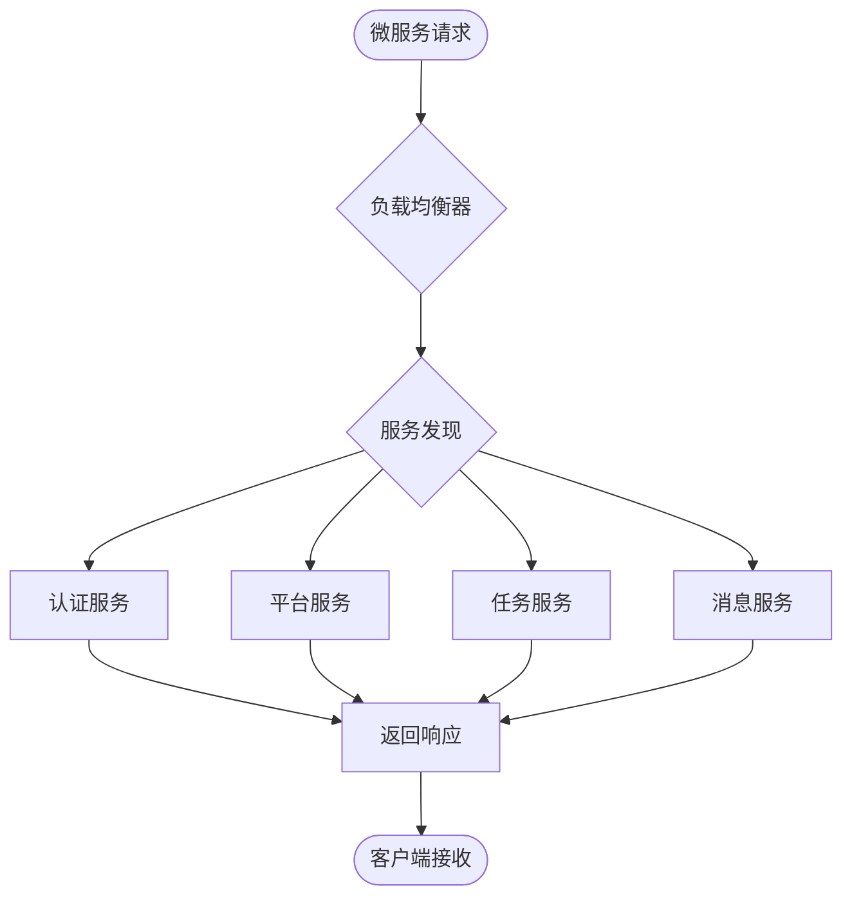
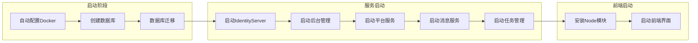
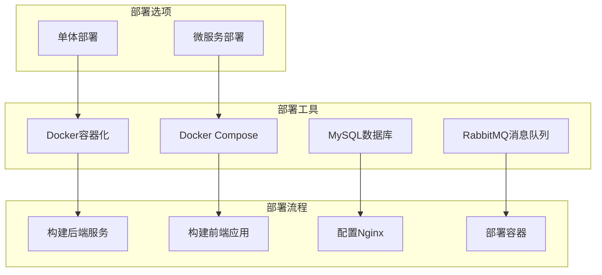
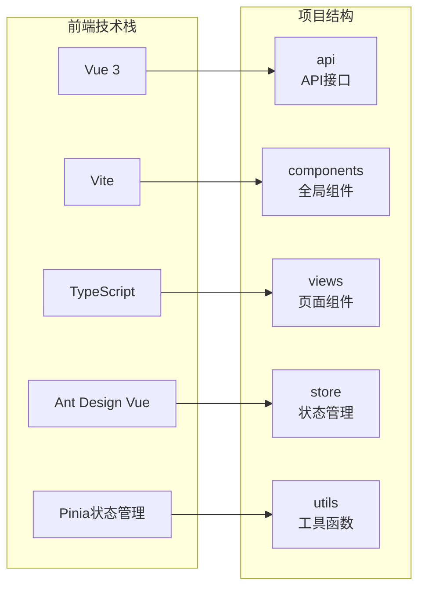

# 目录结构详解

<cite>
**本文档引用的文件**
- [README.md](file://README.md)
- [README.en.md](file://README.en.md)
- [docker-compose.yml](file://docker-compose.yml)
- [starter/readme.md](file://starter/readme.md)
- [gateways/internal/LINGYUN.MicroService.Internal.ApiGateway/src/InternalApiGatewayModule.cs](file://gateways/internal/LINGYUN.MicroService.Internal.ApiGateway/src/InternalApiGatewayModule.cs)
- [gateways/web/LY.MicroService.ApiGateway/Program.cs](file://gateways/web/LY.MicroService.ApiGateway/Program.cs)
- [deploy/deploy.ps1](file://deploy/deploy.ps1)
- [deploy/README.md](file://deploy/README.md)
</cite>

## 目录结构概览

该项目是一个基于ABP框架的现代化企业级管理系统，采用了前后端分离的微服务架构设计。项目整体结构清晰，模块化程度高，便于维护和扩展。

**图表来源**
- [README.md](file://README.md#L1-L50)
- [docker-compose.yml](file://docker-compose.yml#L1-L50)

## 核心目录结构分析

### 1. aspnet-core - 后端核心代码

`aspnet-core`目录是整个后端系统的核心，包含了所有C#/.NET相关的代码和配置。

#### 1.1 框架层 (framework)
框架层提供了系统的基础功能和通用组件，采用模块化设计，便于复用和扩展。

**图表来源**
- [aspnet-core/framework/auditing/README.md](file://aspnet-core/framework/auditing/README.md)
- [aspnet-core/framework/authentication/README.md](file://aspnet-core/framework/authentication/README.md)

#### 1.2 业务模块层 (modules)
业务模块层包含了各个业务领域的功能实现，每个模块都是独立的领域服务。

**图表来源**
- [aspnet-core/modules/account/](file://aspnet-core/modules/account/)
- [aspnet-core/modules/identity/](file://aspnet-core/modules/identity/)
- [aspnet-core/modules/platform/](file://aspnet-core/modules/platform/)

#### 1.3 服务层 (services)
服务层是微服务架构的具体实现，每个服务都是独立运行的应用程序。

**图表来源**
- [docker-compose.yml](file://docker-compose.yml#L1-L100)
- [gateways/web/LY.MicroService.ApiGateway/Program.cs](file://gateways/web/LY.MicroService.ApiGateway/Program.cs)

**章节来源**
- [aspnet-core/framework/](file://aspnet-core/framework/)
- [aspnet-core/modules/](file://aspnet-core/modules/)
- [aspnet-core/services/](file://aspnet-core/services/)

### 2. gateways - API网关

API网关是微服务架构的重要组成部分，负责路由转发、负载均衡、安全控制等功能。

#### 2.1 内部网关 (internal)
内部网关专门处理微服务之间的通信，提供服务发现和负载均衡功能。

**图表来源**
- [gateways/internal/LINGYUN.MicroService.Internal.ApiGateway/src/InternalApiGatewayModule.cs](file://gateways/internal/LINGYUN.MicroService.Internal.ApiGateway/src/InternalApiGatewayModule.cs)

#### 2.2 Web网关 (web)
Web网关处理外部客户端的请求，提供统一的入口点。

**章节来源**
- [gateways/internal/](file://gateways/internal/)
- [gateways/web/](file://gateways/web/)

### 3. starter - 启动脚本

启动脚本目录提供了完整的项目启动流程，从环境准备到服务启动的完整自动化。

#### 3.1 启动流程

**图表来源**
- [starter/readme.md](file://starter/readme.md)
- [starter/00.auto-config-docker.cmd](file://starter/00.auto-config-docker.cmd)

**章节来源**
- [starter/](file://starter/)

### 4. deploy - 部署脚本

部署脚本目录包含了完整的部署解决方案，支持多种部署方式。

#### 4.1 部署架构

**图表来源**
- [deploy/deploy.ps1](file://deploy/deploy.ps1)
- [deploy/README.md](file://deploy/README.md)

**章节来源**
- [deploy/](file://deploy/)

### 5. 前端部分 (apps/vue)

前端部分基于Vue 3和Vite构建，采用了现代化的前端技术栈。

#### 5.1 前端架构

**图表来源**
- [README.md](file://README.md#L100-L150)

**章节来源**
- [README.md](file://README.md#L100-L200)

## 目录结构设计理念

### 1. 模块化设计
项目采用了高度模块化的架构设计，每个模块都有明确的职责边界：

- **框架层模块**：提供基础功能和通用组件
- **业务模块**：实现具体的业务逻辑
- **服务层**：实现微服务的独立部署
- **基础设施**：提供支撑性的功能

### 2. 前后端分离
项目实现了严格的前后端分离：

- **前端**：独立的Vue应用，专注于用户界面
- **后端**：RESTful API服务，专注于业务逻辑
- **网关**：统一的API入口和路由管理

### 3. 微服务架构
项目支持微服务部署模式：

- **服务独立**：每个服务都可以独立部署和扩展
- **服务通信**：通过消息队列实现异步通信
- **服务发现**：自动化的服务注册和发现机制

### 4. 自动化运维
项目提供了完整的自动化运维能力：

- **一键启动**：通过启动脚本实现快速部署
- **自动化测试**：完整的测试覆盖和持续集成
- **容器化部署**：支持Docker和Kubernetes部署

## 新开发者导航指南

### 1. 快速开始
对于新加入的开发者，建议按照以下顺序熟悉项目：

1. **阅读README**：了解项目概述和基本概念
2. **查看启动脚本**：理解项目的启动流程
3. **探索后端结构**：熟悉ASP.NET Core的模块化设计
4. **了解前端架构**：掌握Vue 3和Vite的使用
5. **学习部署流程**：掌握Docker和微服务部署

### 2. 开发工作流
典型的开发工作流程包括：

1. **环境准备**：运行启动脚本准备开发环境
2. **后端开发**：在aspnet-core目录下进行业务开发
3. **前端开发**：在apps/vue目录下进行界面开发
4. **测试验证**：运行测试确保功能正确
5. **部署上线**：使用部署脚本进行生产部署

### 3. 技术栈重点
需要重点关注的技术点：

- **C#/.NET Core**：后端开发的核心技术
- **Vue 3 + TypeScript**：前端开发的主要技术
- **Entity Framework Core**：ORM框架和数据库操作
- **Docker**：容器化和部署技术
- **微服务架构**：分布式系统的理解和实践

## 总结

该项目的目录结构体现了现代企业级应用的最佳实践，通过清晰的分层架构、模块化设计和微服务理念，为大型项目的开发和维护提供了优秀的基础架构。无论是初学者还是经验丰富的开发者，都能从这种结构化的组织方式中受益，快速上手并高效开发。