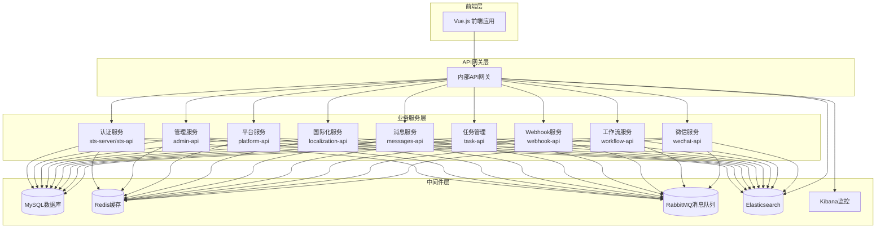
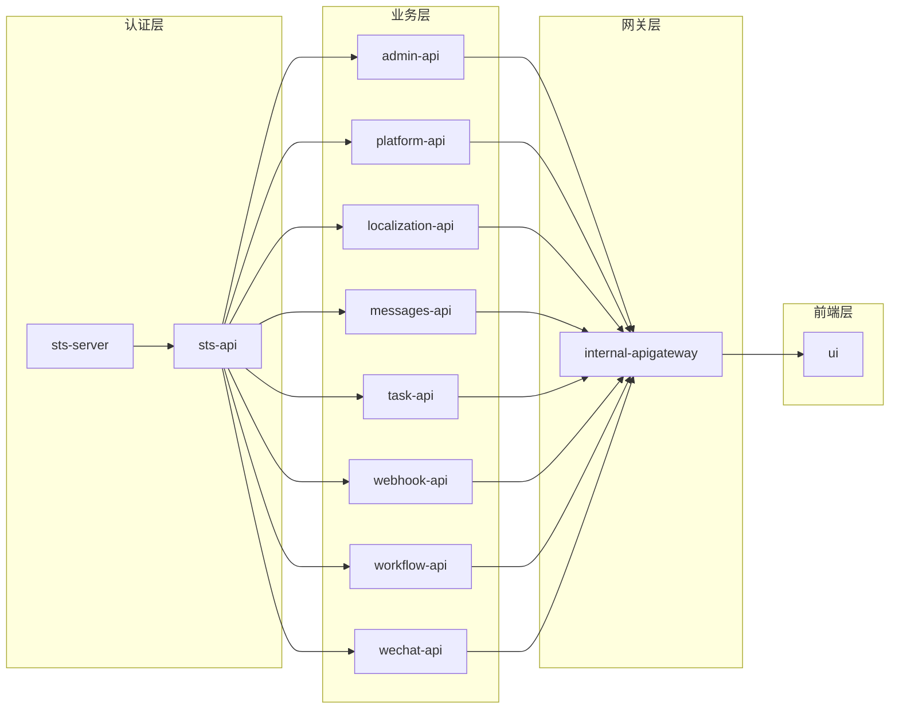
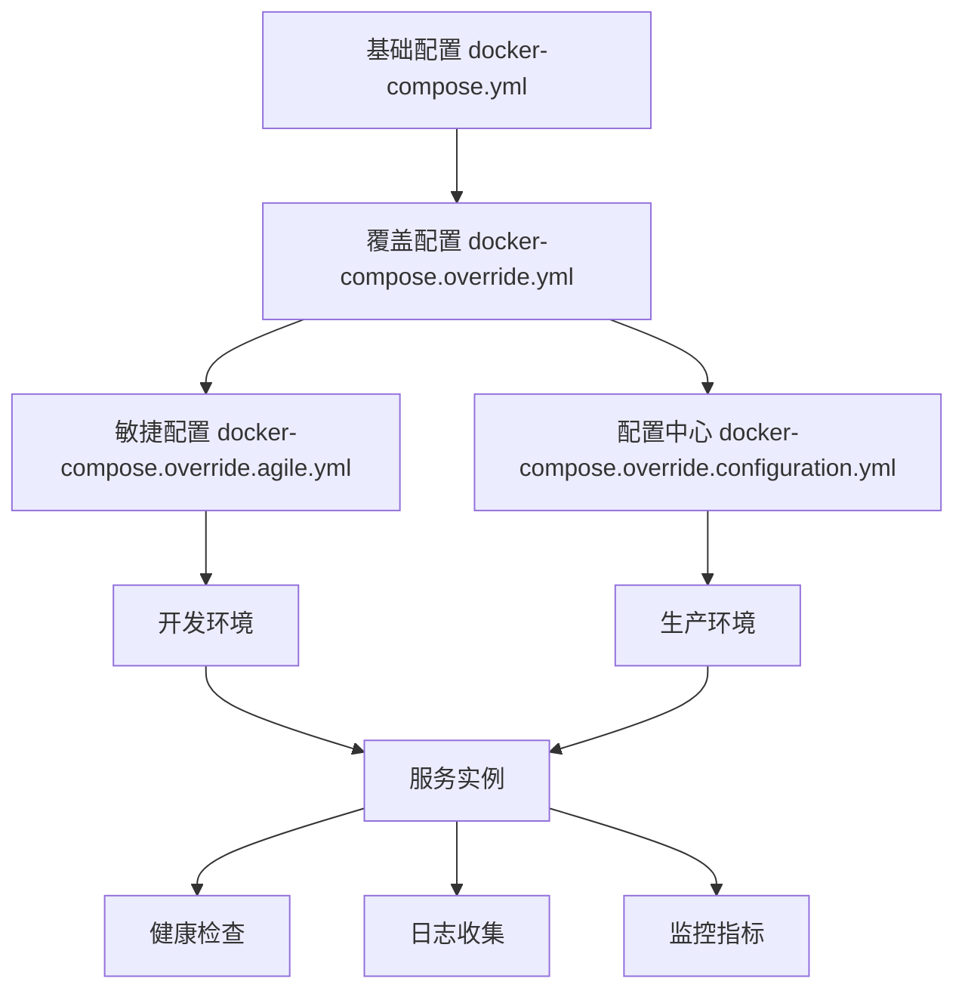
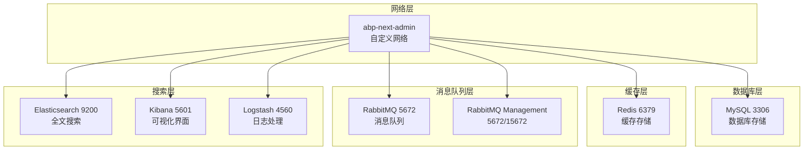
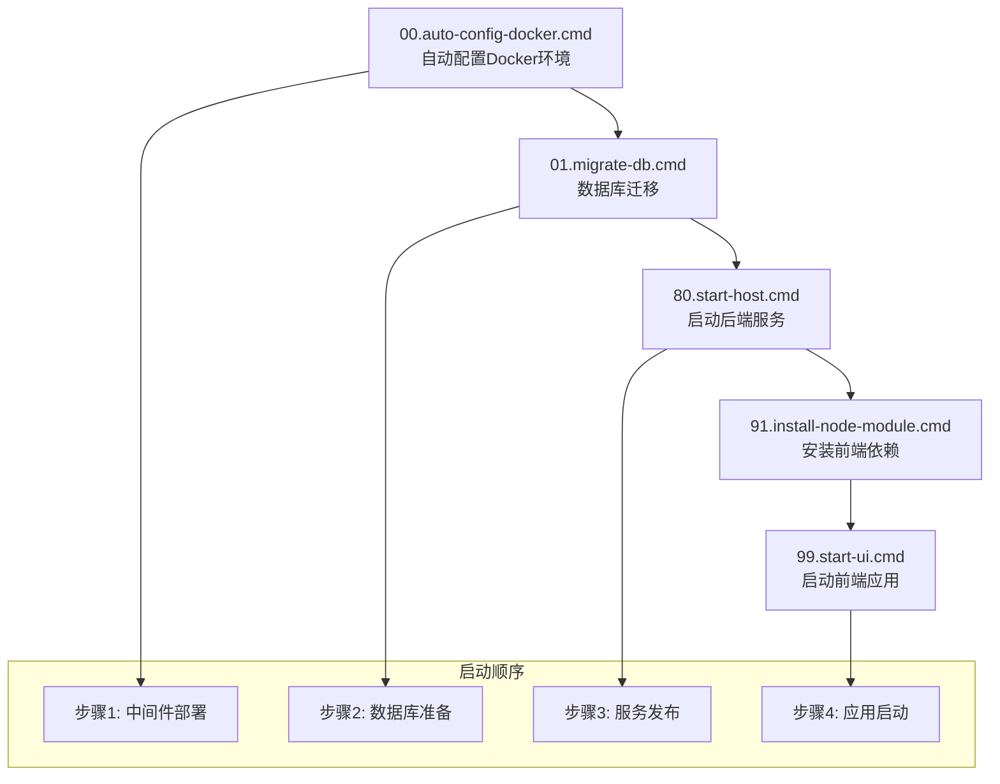

# Docker部署

<cite>
**本文档中引用的文件**
- [docker-compose.yml](file://docker-compose.yml)
- [docker-compose.override.yml](file://docker-compose.override.yml)
- [docker-compose.override.agile.yml](file://docker-compose.override.agile.yml)
- [docker-compose.override.configuration.yml](file://docker-compose.override.configuration.yml)
- [docker-compose.middleware.yml](file://docker-compose.middleware.yml)
- [deploy.ps1](file://deploy/deploy.ps1)
- [00.auto-config-docker.cmd](file://starter/00.auto-config-docker.cmd)
- [readme.md](file://starter/readme.md)
</cite>

## 目录
1. [简介](#简介)
2. [项目架构概览](#项目架构概览)
3. [核心服务组件](#核心服务组件)
4. [Docker Compose配置详解](#docker-compose配置详解)
5. [环境配置管理](#环境配置管理)
6. [中间件服务部署](#中间件服务部署)
7. [部署流程与最佳实践](#部署流程与最佳实践)
8. [运维监控配置](#运维监控配置)
9. [故障排查指南](#故障排查指南)
10. [总结](#总结)

## 简介

本项目采用基于Docker Compose的容器化部署方案，实现了微服务架构的完整容器化部署。该部署方案支持多种环境配置，包括开发、测试和生产环境，并提供了灵活的配置管理和服务编排能力。

系统采用前后端分离架构，包含多个独立的微服务，通过API网关进行统一管理。所有服务都运行在Docker容器中，确保了环境的一致性和可移植性。

## 项目架构概览



**图表来源**
- [docker-compose.yml](file://docker-compose.yml#L1-L244)
- [docker-compose.middleware.yml](file://docker-compose.middleware.yml#L1-L115)

## 核心服务组件

### 服务编排结构

系统包含以下核心服务组件：

1. **认证服务系列**
   - `sts-server`: IdentityServer认证服务器
   - `sts-api`: 认证管理API服务

2. **业务服务系列**
   - `admin-api`: 后台管理系统API
   - `platform-api`: 平台管理服务
   - `localization-api`: 国际化服务
   - `messages-api`: 消息通知服务
   - `task-api`: 任务管理服务
   - `webhook-api`: Webhook管理服务
   - `workflow-api`: 工作流引擎服务
   - `wechat-api`: 微信集成服务

3. **网关服务**
   - `internal-apigateway`: 内部API网关

4. **前端服务**
   - `ui`: Vue.js前端应用

### 服务依赖关系



**图表来源**
- [docker-compose.yml](file://docker-compose.yml#L1-L244)
- [docker-compose.override.yml](file://docker-compose.override.yml#L1-L135)

**章节来源**
- [docker-compose.yml](file://docker-compose.yml#L1-L244)
- [docker-compose.override.yml](file://docker-compose.override.yml#L1-L135)

## Docker Compose配置详解

### 主配置文件 (docker-compose.yml)

主配置文件定义了所有服务的基本结构和网络配置：

```yaml
version: '3.4'

services:
  admin-api:
    hostname: admin-api
    container_name: admin-api
    environment:
      - ASPNETCORE_ENVIRONMENT=Development
      - ASPNETCORE_HTTP_PORTS=80
      - TZ=Asia/Shanghai
    ports:
      - "30010:80"
    networks:
      - abp-next-admin
    healthcheck:
      test: ["CMD-SHELL", "wget --spider http://localhost/healthz || exit"]
      interval: 10s
      timeout: 5s
      retries: 5
    extra_hosts:
      - "host.docker.internal:host-gateway"
      - "auth-server:host-gateway"
```

### 关键配置特性

1. **健康检查配置**
   - 所有服务都配置了健康检查机制
   - 使用wget命令检查 `/healthz` 端点
   - 配置重试策略确保服务稳定性

2. **网络配置**
   - 使用自定义桥接网络 `abp-next-admin`
   - 支持服务间通信和外部访问

3. **主机映射**
   - 使用 `extra_hosts` 配置主机别名
   - 支持 `host.docker.internal` 访问宿主机

### 服务构建配置

每个服务都配置了独立的构建上下文：

```yaml
services:
  admin-api:
    build:
      context: ./aspnet-core/services/Publish/admin
    volumes:
      - ./deploy/framework/admin/logs:/app/Logs
      - ./deploy/framework/admin/modules:/app/Modules
    restart: always
    depends_on:
      - sts-server
```

**章节来源**
- [docker-compose.yml](file://docker-compose.yml#L1-L244)
- [docker-compose.override.yml](file://docker-compose.override.yml#L1-L135)

## 环境配置管理

### 多环境配置策略

系统采用分层配置管理策略，支持多种环境配置：



**图表来源**
- [docker-compose.override.agile.yml](file://docker-compose.override.agile.yml#L1-L147)
- [docker-compose.override.configuration.yml](file://docker-compose.override.configuration.yml#L1-L614)

### 配置文件优先级

1. **基础配置** (`docker-compose.yml`)
   - 定义基本服务结构和网络
   - 包含所有服务的基础配置

2. **覆盖配置** (`docker-compose.override.yml`)
   - 提供本地开发环境的构建配置
   - 包含卷挂载和重启策略

3. **环境特定配置**
   - `docker-compose.override.agile.yml`: 敏捷配置中心
   - `docker-compose.override.configuration.yml`: 配置中心

### 环境变量管理

每个服务都配置了大量的环境变量，涵盖以下方面：

1. **数据库连接**
   ```yaml
   - ConnectionStrings__Default=Server=host.docker.internal;Database=Platform-V70;User Id=root;Password=123456
   ```

2. **缓存配置**
   ```yaml
   - Redis__Configuration=host.docker.internal,defaultDatabase=10
   - Redis__InstanceName=LINGYUN.Abp.Application
   ```

3. **消息队列**
   ```yaml
   - CAP__RabbitMQ__HostName=host.docker.internal
   - CAP__RabbitMQ__Port=5672
   - CAP__RabbitMQ__UserName=admin
   - CAP__RabbitMQ__Password=123456
   ```

4. **分布式锁**
   ```yaml
   - DistributedLock__IsEnabled=true
   - DistributedLock__Redis__Configuration=host.docker.internal,defaultDatabase=13
   ```

**章节来源**
- [docker-compose.override.agile.yml](file://docker-compose.override.agile.yml#L1-L147)
- [docker-compose.override.configuration.yml](file://docker-compose.override.configuration.yml#L1-L614)

## 中间件服务部署

### 中间件服务架构



**图表来源**
- [docker-compose.middleware.yml](file://docker-compose.middleware.yml#L1-L115)

### 数据库服务配置

MySQL服务配置了完整的持久化和初始化脚本：

```yaml
abp-mysql:
  image: mysql
  hostname: abp-mysql
  container_name: abp-mysql
  ports:
    - "3306:3306"
  environment:
    - MYSQL_ROOT_PASSWORD=123456
    - MYSQL_ROOT_HOST=%
    - TZ=Asia/Shanghai
  command:
    --default-authentication-plugin=mysql_native_password
    --character-set-server=utf8mb4
    --collation-server=utf8mb4_general_ci
    --lower_case_table_names=1
    --max_connections=1024
  volumes:
    - ./deploy/middleware/mysql/data:/var/lib/mysql
    - ./deploy/middleware/mysql/conf:/etc/mysql/conf.d
    - ./deploy/middleware/mysql/logs:/logs
    - ./deploy/mysql/docker-entrypoint-initdb.d:/docker-entrypoint-initdb.d
```

### 缓存服务配置

Redis服务配置了高可用和持久化：

```yaml
abp-redis:
  image: redis:6
  hostname: abp-redis
  container_name: abp-redis
  environment:
    - TZ=Asia/Shanghai
  volumes:
    - ./deploy/middleware/redis/data:/data
  ports:
    - "6379:6379"
  restart: always
```

### 消息队列服务配置

RabbitMQ服务配置了管理界面和持久化：

```yaml
abp-rabbitmq:
  image: rabbitmq:management
  hostname: abp-rabbitmq
  container_name: abp-rabbitmq
  ports:
    - "5672:5672"
    - "15672:15672"
    - "25672:25672"
  environment:
    - RABBITMQ_ERLANG_COOKIE=8ue48g9FJQ87YV9Hfd8yhg==
    - RABBITMQ_DEFAULT_VHOST=/
    - RABBITMQ_DEFAULT_USER=admin
    - RABBITMQ_DEFAULT_PASS=123456
    - TZ=Asia/Shanghai
  volumes:
    - ./deploy/middleware/rabbitmq/logs:/var/log/rabbitmq
    - ./deploy/middleware/rabbitmq/data:/var/lib/rabbitmq
```

### 搜索服务配置

Elasticsearch和Kibana配置了完整的日志和搜索功能：

```yaml
abp-elasticsearch:
  image: elasticsearch:7.16.3
  container_name: abp-elasticsearch
  restart: always
  environment:
    - "cluster.name=elasticsearch"
    - "discovery.type=single-node"
    - "ES_JAVA_OPTS=-Xms15g -Xmx15g"
    - TZ=Asia/Shanghai
  volumes:
    - ./deploy/middleware/elasticsearch/plugins:/usr/share/elasticsearch/plugins
    - ./deploy/middleware/elasticsearch/data:/usr/share/elasticsearch/data
  ports:
    - 9200:9200

abp-kibana:
  image: kibana:7.16.3
  container_name: abp-kibana
  restart: always
  depends_on:
    - abp-elasticsearch
  environment:
    - ELASTICSEARCH_URL=http://host.docker.internal:9200
    - TZ=Asia/Shanghai
  ports:
    - 5601:5601
```

**章节来源**
- [docker-compose.middleware.yml](file://docker-compose.middleware.yml#L1-L115)

## 部署流程与最佳实践

### 自动化部署脚本

系统提供了完整的自动化部署脚本：

```powershell
# 1. 部署中间件
Write-host "deploy middleware..."
Set-Location $rootFolder
docker-compose -f .\docker-compose.middleware.yml up -d --build

# 2. 等待数据库初始化
Write-host "initial database..."
Start-Sleep -Seconds 30

# 3. 创建数据库
Write-host "create database..."
Set-Location $aspnetcorePath
cmd.exe /c create-database.bat

# 4. 执行数据库迁移
Write-host "migrate database..."
Set-Location $buildPath
foreach ($solution in $migrationArray) {  
    Set-Location $solution.Path
    dotnet run --no-build
}

# 5. 发布程序包
Write-host "release .net project..."
Set-Location $buildPath
foreach ($solution in $serviceArray) {  
    $publishPath = $rootFolder + "/aspnet-core/services/Publish/" + $solution.Service + "/"
    dotnet publish -c Release -o $publishPath $solution.Path --no-cache
    $dockerFile = Join-Path $solution.Path "Dockerfile"
    if ((Test-Path $dockerFile)) {
        Copy-Item $dockerFile -Destination $publishPath
    }
}

# 6. 构建前端项目
Write-host "build front project..."
Set-Location $vuePath
pnpm install
pnpm build

# 7. 运行应用程序
Write-host "running application..."
Set-Location $rootFolder
docker-compose -f .\docker-compose.yml -f .\docker-compose.override.yml -f .\docker-compose.override.configuration.yml up -d --build
```

### 快速启动脚本

系统提供了快速启动脚本，简化部署流程：



**图表来源**
- [deploy.ps1](file://deploy/deploy.ps1#L1-L60)
- [readme.md](file://starter/readme.md#L1-L11)

### 部署最佳实践

1. **环境隔离**
   - 使用独立的Docker网络隔离服务
   - 配置适当的防火墙规则
   - 使用不同的端口避免冲突

2. **资源规划**
   - 为Elasticsearch分配充足的内存
   - 配置合理的CPU和内存限制
   - 使用持久化存储确保数据安全

3. **监控和日志**
   - 启用健康检查机制
   - 配置集中式日志收集
   - 设置告警机制

4. **备份策略**
   - 定期备份数据库
   - 保存配置文件
   - 备份容器镜像

**章节来源**
- [deploy.ps1](file://deploy/deploy.ps1#L1-L60)
- [00.auto-config-docker.cmd](file://starter/00.auto-config-docker.cmd#L1-L27)

## 运维监控配置

### 健康检查配置

所有服务都配置了健康检查机制：

```yaml
healthcheck:
  test: ["CMD-SHELL", "wget --spider http://localhost/healthz || exit"]
  interval: 10s
  timeout: 5s
  retries: 5
```

### 日志收集配置

每个服务都配置了日志卷挂载：

```yaml
volumes:
  - ./deploy/framework/admin/logs:/app/Logs
  - ./deploy/framework/admin/modules:/app/Modules
```

### 监控指标暴露

系统集成了多种监控工具：

1. **Elasticsearch监控**
   - 指标收集和存储
   - 性能监控
   - 错误追踪

2. **Kibana可视化**
   - 数据可视化
   - 报表生成
   - 实时监控

3. **RabbitMQ管理界面**
   - 消息队列监控
   - 队列状态查看
   - 性能指标

### 分布式追踪

系统支持分布式追踪和链路追踪：

```yaml
CAP__EventBus__DefaultGroup=BackendAdmin
CAP__EventBus__Version=v1
CAP__EventBus__FailedRetryInterval=300
CAP__EventBus__FailedRetryCount=10
```

**章节来源**
- [docker-compose.yml](file://docker-compose.yml#L1-L244)
- [docker-compose.override.configuration.yml](file://docker-compose.override.configuration.yml#L1-L614)

## 故障排查指南

### 常见问题及解决方案

#### 1. 容器启动失败

**症状**: 容器无法正常启动或频繁重启

**排查步骤**:
```bash
# 查看容器日志
docker logs container_name

# 检查容器状态
docker ps -a

# 检查网络连接
docker network inspect abp-next-admin
```

**解决方案**:
- 检查环境变量配置
- 验证端口是否被占用
- 确认依赖服务是否正常运行

#### 2. 网络连接问题

**症状**: 服务间无法通信

**排查步骤**:
```bash
# 测试网络连通性
docker exec container_name ping host.docker.internal

# 检查DNS解析
docker exec container_name nslookup auth-server
```

**解决方案**:
- 配置正确的 `extra_hosts`
- 检查网络驱动类型
- 验证防火墙设置

#### 3. 数据卷权限错误

**症状**: 容器无法写入数据卷

**排查步骤**:
```bash
# 检查卷权限
ls -la ./deploy/

# 检查容器用户
docker exec container_name whoami
```

**解决方案**:
- 修改卷权限
- 使用正确的用户ID
- 配置SELinux标签

#### 4. 数据库连接失败

**症状**: 服务无法连接到数据库

**排查步骤**:
```bash
# 检查数据库容器状态
docker logs abp-mysql

# 测试数据库连接
docker exec -it abp-mysql mysql -u root -p
```

**解决方案**:
- 验证数据库密码
- 检查网络配置
- 确认数据库服务状态

### 调试工具和技巧

1. **容器调试**
   ```bash
   # 进入容器交互模式
   docker exec -it container_name bash
   
   # 查看进程状态
   docker exec container_name ps aux
   ```

2. **网络调试**
   ```bash
   # 网络连通性测试
   docker exec container_name telnet target_host port
   
   # 网络配置检查
   docker exec container_name ip addr show
   ```

3. **性能监控**
   ```bash
   # 容器资源使用情况
   docker stats
   
   # 系统资源使用情况
   docker system df
   ```

### 日志分析

系统提供了完整的日志收集和分析能力：

1. **服务日志**
   - 存储在 `./deploy/framework/*/logs/` 目录
   - 支持轮转和清理
   - 可配置日志级别

2. **中间件日志**
   - 数据库操作日志
   - 缓存访问日志
   - 消息队列日志

3. **应用日志**
   - 结构化日志格式
   - 集中式日志收集
   - 日志搜索和过滤

## 总结

本Docker部署方案提供了完整的微服务容器化解决方案，具有以下特点：

### 核心优势

1. **模块化设计**
   - 清晰的服务边界
   - 独立的配置管理
   - 灵活的扩展能力

2. **环境一致性**
   - 开发、测试、生产环境统一
   - 自动化部署流程
   - 版本控制和回滚

3. **运维友好**
   - 完整的监控体系
   - 详细的日志记录
   - 简单的故障排查

4. **高性能**
   - 优化的资源配置
   - 高可用架构设计
   - 缓存和负载均衡

### 最佳实践建议

1. **生产环境部署**
   - 使用专用的生产配置文件
   - 配置SSL证书和HTTPS
   - 设置适当的资源限制

2. **监控和告警**
   - 配置完整的监控指标
   - 设置告警规则
   - 定期检查系统健康状态

3. **安全加固**
   - 使用强密码和密钥
   - 配置网络安全策略
   - 定期更新容器镜像

4. **备份和恢复**
   - 定期备份重要数据
   - 测试恢复流程
   - 制定灾难恢复计划

通过遵循这些最佳实践和配置指南，可以确保系统的稳定运行和高效维护。Docker容器化部署不仅提高了开发效率，还为系统的可扩展性和可维护性奠定了坚实的基础。