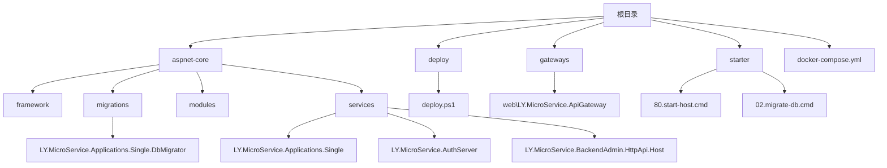
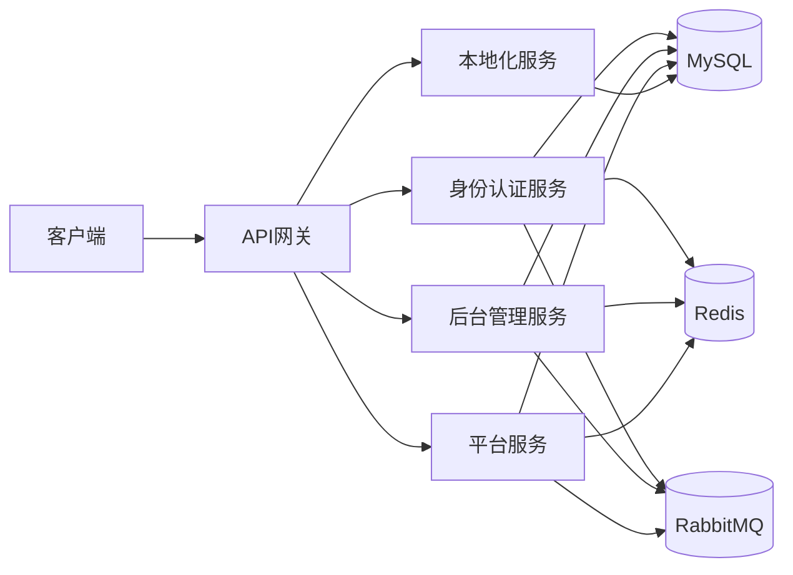
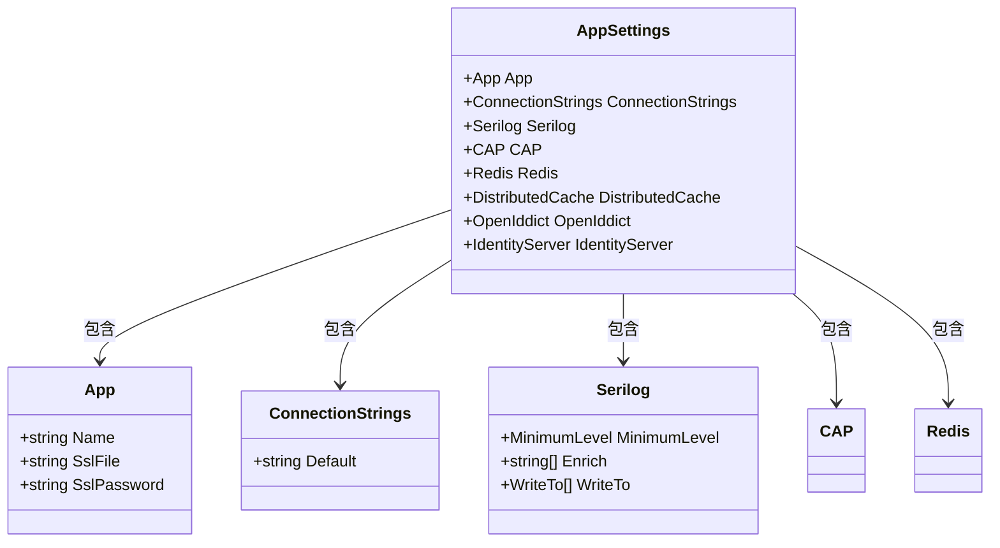
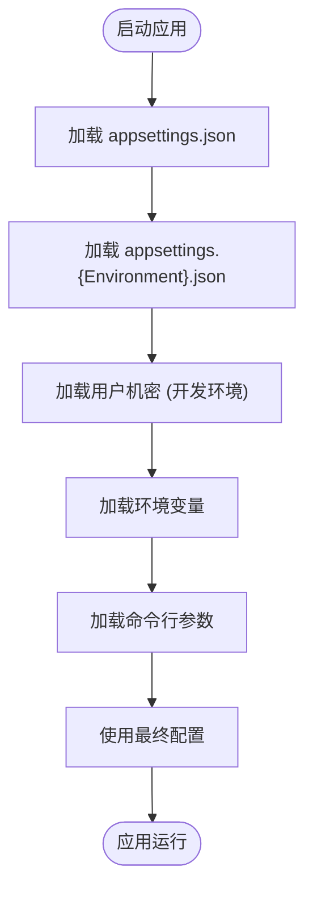
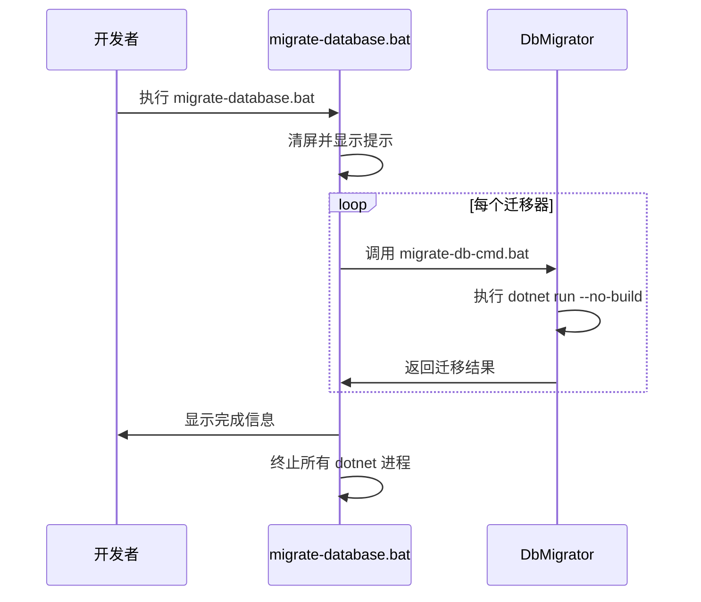
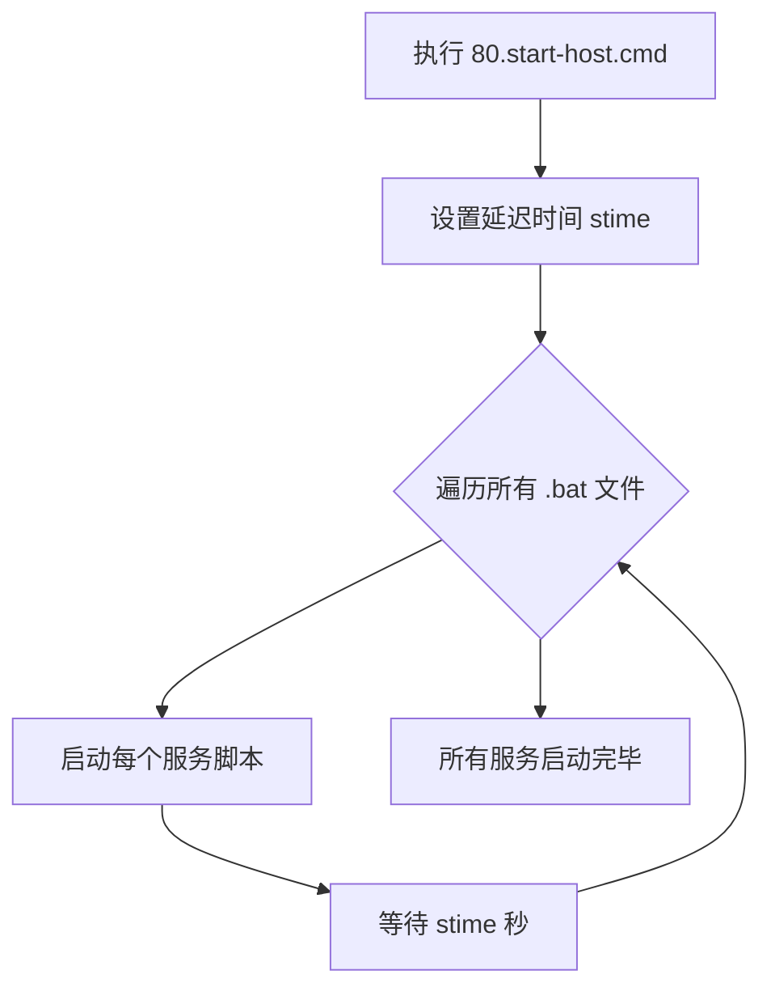
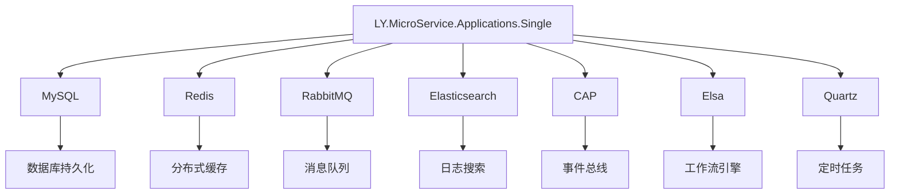
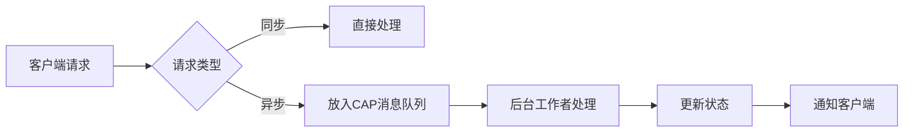

# 单体部署

<cite>
**本文档中引用的文件**  
- [appsettings.json](file://aspnet-core/services/LY.MicroService.Applications.Single/appsettings.json)
- [appsettings.Development.json](file://aspnet-core/services/LY.MicroService.Applications.Single/appsettings.Development.json)
- [migrate-database.bat](file://aspnet-core/migrate-database.bat)
- [migrate-db-cmd.bat](file://aspnet-core/migrate-db-cmd.bat)
- [start-http-api-host.bat](file://aspnet-core/start-http-api-host.bat)
- [80.start-host.cmd](file://starter/80.start-host.cmd)
- [deploy.ps1](file://deploy/deploy.ps1)
- [docker-compose.yml](file://docker-compose.yml)
- [docker-compose.override.yml](file://docker-compose.override.yml)
</cite>

## 目录

1. [简介](#简介)
2. [项目结构](#项目结构)
3. [核心组件](#核心组件)
4. [架构概述](#架构概述)
5. [详细组件分析](#详细组件分析)
6. [依赖分析](#依赖分析)
7. [性能考虑](#性能考虑)
8. [故障排除指南](#故障排除指南)
9. [结论](#结论)

## 简介

本项目是一个基于 ABP 框架的后台管理系统，支持单体服务和微服务两种部署模式。本文档重点介绍单体服务的完整部署流程，包括应用程序的编译、打包、发布、配置管理、服务化部署以及性能调优等关键环节。系统采用 .NET 6 技术栈，结合 Vue Vben Admin 前端框架，实现了现代化的企业级应用架构。

## 项目结构

项目采用分层架构设计，主要分为以下几个部分：



**图示来源**  
- [docker-compose.yml](file://docker-compose.yml)
- [aspnet-core](file://aspnet-core)

**本节来源**  
- [README.md](file://README.md#L0-L321)

## 核心组件

系统的核心组件包括身份认证服务器、后台管理API主机、平台服务等。这些服务通过CAP（分布式事件总线）进行通信，并使用Elsa工作流引擎实现业务流程自动化。数据库采用MySQL，缓存使用Redis，消息队列使用RabbitMQ。所有服务共享同一套配置体系，通过`appsettings.json`及其环境变体进行配置管理。

**本节来源**  
- [appsettings.json](file://aspnet-core/services/LY.MicroService.Applications.Single/appsettings.json#L0-L95)
- [appsettings.Development.json](file://aspnet-core/services/LY.MicroService.Applications.Single/appsettings.Development.json#L0-L199)

## 架构概述

系统采用单体架构部署模式，所有微服务模块被打包为一个独立的应用程序运行。



**图示来源**  
- [docker-compose.yml](file://docker-compose.yml)
- [docker-compose.override.yml](file://docker-compose.override.yml)

## 详细组件分析

### 应用程序配置分析

系统使用ASP.NET Core的标准配置系统，支持多环境配置文件。

#### 配置文件结构


**图示来源**  
- [appsettings.json](file://aspnet-core/services/LY.MicroService.Applications.Single/appsettings.json#L0-L95)
- [appsettings.Development.json](file://aspnet-core/services/LY.MicroService.Applications.Single/appsettings.Development.json#L0-L199)

#### 配置加载流程


**本节来源**  
- [appsettings.json](file://aspnet-core/services/LY.MicroService.Applications.Single/appsettings.json#L0-L95)
- [appsettings.Development.json](file://aspnet-core/services/LY.MicroService.Applications.Single/appsettings.Development.json#L0-L199)

### 部署流程分析

#### 数据库迁移流程


**图示来源**  
- [migrate-database.bat](file://aspnet-core/migrate-database.bat#L0-L12)
- [migrate-db-cmd.bat](file://aspnet-core/migrate-db-cmd.bat#L0-L31)

#### 服务启动流程


**图示来源**  
- [80.start-host.cmd](file://starter/80.start-host.cmd#L0-L8)
- [start-http-api-host.bat](file://aspnet-core/start-http-api-host.bat#L0-L36)

## 依赖分析

系统依赖关系复杂，涉及多个外部组件和服务。



**图示来源**  
- [appsettings.Development.json](file://aspnet-core/services/LY.MicroService.Applications.Single/appsettings.Development.json#L0-L199)
- [docker-compose.yml](file://docker-compose.yml)

**本节来源**  
- [appsettings.Development.json](file://aspnet-core/services/LY.MicroService.Applications.Single/appsettings.Development.json#L0-L199)
- [docker-compose.yml](file://docker-compose.yml)

## 性能考虑

### 线程池配置

系统通过ASP.NET Core内置的线程池管理机制进行性能优化。建议在生产环境中根据服务器CPU核心数调整线程池大小：

```json
{
  "System": {
    "Threading": {
      "ThreadPool": {
        "MinThreads": 100,
        "MaxThreads": 200
      }
    }
  }
}
```

### 内存限制设置

使用Docker部署时，应设置合理的内存限制：

```yaml
services:
  applications.single:
    mem_limit: 2g
    mem_reservation: 1g
```

### 请求队列管理

系统通过Serilog日志系统和CAP消息队列实现请求的异步处理和流量削峰：



**本节来源**  
- [appsettings.json](file://aspnet-core/services/LY.MicroService.Applications.Single/appsettings.json#L0-L95)
- [appsettings.Development.json](file://aspnet-core/services/LY.MicroService.Applications.Single/appsettings.Development.json#L0-L199)

## 故障排除指南

### 常见问题及解决方案

1. **数据库迁移失败**
   - 检查数据库连接字符串是否正确
   - 确认数据库服务是否已启动
   - 查看`Logs/Error-.log`中的详细错误信息

2. **服务无法启动**
   - 检查端口是否被占用
   - 确认依赖服务（Redis、RabbitMQ）是否正常运行
   - 查看控制台输出的错误信息

3. **配置不生效**
   - 确认环境变量`ASPNETCORE_ENVIRONMENT`设置正确
   - 检查配置文件命名是否符合规范
   - 验证配置项名称拼写是否正确

**本节来源**  
- [README.md](file://README.md#L0-L321)
- [deploy.ps1](file://deploy/deploy.ps1#L0-L59)

## 结论

本文档详细介绍了基于ABP框架的单体应用部署方案。通过合理的配置管理、自动化部署脚本和性能调优策略，可以实现系统的高效部署和稳定运行。建议在生产环境中使用Docker容器化部署，结合CI/CD流水线实现自动化发布，以提高部署效率和系统可靠性。