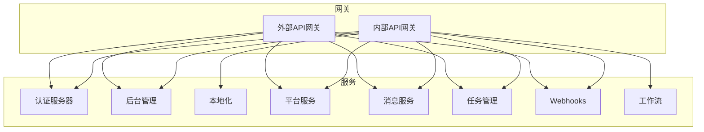
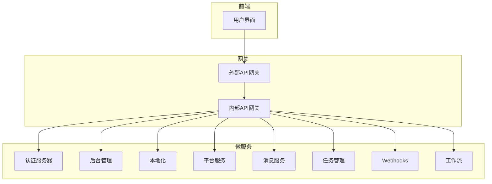
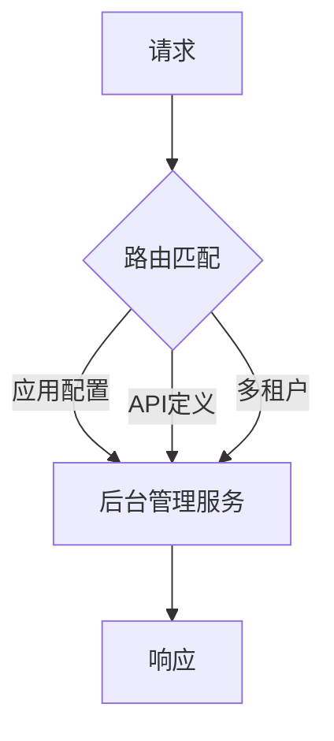
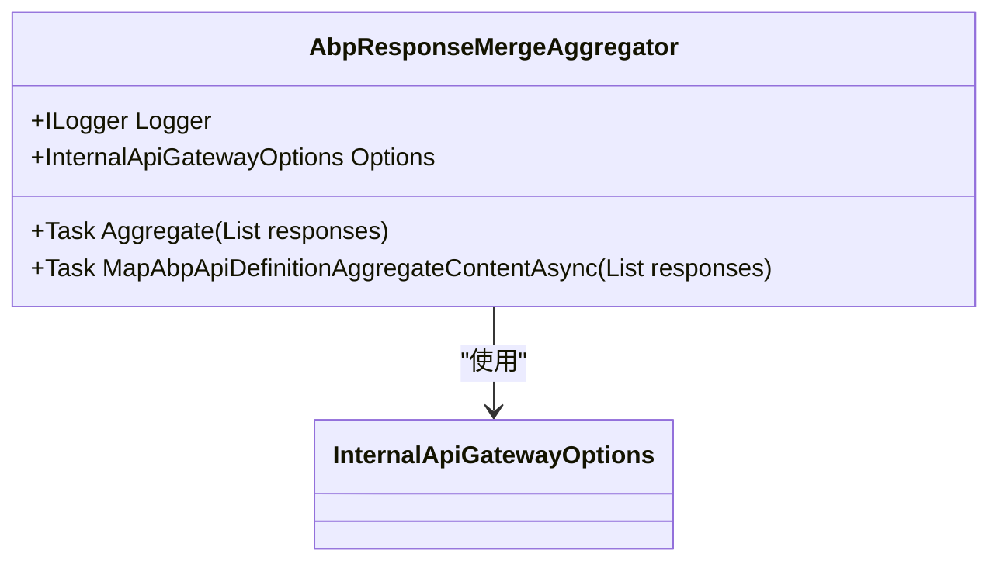
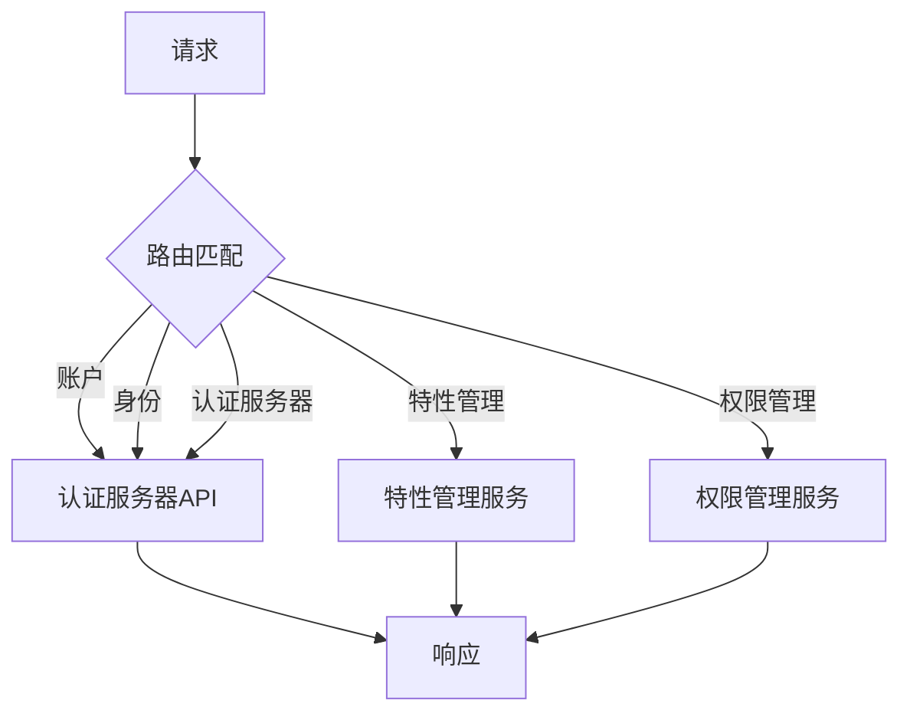
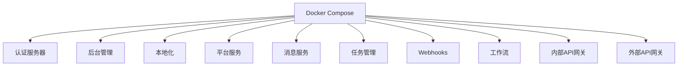
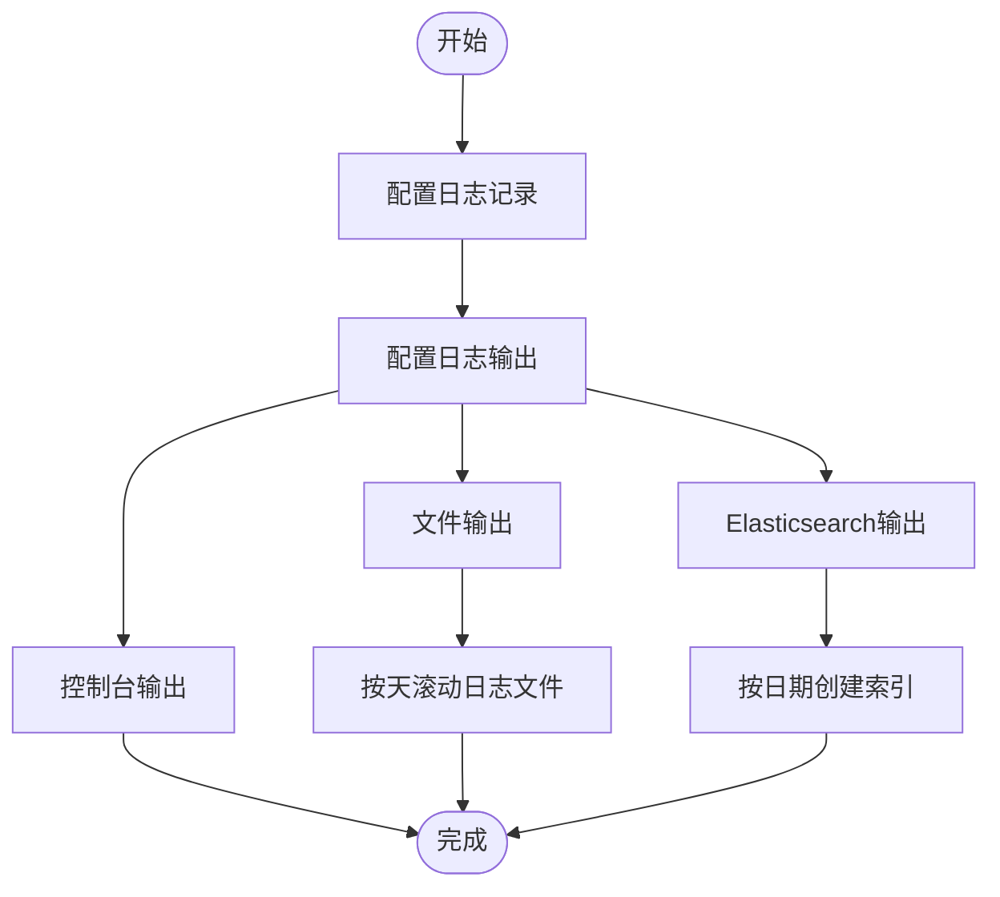

# API网关部署

<cite>
**本文档引用的文件**
- [ocelot.json](file://gateways/internal/LINGYUN.MicroService.Internal.ApiGateway/src/LINGYUN.MicroService.Internal.ApiGateway/ocelot.json)
- [yarp.json](file://gateways/web/LY.MicroService.ApiGateway/yarp.json)
- [InternalApiGatewayOptions.cs](file://gateways/internal/LINGYUN.MicroService.Internal.ApiGateway/src/LINGYUN.MicroService.Internal.ApiGateway/InternalApiGatewayOptions.cs)
- [AbpResponseMergeAggregator.cs](file://gateways/internal/LINGYUN.MicroService.Internal.ApiGateway/src/LINGYUN.MicroService.Internal.ApiGateway/Ocelot/Multiplexer/AbpResponseMergeAggregator.cs)
- [Program.cs](file://gateways/internal/LINGYUN.MicroService.Internal.ApiGateway/src/LINGYUN.MicroService.Internal.ApiGateway/Program.cs)
- [appsettings.json](file://gateways/internal/LINGYUN.MicroService.Internal.ApiGateway/src/LINGYUN.MicroService.Internal.ApiGateway/appsettings.json)
- [docker-compose.yml](file://docker-compose.yml)
- [deploy.ps1](file://deploy/deploy.ps1)
</cite>

## 目录
1. [简介](#简介)
2. [项目结构](#项目结构)
3. [核心组件](#核心组件)
4. [架构概述](#架构概述)
5. [详细组件分析](#详细组件分析)
6. [依赖分析](#依赖分析)
7. [性能考虑](#性能考虑)
8. [故障排除指南](#故障排除指南)
9. [结论](#结论)

## 简介
本文档详细说明了内部和外部API网关的部署配置，包括Ocelot和YARP的路由规则配置、请求聚合、认证集成、限流熔断策略。文档涵盖了网关集群的部署方案，确保高可用性。提供了与认证服务的深度集成配置，包括JWT验证、权限检查。说明了网关的监控配置、日志收集和性能调优策略，以及在Kubernetes环境下的部署最佳实践。

## 项目结构
项目包含两个主要的网关：内部API网关和外部API网关。内部API网关使用Ocelot实现，外部API网关使用YARP实现。两个网关都配置了详细的路由规则和认证集成。

**图示来源**
- [yarp.json](file://gateways/web/LY.MicroService.ApiGateway/yarp.json)
- [ocelot.json](file://gateways/internal/LINGYUN.MicroService.Internal.ApiGateway/src/LINGYUN.MicroService.Internal.ApiGateway/ocelot.json)

**本节来源**
- [gateways](file://gateways)

## 核心组件
核心组件包括内部API网关和外部API网关，分别使用Ocelot和YARP实现。内部API网关负责聚合多个微服务的API定义，外部API网关负责路由到各个微服务。

**本节来源**
- [InternalApiGatewayOptions.cs](file://gateways/internal/LINGYUN.MicroService.Internal.ApiGateway/src/LINGYUN.MicroService.Internal.ApiGateway/InternalApiGatewayOptions.cs)
- [AbpResponseMergeAggregator.cs](file://gateways/internal/LINGYUN.MicroService.Internal.ApiGateway/src/LINGYUN.MicroService.Internal.ApiGateway/Ocelot/Multiplexer/AbpResponseMergeAggregator.cs)

## 架构概述
系统架构采用微服务架构，通过API网关统一对外提供服务。内部API网关使用Ocelot实现，负责聚合多个微服务的API定义；外部API网关使用YARP实现，负责路由到各个微服务。

**图示来源**
- [docker-compose.yml](file://docker-compose.yml)
- [yarp.json](file://gateways/web/LY.MicroService.ApiGateway/yarp.json)
- [ocelot.json](file://gateways/internal/LINGYUN.MicroService.Internal.ApiGateway/src/LINGYUN.MicroService.Internal.ApiGateway/ocelot.json)

## 详细组件分析
### 内部API网关分析
内部API网关使用Ocelot实现，配置了详细的路由规则和聚合策略。

#### 路由配置
内部API网关的路由配置在`ocelot.json`文件中定义，包括应用配置、API定义和多租户等路由。

**图示来源**
- [ocelot.json](file://gateways/internal/LINGYUN.MicroService.Internal.ApiGateway/src/LINGYUN.MicroService.Internal.ApiGateway/ocelot.json)

#### 请求聚合
内部API网关实现了请求聚合功能，通过自定义的`AbpResponseMergeAggregator`类实现。

**图示来源**
- [AbpResponseMergeAggregator.cs](file://gateways/internal/LINGYUN.MicroService.Internal.ApiGateway/src/LINGYUN.MicroService.Internal.ApiGateway/Ocelot/Multiplexer/AbpResponseMergeAggregator.cs)
- [InternalApiGatewayOptions.cs](file://gateways/internal/LINGYUN.MicroService.Internal.ApiGateway/src/LINGYUN.MicroService.Internal.ApiGateway/InternalApiGatewayOptions.cs)

**本节来源**
- [AbpResponseMergeAggregator.cs](file://gateways/internal/LINGYUN.MicroService.Internal.ApiGateway/src/LINGYUN.MicroService.Internal.ApiGateway/Ocelot/Multiplexer/AbpResponseMergeAggregator.cs)
- [InternalApiGatewayOptions.cs](file://gateways/internal/LINGYUN.MicroService.Internal.ApiGateway/src/LINGYUN.MicroService.Internal.ApiGateway/InternalApiGatewayOptions.cs)

### 外部API网关分析
外部API网关使用YARP实现，配置了详细的路由规则。

#### 路由配置
外部API网关的路由配置在`yarp.json`文件中定义，包括账户、身份、认证服务器等路由。

**图示来源**
- [yarp.json](file://gateways/web/LY.MicroService.ApiGateway/yarp.json)

**本节来源**
- [yarp.json](file://gateways/web/LY.MicroService.ApiGateway/yarp.json)

## 依赖分析
系统依赖于多个微服务和中间件，通过Docker Compose进行部署管理。

**图示来源**
- [docker-compose.yml](file://docker-compose.yml)

**本节来源**
- [docker-compose.yml](file://docker-compose.yml)

## 性能考虑
网关配置了详细的日志记录和监控策略，确保系统的稳定性和可维护性。

**图示来源**
- [appsettings.json](file://gateways/internal/LINGYUN.MicroService.Internal.ApiGateway/src/LINGYUN.MicroService.Internal.ApiGateway/appsettings.json)

## 故障排除指南
### 启动问题
如果网关无法启动，请检查以下几点：
1. 确认所有依赖服务已启动
2. 检查配置文件是否正确
3. 查看日志文件获取详细错误信息

### 路由问题
如果路由不工作，请检查：
1. 路由配置是否正确
2. 目标服务是否可达
3. 网络配置是否正确

**本节来源**
- [Program.cs](file://gateways/internal/LINGYUN.MicroService.Internal.ApiGateway/src/LINGYUN.MicroService.Internal.ApiGateway/Program.cs)
- [deploy.ps1](file://deploy/deploy.ps1)

## 结论
本文档详细介绍了API网关的部署配置，包括内部和外部网关的实现、路由规则、认证集成、监控配置等。通过合理的配置和部署，可以确保系统的高可用性和稳定性。