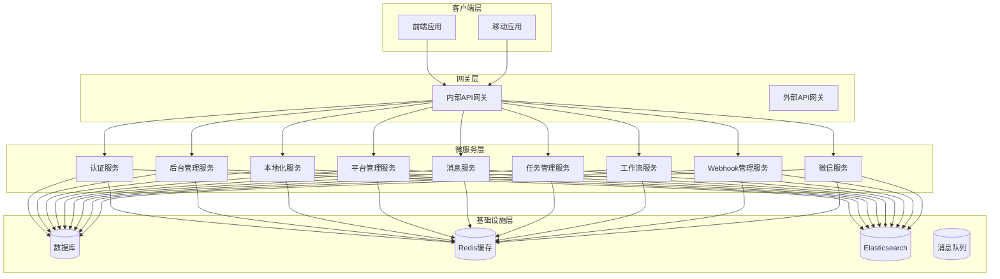
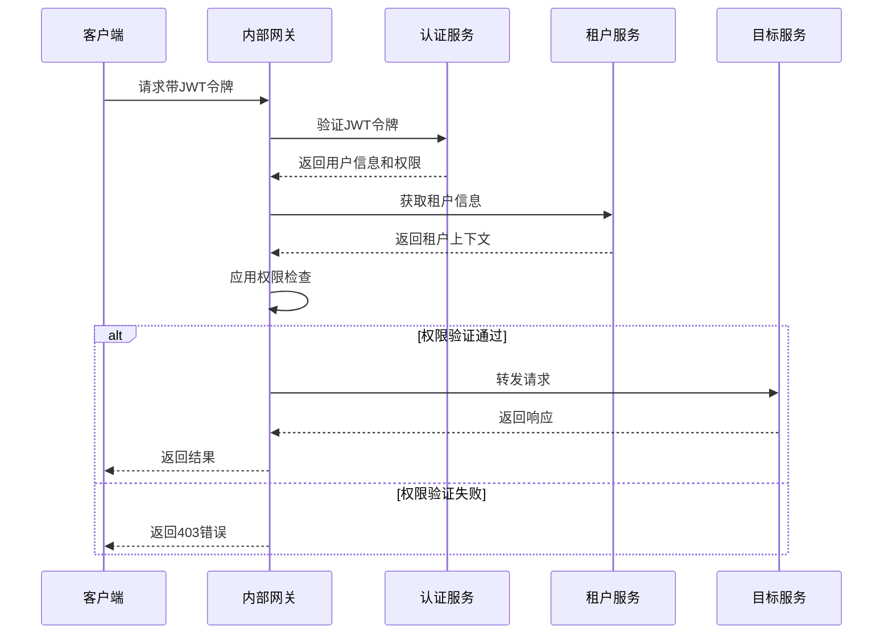
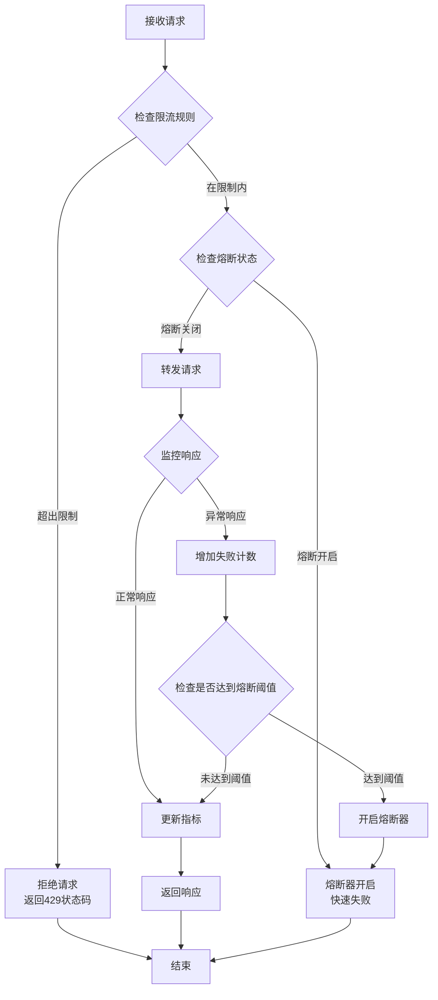
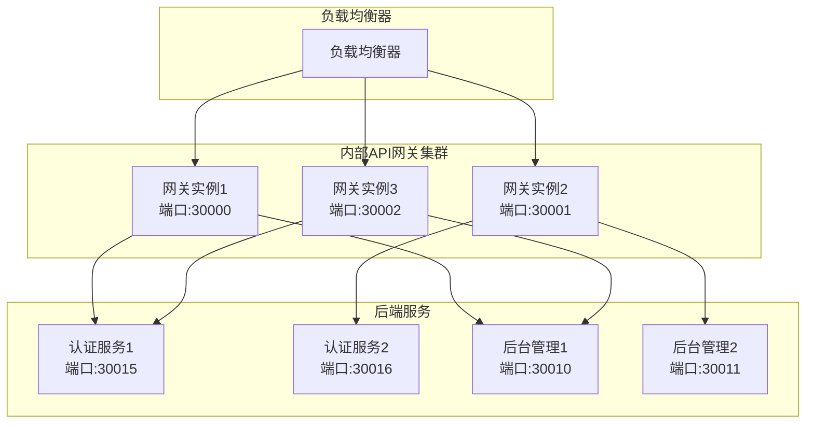
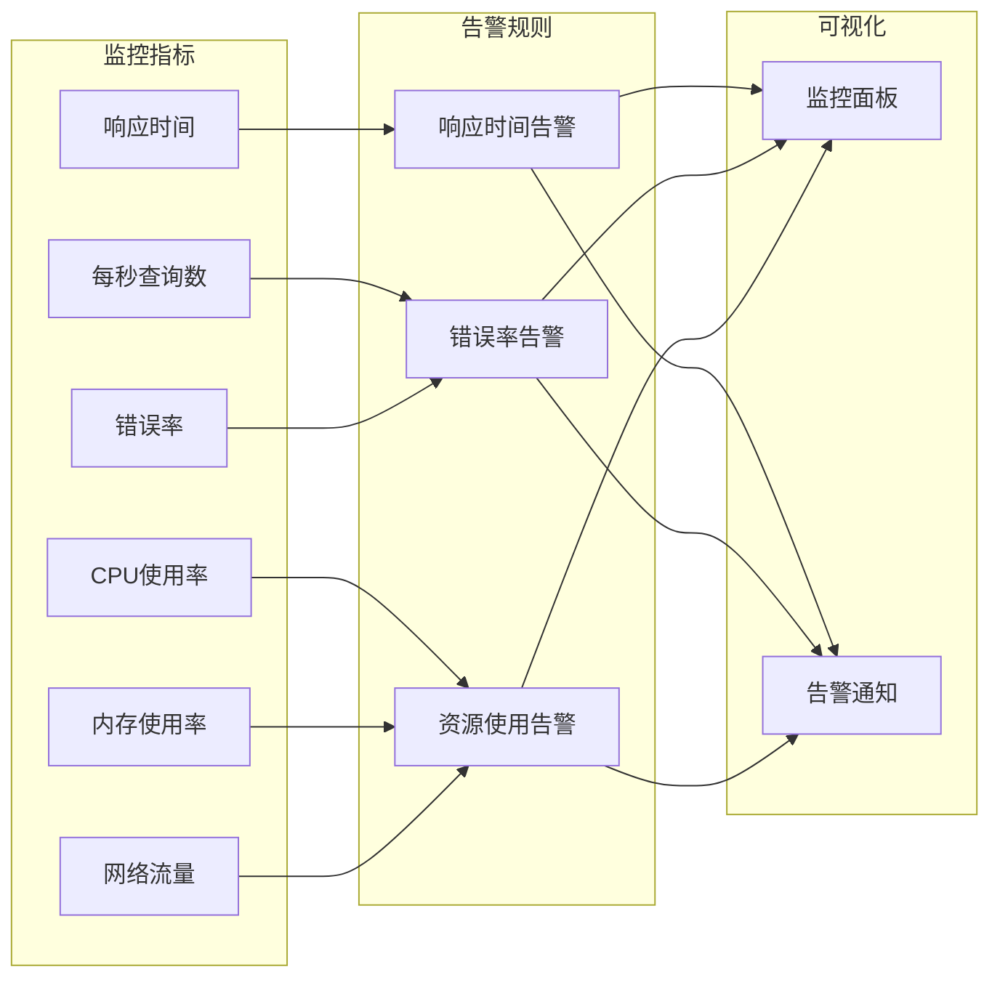
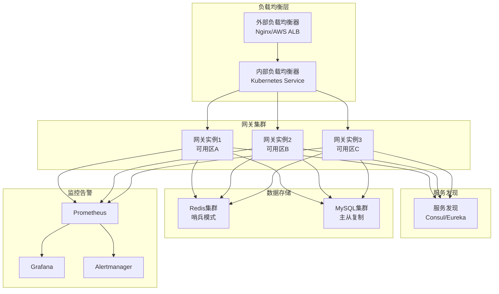
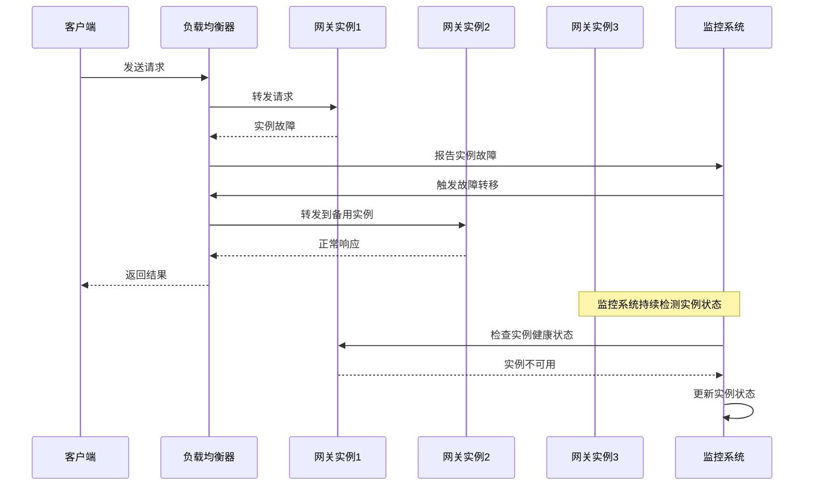

现在我已经收集了足够的信息来创建内部API网关部署文档。让我开始编写文档：

<docs>
# 内部API网关部署文档

<cite>
**本文档中引用的文件**
- [Program.cs](file://gateways/internal/LINGYUN.MicroService.Internal.ApiGateway/src/LINGYUN.MicroService.Internal.ApiGateway/Program.cs)
- [InternalApiGatewayModule.cs](file://gateways/internal/LINGYUN.MicroService.Internal.ApiGateway/src/LINGYUN.MicroService.Internal.ApiGateway/InternalApiGatewayModule.cs)
- [InternalApiGatewayOptions.cs](file://gateways/internal/LINGYUN.MicroService.Internal.ApiGateway/src/LINGYUN.MicroService.Internal.ApiGateway/InternalApiGatewayOptions.cs)
- [DownstreamOpenApi.cs](file://gateways/internal/LINGYUN.MicroService.Internal.ApiGateway/src/LINGYUN.MicroService.Internal.ApiGateway/Models/DownstreamOpenApi.cs)
- [ocelot.json](file://gateways/internal/LINGYUN.MicroService.Internal.ApiGateway/src/LINGYUN.MicroService.Internal.ApiGateway/ocelot.json)
- [appsettings.json](file://gateways/internal/LINGYUN.MicroService.Internal.ApiGateway/src/LINGYUN.MicroService.Internal.ApiGateway/appsettings.json)
- [docker-compose.yml](file://docker-compose.yml)
- [start-internal-gateway.bat](file://aspnet-core/start-internal-gateway.bat)
- [70.start-internal-gateway.bat](file://starter/70.start-internal-gateway.bat)
- [UserinfoIdentitySession.cs](file://aspnet-core/modules/openIddict/LINGYUN.Abp.OpenIddict.AspNetCore.Session/LINGYUN/Abp/OpenIddict/AspNetCore/Session/UserinfoIdentitySession.cs)
- [TenantHeaderParamter.cs](file://aspnet-core/services/LY.MicroService.IdentityServer.HttpApi.Host/TenantHeaderParamter.cs)
</cite>

## 目录
1. [简介](#简介)
2. [项目架构概览](#项目架构概览)
3. [核心组件分析](#核心组件分析)
4. [Ocelot配置详解](#ocelot配置详解)
5. [认证与授权集成](#认证与授权集成)
6. [限流与熔断策略](#限流与熔断策略)
7. [负载均衡配置](#负载均衡配置)
8. [监控与日志配置](#监控与日志配置)
9. [Kubernetes部署方案](#kubernetes部署方案)
10. [高可用性部署](#高可用性部署)
11. [故障排除指南](#故障排除指南)
12. [总结](#总结)

## 简介

本文档详细介绍了基于Ocelot的内部API网关部署配置，该网关是ABP Next Admin微服务架构的核心组件。网关提供了路由规则管理、服务发现、请求聚合、认证集成、限流熔断等关键功能，确保微服务之间的安全通信和高效协作。

内部API网关采用.NET Core技术栈，集成了ABP框架，支持多租户架构，并提供了完整的监控、日志和性能优化功能。

## 项目架构概览



**图表来源**
- [docker-compose.yml](file://docker-compose.yml#L1-L244)

## 核心组件分析

### 网关入口程序

内部API网关的入口程序位于`Program.cs`文件中，采用了现代化的.NET Core应用程序构建模式：

```csharp
public async static Task<int> Main(string[] args)
{
    try
    {
        Log.Information("Starting Internal ApiGateway.");
        
        var builder = WebApplication.CreateBuilder(args);
        
        builder.Host.AddAppSettingsSecretsJson()
           .UseAutofac()
           .ConfigureAppConfiguration((context, config) =>
           {
               var configuration = config.Build();
               var agileConfigEnabled = configuration["AgileConfig:IsEnabled"];
               if (agileConfigEnabled.IsNullOrEmpty() || bool.Parse(agileConfigEnabled))
               {
                   config.AddAgileConfig(new AgileConfig.Client.ConfigClient(configuration));
               }
               config.AddJsonFile("ocelot.json", optional: true, reloadOnChange: true);
               if (!context.HostingEnvironment.EnvironmentName.IsNullOrWhiteSpace())
               {
                   config.AddJsonFile($"ocelot.{context.HostingEnvironment.EnvironmentName}.json", optional: true, reloadOnChange: true);
               }
           })
            .UseSerilog((context, provider, config) =>
            {
                config.ReadFrom.Configuration(context.Configuration);
            });
            
        await builder.AddApplicationAsync<InternalApiGatewayModule>(options =>
        {
            var pluginFolder = Path.Combine(Directory.GetCurrentDirectory(), "Modules");
            DirectoryHelper.CreateIfNotExists(pluginFolder);
            options.PlugInSources.AddFolder(pluginFolder, SearchOption.AllDirectories);
        });
        
        var app = builder.Build();
        await app.InitializeApplicationAsync();
        await app.RunAsync();
        return 0;
    }
    catch (Exception ex)
    {
        Log.Fatal(ex, "Host terminated unexpectedly!");
        return 1;
    }
    finally
    {
        Log.CloseAndFlush();
    }
}
```

### 网关模块配置

`InternalApiGatewayModule`是网关的核心模块，负责配置整个网关的功能：

```csharp
[DependsOn(
    typeof(AbpAutofacModule),
    typeof(AbpSerilogEnrichersApplicationModule),
    typeof(AbpSerilogEnrichersUniqueIdModule),
    typeof(AbpCachingStackExchangeRedisModule),
    typeof(AbpAspNetCoreSerilogModule)
)]
public partial class InternalApiGatewayModule : AbpModule
{
    public override void ConfigureServices(ServiceConfigurationContext context)
    {
        var hostingEnvironment = context.Services.GetHostingEnvironment();
        var configuration = context.Services.GetConfiguration();
        
        ConfigureLocalization();
        ConfigureJsonSerializer();
        ConfigureVirtualFileSystem();
        ConfigureCaching(configuration);
        ConfigureApiGateway(configuration);
        ConfigureKestrelServer(configuration, hostingEnvironment.IsDevelopment());
        ConfigureSecurity(context.Services, configuration, hostingEnvironment.IsDevelopment());
        ConfigureMvc(context.Services);
        ConfigureSwagger(context.Services);
        ConfigureCors(context.Services, configuration);
        ConfigureOcelot(context.Services, configuration);
    }
}
```

**章节来源**
- [Program.cs](file://gateways/internal/LINGYUN.MicroService.Internal.ApiGateway/src/LINGYUN.MicroService.Internal.ApiGateway/Program.cs#L1-L72)
- [InternalApiGatewayModule.cs](file://gateways/internal/LINGYUN.MicroService.Internal.ApiGateway/src/LINGYUN.MicroService.Internal.ApiGateway/InternalApiGatewayModule.cs#L1-L88)

## Ocelot配置详解

### 全局配置

Ocelot的全局配置包含了服务发现、限流、熔断、负载均衡等关键设置：

```json
{
  "GlobalConfiguration": {
    "RequestIdKey": null,
    "ServiceDiscoveryProvider": {
      "Scheme": null,
      "Host": null,
      "Port": 0,
      "Type": null,
      "Token": null,
      "ConfigurationKey": null,
      "PollingInterval": 0,
      "Namespace": null
    },
    "RateLimitOptions": {
      "ClientIdHeader": "ClientId",
      "QuotaExceededMessage": "您的操作过快,请稍后再试!",
      "RateLimitCounterPrefix": "ocelot",
      "DisableRateLimitHeaders": false,
      "HttpStatusCode": 429
    },
    "QoSOptions": {
      "ExceptionsAllowedBeforeBreaking": 30,
      "DurationOfBreak": 60000,
      "TimeoutValue": 30000
    },
    "BaseUrl": "http://localhost:30000",
    "LoadBalancerOptions": {
      "Type": "RoundRobin",
      "Key": null,
      "Expiry": 0
    },
    "DownstreamScheme": "HTTP",
    "HttpHandlerOptions": {
      "AllowAutoRedirect": false,
      "UseCookieContainer": false,
      "UseTracing": true,
      "UseProxy": true,
      "MaxConnectionsPerServer": 2147483647
    },
    "DownstreamHttpVersion": null
  }
}
```

### 路由配置示例

每个路由都包含详细的配置选项：

```json
{
  "DownstreamPathTemplate": "/api/abp/application-configuration",
  "UpstreamPathTemplate": "/api/abp/backend-admin/application-configuration",
  "UpstreamHttpMethod": ["GET"],
  "DownstreamHttpMethod": null,
  "AddHeadersToRequest": {},
  "UpstreamHeaderTransform": {},
  "DownstreamHeaderTransform": {},
  "AddClaimsToRequest": {},
  "RouteClaimsRequirement": {},
  "AddQueriesToRequest": {},
  "ChangeDownstreamPathTemplate": {},
  "RequestIdKey": null,
  "FileCacheOptions": {
    "TtlSeconds": 0,
    "Region": null
  },
  "RouteIsCaseSensitive": false,
  "ServiceName": null,
  "ServiceNamespace": null,
  "DownstreamScheme": "http",
  "QoSOptions": {
    "ExceptionsAllowedBeforeBreaking": 10,
    "DurationOfBreak": 1000,
    "TimeoutValue": 10000
  },
  "LoadBalancerOptions": {
    "Type": "RoundRobin",
    "Key": null,
    "Expiry": 0
  },
  "RateLimitOptions": {
    "ClientWhitelist": [],
    "EnableRateLimiting": false,
    "Period": null,
    "PeriodTimespan": 0.0,
    "Limit": 0
  },
  "AuthenticationOptions": {
    "AuthenticationProviderKey": null,
    "AllowedScopes": []
  },
  "HttpHandlerOptions": {
    "AllowAutoRedirect": false,
    "UseCookieContainer": false,
    "UseTracing": true,
    "UseProxy": true,
    "MaxConnectionsPerServer": 2147483647
  },
  "DownstreamHostAndPorts": [
    {
      "Host": "127.0.0.1",
      "Port": 30010
    }
  ],
  "UpstreamHost": null,
  "Key": "backend-admin-configuration",
  "DelegatingHandlers": [],
  "Priority": 1,
  "Timeout": 0,
  "DangerousAcceptAnyServerCertificateValidator": false,
  "SecurityOptions": {
    "IPAllowedList": [],
    "IPBlockedList": []
  },
  "DownstreamHttpVersion": null
}
```

**章节来源**
- [ocelot.json](file://gateways/internal/LINGYUN.MicroService.Internal.ApiGateway/src/LINGYUN.MicroService.Internal.ApiGateway/ocelot.json#L4306-L4348)
- [ocelot.json](file://gateways/internal/LINGYUN.MicroService.Internal.ApiGateway/src/LINGYUN.MicroService.Internal.ApiGateway/ocelot.json#L1-L199)

## 认证与授权集成

### JWT认证集成

网关与认证服务深度集成，支持JWT令牌验证和租户隔离：

```csharp
public async virtual ValueTask HandleAsync(OpenIddictServerEvents.HandleUserInfoRequestContext context)
{
    var tenantId = context.Principal.FindTenantId();
    using (CurrentTenant.Change(tenantId))
    {
        if (!await IdentitySessionChecker.ValidateSessionAsync(context.Principal))
        {
            context.Reject(Errors.InvalidToken, "The user session has expired.");
        }
    }
}
```

### 租户隔离配置

系统支持多租户架构，通过HTTP头部传递租户ID：

```csharp
public class TenantHeaderParamter : IOperationFilter
{
    private readonly AbpMultiTenancyOptions _multiTenancyOptions;
    private readonly AbpAspNetCoreMultiTenancyOptions _aspNetCoreMultiTenancyOptions;
    
    public void Apply(OpenApiOperation operation, OperationFilterContext context)
    {
        if (_multiTenancyOptions.IsEnabled)
        {
            operation.Parameters = operation.Parameters ?? new List<OpenApiParameter>();
            operation.Parameters.Add(new OpenApiParameter
            {
                Name = _aspNetCoreMultiTenancyOptions.TenantKey,
                In = ParameterLocation.Header,
                Description = "Tenant Id in http header",
                Required = false
            });
        }
    }
}
```

### 权限检查机制

网关实现了细粒度的权限检查，确保只有授权用户才能访问特定资源：



**图表来源**
- [UserinfoIdentitySession.cs](file://aspnet-core/modules/openIddict/LINGYUN.Abp.OpenIddict.AspNetCore.Session/LINGYUN/Abp/OpenIddict/AspNetCore/Session/UserinfoIdentitySession.cs#L29-L47)
- [TenantHeaderParamter.cs](file://aspnet-core/services/LY.MicroService.IdentityServer.HttpApi.Host/TenantHeaderParamter.cs#L1-L35)

**章节来源**
- [UserinfoIdentitySession.cs](file://aspnet-core/modules/openIddict/LINGYUN.Abp.OpenIddict.AspNetCore.Session/LINGYUN/Abp/OpenIddict/AspNetCore/Session/UserinfoIdentitySession.cs#L29-L47)
- [TenantHeaderParamter.cs](file://aspnet-core/services/LY.MicroService.IdentityServer.HttpApi.Host/TenantHeaderParamter.cs#L1-L35)

## 限流与熔断策略

### 限流配置

网关实现了基于令牌桶算法的限流机制：

```json
{
  "RateLimitOptions": {
    "ClientIdHeader": "ClientId",
    "QuotaExceededMessage": "您的操作过快,请稍后再试!",
    "RateLimitCounterPrefix": "ocelot",
    "DisableRateLimitHeaders": false,
    "HttpStatusCode": 429
  }
}
```

### 熔断配置

熔断器保护下游服务免受故障影响：

```json
{
  "QoSOptions": {
    "ExceptionsAllowedBeforeBreaking": 30,
    "DurationOfBreak": 60000,
    "TimeoutValue": 30000
  }
}
```

### 限流策略流程



## 负载均衡配置

### 负载均衡算法

网关支持多种负载均衡算法，默认使用轮询算法：

```json
{
  "LoadBalancerOptions": {
    "Type": "RoundRobin",
    "Key": null,
    "Expiry": 0
  }
}
```

### 多实例部署



**图表来源**
- [docker-compose.yml](file://docker-compose.yml#L150-L170)

## 监控与日志配置

### 日志配置

网关使用Serilog进行结构化日志记录，支持多种输出目标：

```json
{
  "Serilog": {
    "MinimumLevel": {
      "Default": "Debug",
      "Override": {
        "System": "Warning",
        "Microsoft": "Warning"
      }
    },
    "Enrich": [ 
      "FromLogContext", 
      "WithProcessId", 
      "WithThreadId", 
      "WithEnvironmentName", 
      "WithMachineName", 
      "WithApplicationName", 
      "WithUniqueId" 
    ],
    "WriteTo": [
      {
        "Name": "Console",
        "Args": {
          "initialMinimumLevel": "Information",
          "standardErrorFromLevel": "Information",
          "restrictedToMinimumLevel": "Information",
          "outputTemplate": "{Timestamp:yyyy-MM-dd HH:mm:ss} [{Level:u3}] [{SourceContext}] [{ProcessId}] [{ThreadId}] - {Message:lj}{NewLine}{Exception}"
        }
      },
      {
        "Name": "File",
        "Args": {
          "path": "Logs/Debug-.log",
          "restrictedToMinimumLevel": "Debug",
          "rollingInterval": "Day",
          "outputTemplate": "{Timestamp:yyyy-MM-dd HH:mm:ss} [{Level:u3}] [{SourceContext}] [{ProcessId}] [{ThreadId}] - {Message:lj}{NewLine}{Exception}"
        }
      }
    ]
  }
}
```

### 健康检查配置

每个服务都配置了健康检查端点：

```yaml
healthcheck:
  test: ["CMD-SHELL", "wget --spider http://localhost/healthz || exit"]
  interval: 10s
  timeout: 5s
  retries: 5
```

### 监控指标



**章节来源**
- [appsettings.json](file://gateways/internal/LINGYUN.MicroService.Internal.ApiGateway/src/LINGYUN.MicroService.Internal.ApiGateway/appsettings.json#L1-L81)
- [docker-compose.yml](file://docker-compose.yml#L20-L30)

## Kubernetes部署方案

### Docker Compose部署

系统提供了完整的Docker Compose配置，支持一键部署：

```yaml
version: '3.4'

services:
  internal-apigateway:
    hostname: apigateway
    container_name: apigateway
    environment:
      - ASPNETCORE_ENVIRONMENT=Development
      - ASPNETCORE_HTTP_PORTS=80
      - TZ=Asia/Shanghai
    ports:
      - "30000:80"
    networks:
      - abp-next-admin
    extra_hosts:
      - "host.docker.internal:host-gateway"
      - "auth-server:host-gateway"
      - "auth-server-api:host-gateway"
      - "localization-api:host-gateway"
      - "workflow-api:host-gateway"
      - "webhooks-api:host-gateway"
      - "wechat-api:host-gateway"
      - "messages-api:host-gateway"
      - "platform-api:host-gateway"
      - "tasks-api:host-gateway"
      - "admin-api:host-gateway"
```

### Kubernetes部署清单

```yaml
apiVersion: apps/v1
kind: Deployment
metadata:
  name: internal-apigateway
spec:
  replicas: 3
  selector:
    matchLabels:
      app: internal-apigateway
  template:
    metadata:
      labels:
        app: internal-apigateway
    spec:
      containers:
      - name: internal-apigateway
        image: internal-apigateway:latest
        ports:
        - containerPort: 80
        env:
        - name: ASPNETCORE_ENVIRONMENT
          value: "Production"
        - name: ASPNETCORE_HTTP_PORTS
          value: "80"
        resources:
          requests:
            memory: "256Mi"
            cpu: "250m"
          limits:
            memory: "512Mi"
            cpu: "500m"
        livenessProbe:
          httpGet:
            path: /healthz
            port: 80
          initialDelaySeconds: 30
          periodSeconds: 10
        readinessProbe:
          httpGet:
            path: /healthz
            port: 80
          initialDelaySeconds: 5
          periodSeconds: 5
---
apiVersion: v1
kind: Service
metadata:
  name: internal-apigateway-service
spec:
  selector:
    app: internal-apigateway
  ports:
  - protocol: TCP
    port: 80
    targetPort: 80
  type: LoadBalancer
```

### Helm Chart配置

```yaml
# values.yaml
replicaCount: 3

image:
  repository: internal-apigateway
  tag: latest
  pullPolicy: IfNotPresent

service:
  type: LoadBalancer
  port: 80

ingress:
  enabled: true
  className: ""
  annotations:
    kubernetes.io/ingress.class: nginx
    cert-manager.io/cluster-issuer: letsencrypt-prod
  hosts:
    - host: api.example.com
      paths:
        - path: /
          pathType: Prefix
  tls:
    - secretName: api-tls
      hosts:
        - api.example.com

resources:
  limits:
    cpu: 500m
    memory: 512Mi
  requests:
    cpu: 250m
    memory: 256Mi

autoscaling:
  enabled: true
  minReplicas: 2
  maxReplicas: 10
  targetCPUUtilizationPercentage: 70
  targetMemoryUtilizationPercentage: 80
```

**章节来源**
- [docker-compose.yml](file://docker-compose.yml#L150-L170)

## 高可用性部署

### 集群部署架构



### 故障转移机制



### 数据备份与恢复

```yaml
apiVersion: batch/v1
kind: CronJob
metadata:
  name: gateway-backup
spec:
  schedule: "0 2 * * *"  # 每天凌晨2点执行
  jobTemplate:
    spec:
      template:
        spec:
          containers:
          - name: backup
            image: postgres:13
            command:
            - /bin/bash
            - -c
            - |
              pg_dump -h postgres-primary -U postgres -d gateway_db > /backup/gateway-$(date +%Y%m%d).sql
              aws s3 cp /backup/gateway-$(date +%Y%m%d).sql s3://backup-bucket/gateway/
            env:
            - name: PGPASSWORD
              valueFrom:
                secretKeyRef:
                  name: postgres-secret
                  key: password
            volumeMounts:
            - name: backup-storage
              mountPath: /backup
          volumes:
          - name: backup-storage
            persistentVolumeClaim:
              claimName: backup-pvc
          restartPolicy: OnFailure
```

## 故障排除指南

### 常见问题诊断

#### 1. 网关启动失败

**症状**: 网关无法启动或启动后立即退出

**排查步骤**:
```bash
# 查看启动日志
docker logs apigateway

# 检查配置文件
cat ocelot.json | jq .

# 验证端口占用
netstat -tulpn | grep 30000

# 检查依赖服务
curl http://auth-server:44385/healthz
```

#### 2. 路由配置错误

**症状**: 请求被拒绝或返回404错误

**排查步骤**:
```bash
# 检查路由配置
curl http://localhost:30000/api/ApiGateway/Basic/Routes

# 验证上游路径
curl -v http://localhost:30000/api/abp/backend-admin/application-configuration

# 检查下游服务状态
curl http://127.0.0.1:30010/healthz
```

#### 3. 认证失败

**症状**: JWT令牌验证失败

**排查步骤**:
```bash
# 验证JWT令牌
jwt.io

# 检查认证服务
curl http://auth-server:44385/.well-known/openid-configuration

# 验证租户配置
curl -H