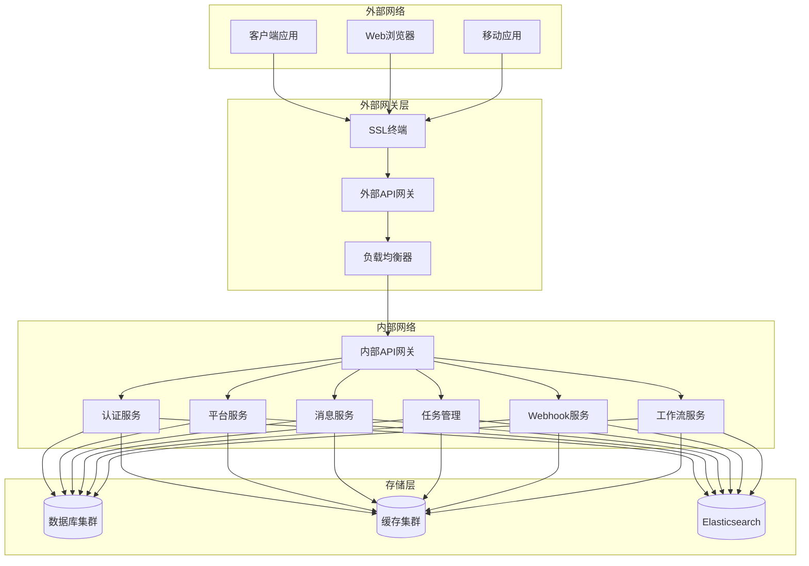
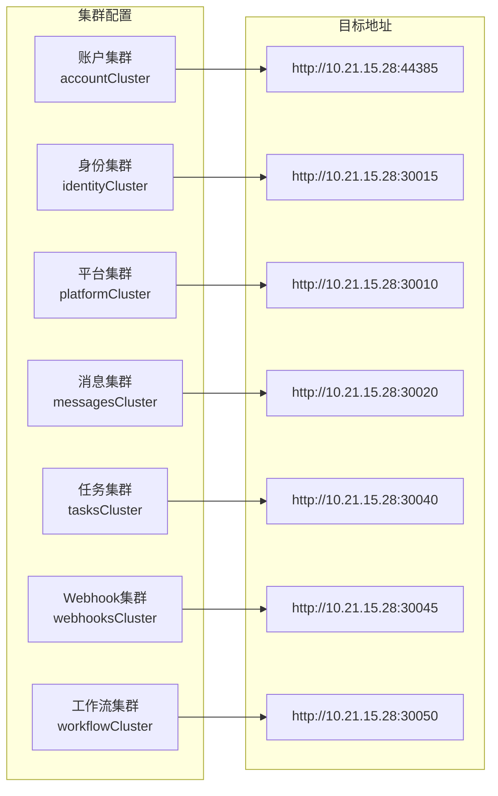
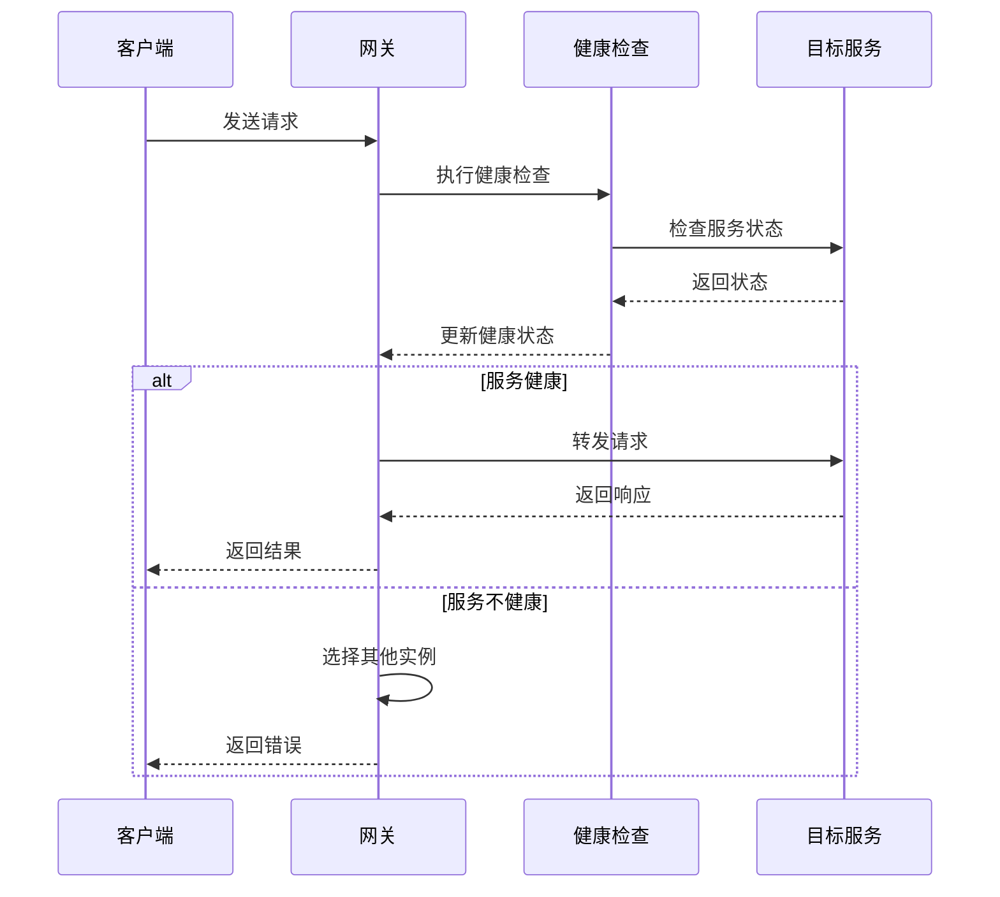
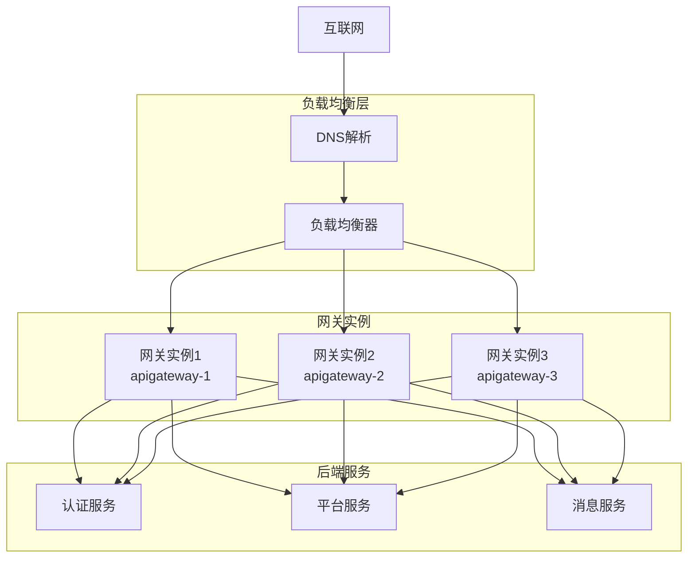
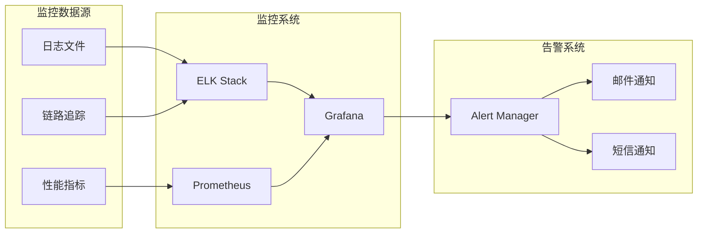
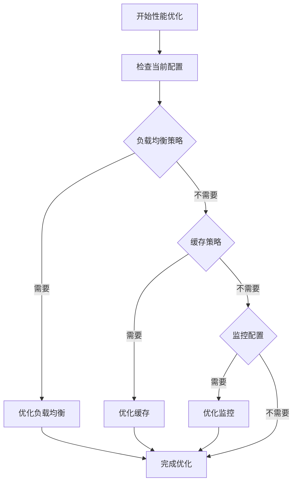

# 外部网关部署文档

<cite>
**本文档中引用的文件**
- [yarp.json](file://gateways/web/LY.MicroService.ApiGateway/yarp.json)
- [Program.cs](file://gateways/web/LY.MicroService.ApiGateway/Program.cs)
- [InternalApiGatewayModule.cs](file://gateways/web/LY.MicroService.ApiGateway/InternalApiGatewayModule.cs)
- [InternalApiGatewayOptions.cs](file://gateways/web/LY.MicroService.ApiGateway/InternalApiGatewayOptions.cs)
- [appsettings.json](file://gateways/web/LY.MicroService.ApiGateway/appsettings.json)
- [appsettings.Development.json](file://gateways/web/LY.MicroService.ApiGateway/appsettings.Development.json)
- [docker-compose.yml](file://docker-compose.yml)
- [docker-compose.override.yml](file://docker-compose.override.yml)
- [AbpHostingHostBuilderExtensions.cs](file://gateways/internal/LINGYUN.MicroService.Internal.ApiGateway/src/LINGYUN.MicroService.Internal.Gateway/AbpHostingHostBuilderExtensions.cs)
</cite>

## 目录
1. [简介](#简介)
2. [项目架构概览](#项目架构概览)
3. [外部网关核心组件](#外部网关核心组件)
4. [YARP配置详解](#yarp配置详解)
5. [负载均衡策略](#负载均衡策略)
6. [SSL终止与安全配置](#ssl终止与安全配置)
7. [CORS配置](#cors配置)
8. [高可用部署方案](#高可用部署方案)
9. [监控与日志配置](#监控与日志配置)
10. [故障排除指南](#故障排除指南)
11. [总结](#总结)

## 简介

本文档详细介绍了基于YARP（Yet Another Reverse Proxy）的外部API网关部署配置。该网关作为微服务架构中的关键组件，负责处理来自客户端的请求，实现路由转发、负载均衡、SSL终止、CORS处理等核心功能。

外部网关与内部网关协同工作，为不同的客户端群体提供定制化的API访问策略。通过合理的配置和部署，确保系统的高可用性、安全性和可扩展性。

## 项目架构概览



**图表来源**
- [docker-compose.yml](file://docker-compose.yml#L1-L244)
- [yarp.json](file://gateways/web/LY.MicroService.ApiGateway/yarp.json#L1-L124)

## 外部网关核心组件

### 网关启动程序

外部网关的核心启动逻辑在Program.cs中实现，采用现代化的ASP.NET Core应用程序模式：

```csharp
// 配置Serilog日志系统
builder.Host.UseSerilog((context, provider, config) =>
{
    config.ReadFrom.Configuration(context.Configuration);
});

// 添加YARP配置文件
config.AddJsonFile("yarp.json", true, true).AddEnvironmentVariables();

// 加载ABP模块
await builder.AddApplicationAsync<InternalApiGatewayModule>();
```

### 模块配置

InternalApiGatewayModule是网关的主要配置模块，负责：

- **路由配置**：通过YARP实现智能路由转发
- **CORS处理**：支持跨域资源共享
- **Swagger集成**：提供API文档和测试界面
- **健康检查**：监控服务状态

**章节来源**
- [Program.cs](file://gateways/web/LY.MicroService.ApiGateway/Program.cs#L1-L55)
- [InternalApiGatewayModule.cs](file://gateways/web/LY.MicroService.ApiGateway/InternalApiGatewayModule.cs#L1-L171)

## YARP配置详解

### 基础路由配置

YARP配置文件定义了完整的路由规则和集群设置：

```json
{
  "ReverseProxy": {
    "Routes": {
      "Account": {
        "ClusterId": "accountCluster",
        "Match": {
          "Path": "/api/account/{**everything}"
        }
      },
      "Identity": {
        "ClusterId": "identityCluster",
        "Match": {
          "Path": "/api/identity/{**everything}"
        }
      }
    },
    "Clusters": {
      "accountCluster": {
        "Destinations": {
          "destination1": {
            "Address": "http://10.21.15.28:44385"
          }
        }
      }
    }
  }
}
```

### 路由规则设计

网关支持多种路由模式：

1. **路径前缀匹配**：`/api/account/{**everything}`
2. **通配符支持**：`{**everything}`捕获剩余路径
3. **集群关联**：每个路由对应特定的服务集群

### 集群配置策略



**图表来源**
- [yarp.json](file://gateways/web/LY.MicroService.ApiGateway/yarp.json#L1-L124)

**章节来源**
- [yarp.json](file://gateways/web/LY.MicroService.ApiGateway/yarp.json#L1-L124)

## 负载均衡策略

### 内置负载均衡算法

YARP提供了多种内置的负载均衡策略：

1. **轮询（Round Robin）**：默认策略，按顺序分发请求
2. **最少连接（Least Connections）**：优先分配到连接数较少的实例
3. **哈希一致性（Hash-based）**：基于请求特征保持会话一致性

### 配置示例

```json
{
  "Clusters": {
    "accountCluster": {
      "LoadBalancingPolicy": "RoundRobin",
      "Destinations": {
        "destination1": {
          "Address": "http://10.21.15.28:44385"
        },
        "destination2": {
          "Address": "http://10.21.15.28:44386"
        }
      }
    }
  }
}
```

### 健康检查配置



**图表来源**
- [docker-compose.yml](file://docker-compose.yml#L15-L25)

## SSL终止与安全配置

### SSL证书配置

外部网关支持SSL终止，可以在网关层面统一处理HTTPS请求：

```json
{
  "Kestrel": {
    "Endpoints": {
      "Https": {
        "Url": "https://0.0.0.0:443",
        "Certificate": {
          "Path": "/path/to/certificate.pfx",
          "Password": "certificate-password"
        }
      }
    }
  }
}
```

### 安全中间件配置

```csharp
// 启用HTTPS重定向
app.UseHttpsRedirection();

// 配置CORS策略
app.UseCors(builder =>
{
    builder
        .WithOrigins("https://client-domain.com")
        .AllowAnyHeader()
        .AllowAnyMethod()
        .AllowCredentials();
});
```

### 安全防护措施

1. **请求限制**：防止DDoS攻击
2. **速率限制**：控制API调用频率
3. **IP白名单**：限制访问来源
4. **内容安全策略**：防止XSS攻击

**章节来源**
- [InternalApiGatewayModule.cs](file://gateways/web/LY.MicroService.ApiGateway/InternalApiGatewayModule.cs#L70-L90)

## CORS配置

### 跨域资源共享策略

网关实现了灵活的CORS配置，支持多域名访问：

```csharp
context.Services.AddCors(options =>
{
    options.AddDefaultPolicy(builder =>
    {
        builder
            .WithOrigins(
                configuration["App:CorsOrigins"]
                    .Split(",", StringSplitOptions.RemoveEmptyEntries)
                    .Select(o => o.Trim().RemovePostFix("/"))
                    .ToArray()
            )
            .WithAbpExposedHeaders()
            .WithAbpWrapExposedHeaders()
            .SetIsOriginAllowedToAllowWildcardSubdomains()
            .AllowAnyHeader()
            .AllowAnyMethod()
            .AllowCredentials();
    });
});
```

### CORS配置参数

| 参数 | 描述 | 示例值 |
|------|------|--------|
| WithOrigins | 允许的源域名 | https://app.example.com |
| AllowAnyHeader | 允许所有HTTP头 | true |
| AllowAnyMethod | 允许所有HTTP方法 | true |
| AllowCredentials | 允许携带凭据 | true |

### 调试环境配置

开发环境下的CORS配置更加宽松：

```json
{
  "App": {
    "CorsOrigins": "http://127.0.0.1:3100,http://localhost:3100"
  }
}
```

**章节来源**
- [InternalApiGatewayModule.cs](file://gateways/web/LY.MicroService.ApiGateway/InternalApiGatewayModule.cs#L80-L100)
- [appsettings.Development.json](file://gateways/web/LY.MicroService.ApiGateway/appsettings.Development.json#L10-L15)

## 高可用部署方案

### Docker Compose部署

项目提供了完整的Docker Compose配置，支持一键部署：

```yaml
version: '3.4'

services:
  external-apigateway:
    hostname: external-apigateway
    container_name: external-apigateway
    environment:
      - ASPNETCORE_ENVIRONMENT=Production
      - ASPNETCORE_HTTP_PORTS=80
      - ASPNETCORE_HTTPS_PORTS=443
    ports:
      - "80:80"
      - "443:443"
    networks:
      - abp-next-admin
    healthcheck:
      test: ["CMD-SHELL", "wget --spider http://localhost/healthz || exit"]
      interval: 10s
      timeout: 5s
      retries: 5
    extra_hosts:
      - "host.docker.internal:host-gateway"
```

### 横向扩展配置



**图表来源**
- [docker-compose.yml](file://docker-compose.yml#L130-L150)

### 故障转移机制

```yaml
healthcheck:
  test: ["CMD-SHELL", "curl -f http://localhost/healthz || exit 1"]
  interval: 30s
  timeout: 10s
  retries: 3
  start_period: 40s
```

### 自动扩缩容

```yaml
deploy:
  replicas: 3
  update_config:
    parallelism: 1
    delay: 10s
  restart_policy:
    condition: on-failure
    delay: 5s
    max_attempts: 3
```

**章节来源**
- [docker-compose.yml](file://docker-compose.yml#L130-L150)
- [docker-compose.override.yml](file://docker-compose.override.yml#L1-L135)

## 监控与日志配置

### 日志系统配置

网关集成了Serilog日志框架，支持多级日志输出：

```json
{
  "Serilog": {
    "MinimumLevel": {
      "Default": "Information",
      "Override": {
        "System": "Warning",
        "Microsoft": "Warning",
        "DotNetCore": "Information"
      }
    },
    "WriteTo": [
      {
        "Name": "Console",
        "Args": {
          "restrictedToMinimumLevel": "Debug",
          "outputTemplate": "{Timestamp:yyyy-MM-dd HH:mm:ss} [{Level:u3}] [{SourceContext}] [{ProcessId}] [{ThreadId}] - {Message:lj}{NewLine}{Exception}"
        }
      },
      {
        "Name": "File",
        "Args": {
          "path": "Logs/Debug-.log",
          "restrictedToMinimumLevel": "Debug",
          "rollingInterval": "Day"
        }
      }
    ]
  }
}
```

### 监控指标收集



### 访问日志分析

```json
{
  "Serilog": {
    "WriteTo": [
      {
        "Name": "Elasticsearch",
        "Args": {
          "nodeUris": "http://127.0.0.1:9200",
          "indexFormat": "abp.external-gateway-{0:yyyy.MM.dd}",
          "autoRegisterTemplate": true,
          "autoRegisterTemplateVersion": "ESv7"
        }
      }
    ]
  }
}
```

### 安全审计配置

```csharp
// 启用审计日志
app.UseAuditing();

// 配置审计记录
services.Configure<AuditingOptions>(options =>
{
    options.IsEnabled = true;
    options.EntityHistorySelectors.AddAllEntities();
});
```

**章节来源**
- [appsettings.json](file://gateways/web/LY.MicroService.ApiGateway/appsettings.json#L1-L73)
- [appsettings.Development.json](file://gateways/web/LY.MicroService.ApiGateway/appsettings.Development.json#L50-L73)

## 故障排除指南

### 常见问题诊断

1. **路由不匹配**
   - 检查YARP配置文件语法
   - 验证路径模式是否正确
   - 确认集群配置是否存在

2. **SSL证书问题**
   - 验证证书文件路径
   - 检查证书有效期
   - 确认私钥密码正确

3. **CORS跨域失败**
   - 检查允许的源域名配置
   - 验证预检请求处理
   - 确认凭据设置

### 性能优化建议



### 调试工具配置

```json
{
  "Serilog": {
    "MinimumLevel": {
      "Default": "Debug",
      "Override": {
        "Yarp.ReverseProxy": "Debug"
      }
    }
  }
}
```

**章节来源**
- [InternalApiGatewayModule.cs](file://gateways/web/LY.MicroService.ApiGateway/InternalApiGatewayModule.cs#L150-L171)

## 总结

本文档详细介绍了基于YARP的外部API网关部署配置，涵盖了从基础配置到高级部署的各个方面。通过合理配置路由规则、负载均衡策略、SSL终止、CORS处理和安全防护措施，可以构建一个高性能、高可用的API网关系统。

关键要点包括：

1. **配置灵活性**：YARP配置文件支持动态更新和热重载
2. **高可用性**：通过Docker容器化部署和健康检查实现自动故障转移
3. **安全性**：SSL终止、CORS控制和安全中间件保护
4. **可观测性**：完善的日志记录和监控指标收集
5. **扩展性**：支持横向扩展和自动扩缩容

通过遵循本文档的指导原则和最佳实践，可以成功部署和运维一个企业级的外部API网关系统。