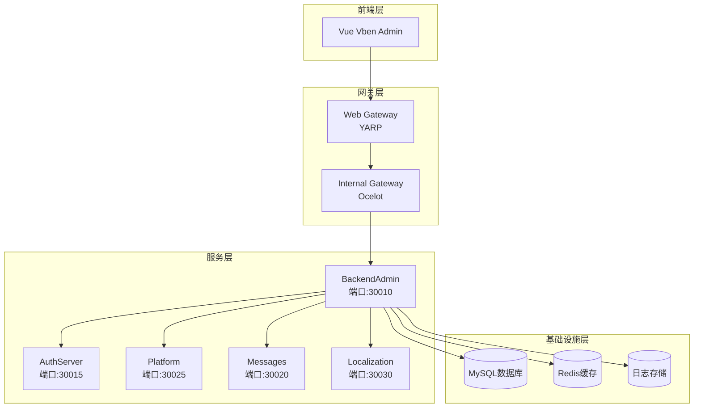
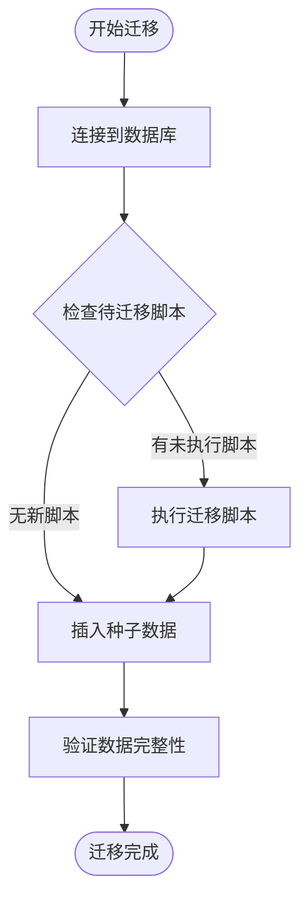
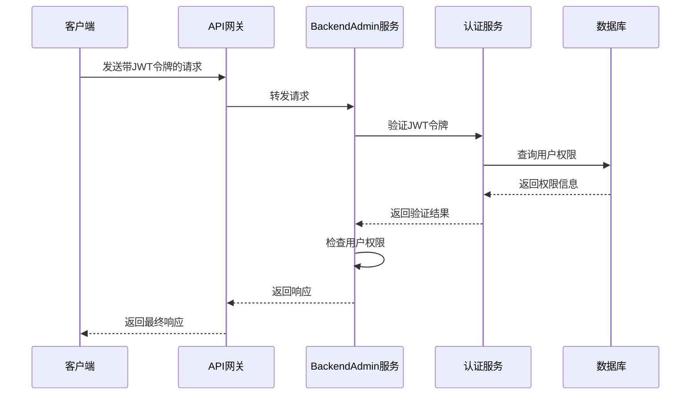
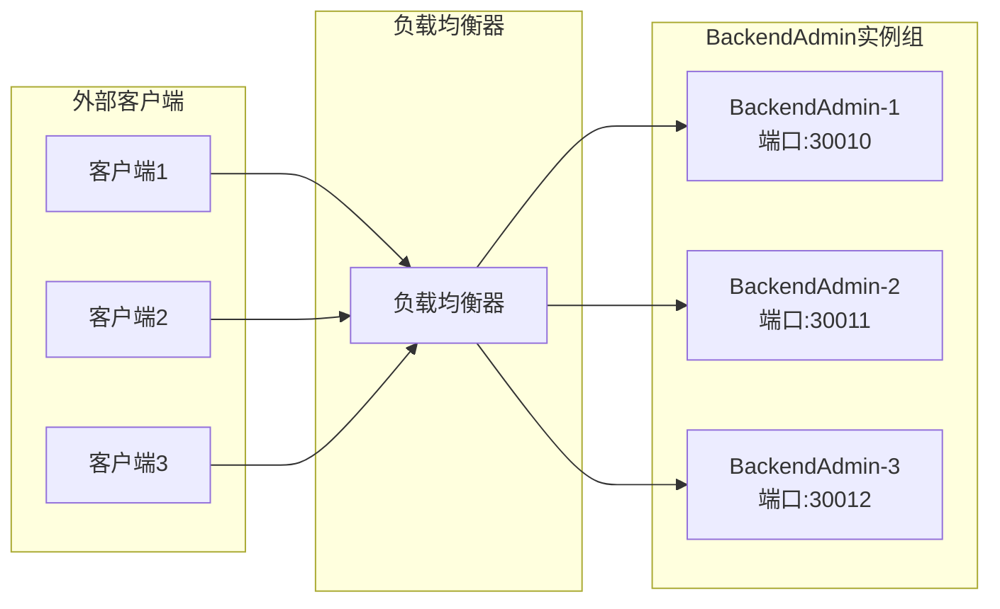
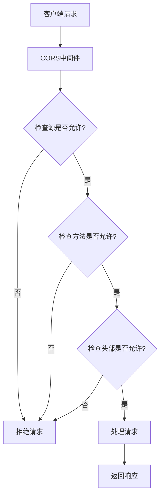
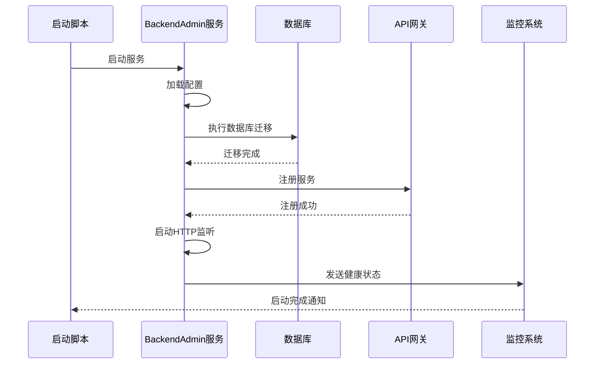

# 后台管理服务部署文档

<cite>
**本文档中引用的文件**
- [Program.cs](file://aspnet-core/services/LY.MicroService.BackendAdmin.HttpApi.Host/Program.cs)
- [appsettings.json](file://aspnet-core/services/LY.MicroService.BackendAdmin.HttpApi.Host/appsettings.json)
- [docker-compose.yml](file://docker-compose.yml)
- [yarp.json](file://gateways/web/LY.MicroService.ApiGateway/yarp.json)
- [ocelot.json](file://gateways/internal/LINGYUN.MicroService.Internal.ApiGateway/src/LINGYUN.MicroService.Internal.ApiGateway/ocelot.json)
- [80.start-host.cmd](file://starter/80.start-host.cmd)
- [readme.md](file://starter/readme.md)
- [BackendAdminDbMigratorModule.cs](file://aspnet-core/migrations/LY.MicroService.BackendAdmin.DbMigrator/BackendAdminDbMigratorModule.cs)
- [AuthServerModule.Configure.cs](file://aspnet-core/services/LY.MicroService.AuthServer/AuthServerModule.Configure.cs)
</cite>

## 目录
1. [简介](#简介)
2. [系统架构概览](#系统架构概览)
3. [服务部署配置](#服务部署配置)
4. [API网关路由配置](#api网关路由配置)
5. [数据库初始化配置](#数据库初始化配置)
6. [认证服务集成](#认证服务集成)
7. [负载均衡配置](#负载均衡配置)
8. [CORS策略设置](#cors策略设置)
9. [服务启动流程](#服务启动流程)
10. [监控与健康检查](#监控与健康检查)
11. [故障排除指南](#故障排除指南)
12. [总结](#总结)

## 简介

后台管理服务（BackendAdmin）是ABP Next Admin框架中的核心微服务组件，负责提供完整的后台管理系统功能。本文档详细说明了BackendAdmin服务的部署流程，包括与API网关的路由配置、权限验证集成、CORS策略设置、数据库初始化配置等内容。

BackendAdmin服务采用微服务架构设计，通过Docker容器化部署，支持水平扩展和高可用性。服务集成了完整的身份认证和授权机制，提供了RESTful API接口，并通过API网关进行统一管理和路由分发。

## 系统架构概览

BackendAdmin服务在整体架构中扮演着关键角色，作为后台管理的核心服务，它与其他微服务协同工作，为前端管理界面提供数据和服务支持。



**图表来源**
- [docker-compose.yml](file://docker-compose.yml#L1-L244)
- [yarp.json](file://gateways/web/LY.MicroService.ApiGateway/yarp.json#L43-L99)

## 服务部署配置

### Docker容器配置

BackendAdmin服务通过Docker容器化部署，配置如下：

```yaml
admin-api:
  hostname: admin-api
  container_name: admin-api
  environment:
    - ASPNETCORE_ENVIRONMENT=Development
    - ASPNETCORE_HTTP_PORTS=80
    - TZ=Asia/Shanghai
  ports:
    - "30010:80"
  networks:
    - abp-next-admin
  healthcheck:
    test: ["CMD-SHELL", "wget --spider http://localhost/healthz || exit"]
    interval: 10s
    timeout: 5s
    retries: 5
  extra_hosts:
    - "host.docker.internal:host-gateway"
    - "auth-server:host-gateway"
```

### 应用程序配置

BackendAdmin服务的配置主要通过appsettings.json文件进行管理：

```json
{
  "App": {
    "CorsOrigins": "http://localhost:3100"
  },
  "Clock": {
    "Kind": "Local"
  },
  "StringEncryption": {
    "DefaultPassPhrase": "s46c5q55nxpeS8Ra",
    "InitVectorBytes": "s83ng0abvd02js84",
    "DefaultSalt": "sf&5)s3#"
  }
}
```

**章节来源**
- [docker-compose.yml](file://docker-compose.yml#L3-L20)
- [appsettings.json](file://aspnet-core/services/LY.MicroService.BackendAdmin.HttpApi.Host/appsettings.json#L1-L92)

## API网关路由配置

### Web Gateway (YARP) 配置

Web Gateway使用YARP（Yet Another Reverse Proxy）作为反向代理服务器，为BackendAdmin服务配置了专门的路由规则：

```json
{
  "backendAdminCluster": {
    "Destinations": {
      "destination1": {
        "Address": "http://10.21.15.28:30010"
      }
    }
  }
}
```

对应的路由配置：
- **上游路径**: `/api/abp/backend-admin/*`
- **下游路径**: `/api/abp/backend-admin/*`
- **集群ID**: `backendAdminCluster`
- **目标地址**: `http://10.21.15.28:30010`

### 内部网关 (Ocelot) 配置

内部网关使用Ocelot作为API网关，为BackendAdmin服务提供了更详细的路由配置：

```json
{
  "DownstreamPathTemplate": "/api/abp/application-configuration",
  "UpstreamPathTemplate": "/api/abp/backend-admin/application-configuration",
  "DownstreamHostAndPorts": [
    {
      "Host": "127.0.0.1",
      "Port": 30010
    }
  ],
  "LoadBalancerOptions": {
    "Type": "RoundRobin"
  }
}
```

**章节来源**
- [yarp.json](file://gateways/web/LY.MicroService.ApiGateway/yarp.json#L75-L85)
- [ocelot.json](file://gateways/internal/LINGYUN.MicroService.Internal.ApiGateway/src/LINGYUN.MicroService.Internal.ApiGateway/ocelot.json#L87-L137)

## 数据库初始化配置

### 数据库连接配置

BackendAdmin服务的数据库初始化通过DbMigrator模块完成，配置文件包含以下连接字符串：

```json
{
  "ConnectionStrings": {
    "Default": "Server=127.0.0.1;Database=Platform-v70;User Id=root;Password=123456;SslMode=None",
    "Platform": "Server=127.0.0.1;Database=Platform-v70;User Id=root;Password=123456;SslMode=None",
    "Identity": "Server=127.0.0.1;Database=AuthServer-V70;User Id=root;Password=123456;SslMode=None",
    "Realtime": "Server=127.0.0.1;Database=Messages-V70;User Id=root;Password=123456;SslMode=None"
  }
}
```

### 数据迁移流程

数据迁移过程遵循以下步骤：

1. **数据库连接建立**: 使用配置的连接字符串建立数据库连接
2. **迁移执行**: 执行所有待处理的数据库迁移脚本
3. **数据种子**: 插入初始数据和默认配置
4. **完整性检查**: 验证数据库结构和数据完整性



**图表来源**
- [BackendAdminDbMigratorModule.cs](file://aspnet-core/migrations/LY.MicroService.BackendAdmin.DbMigrator/BackendAdminDbMigratorModule.cs)

**章节来源**
- [appsettings.json](file://aspnet-core/migrations/LY.MicroService.BackendAdmin.DbMigrator/appsettings.json#L1-L10)

## 认证服务集成

### JWT令牌验证配置

BackendAdmin服务集成了完整的JWT令牌验证机制，通过AuthServer模块实现：

```csharp
services.AddAuthentication(JwtBearerDefaults.AuthenticationScheme)
    .AddAbpJwtBearer(options =>
    {
        configuration.GetSection("AuthServer").Bind(options);
        
        var validIssuers = configuration.GetSection("AuthServer:ValidIssuers").Get<List<string>>();
        if (validIssuers?.Count > 0)
        {
            options.TokenValidationParameters.ValidIssuers = validIssuers;
            options.TokenValidationParameters.IssuerValidator = TokenWildcardIssuerValidator.IssuerValidator;
        }
        
        var validAudiences = configuration.GetSection("AuthServer:ValidAudiences").Get<List<string>>();
        if (validAudiences?.Count > 0)
        {
            options.TokenValidationParameters.ValidAudiences = validAudiences;
        }
    });
```

### 用户权限同步

服务实现了用户权限的实时同步机制：

1. **令牌解析**: 解析请求中的JWT令牌
2. **权限验证**: 验证用户权限和角色信息
3. **权限缓存**: 缓存用户权限信息以提高性能
4. **权限更新**: 实时更新用户的权限变更



**图表来源**
- [AuthServerModule.Configure.cs](file://aspnet-core/services/LY.MicroService.AuthServer/AuthServerModule.Configure.cs#L391-L418)

**章节来源**
- [AuthServerModule.Configure.cs](file://aspnet-core/services/LY.MicroService.AuthServer/AuthServerModule.Configure.cs#L391-L418)

## 负载均衡配置

### Round Robin负载均衡

BackendAdmin服务配置了Round Robin负载均衡算法，确保请求在多个实例间均匀分布：

```json
{
  "LoadBalancerOptions": {
    "Type": "RoundRobin",
    "Key": null,
    "Expiry": 0
  }
}
```

### QoS选项配置

服务质量（QoS）选项确保系统的稳定性和可靠性：

```json
{
  "QoSOptions": {
    "ExceptionsAllowedBeforeBreaking": 10,
    "DurationOfBreak": 1000,
    "TimeoutValue": 10000
  }
}
```

### 水平扩展策略

BackendAdmin服务支持水平扩展，可以通过以下方式增加实例数量：

1. **Docker Compose扩展**: 修改docker-compose.yml文件增加服务实例
2. **Kubernetes部署**: 使用Deployment资源定义多个Pod副本
3. **云平台自动扩缩容**: 基于CPU和内存使用率自动调整实例数量



**图表来源**
- [ocelot.json](file://gateways/internal/LINGYUN.MicroService.Internal.ApiGateway/src/LINGYUN.MicroService.Internal.ApiGateway/ocelot.json#L44-L91)

## CORS策略设置

### 跨域资源共享配置

BackendAdmin服务配置了严格的CORS策略，只允许特定的源进行跨域访问：

```json
{
  "App": {
    "CorsOrigins": "http://localhost:3100"
  }
}
```

### CORS中间件配置

服务通过以下配置实现CORS策略：

1. **允许的源**: 仅允许`http://localhost:3100`域名
2. **允许的方法**: 支持标准的HTTP方法（GET、POST、PUT、DELETE等）
3. **允许的头**: 包含标准的请求头字段
4. **暴露的头**: 允许前端访问的响应头



**章节来源**
- [appsettings.json](file://aspnet-core/services/LY.MicroService.BackendAdmin.HttpApi.Host/appsettings.json#L1-L5)

## 服务启动流程

### 启动顺序

BackendAdmin服务的启动遵循严格的顺序，确保所有依赖项正确初始化：

```cmd
@echo off
cls
title start-all
set stime=12
for /f "delims=" %%i in ('dir *.bat /b') do (
    echo %%i
    start %%i
    ping -n %stime% 127.1 >nul
)
```

### 初始化流程

服务启动过程包括以下关键步骤：

1. **环境变量加载**: 加载应用程序配置和环境变量
2. **模块初始化**: 初始化各个模块和依赖项
3. **数据库迁移**: 执行必要的数据库迁移
4. **服务注册**: 注册服务到服务发现机制
5. **监听端口**: 开始监听HTTP请求



**图表来源**
- [80.start-host.cmd](file://starter/80.start-host.cmd#L1-L9)

**章节来源**
- [80.start-host.cmd](file://starter/80.start-host.cmd#L1-L9)
- [Program.cs](file://aspnet-core/services/LY.MicroService.BackendAdmin.HttpApi.Host/Program.cs#L36-L58)

## 监控与健康检查

### 健康检查配置

BackendAdmin服务配置了完善的健康检查机制：

```yaml
healthcheck:
  test: ["CMD-SHELL", "wget --spider http://localhost/healthz || exit"]
  interval: 10s
  timeout: 5s
  retries: 5
```

### 日志配置

服务使用Serilog进行日志记录，配置了多级日志输出：

```json
{
  "Serilog": {
    "MinimumLevel": {
      "Default": "Information",
      "Override": {
        "System": "Warning",
        "Microsoft": "Warning",
        "DotNetCore": "Information"
      }
    },
    "WriteTo": [
      {
        "Name": "Console",
        "Args": {
          "restrictedToMinimumLevel": "Debug",
          "outputTemplate": "{Timestamp:yyyy-MM-dd HH:mm:ss} [{Level:u3}] [{SourceContext}] [{ProcessId}] [{ThreadId}] - {Message:lj}{NewLine}{Exception}"
        }
      },
      {
        "Name": "File",
        "Args": {
          "path": "Logs/Debug-.log",
          "restrictedToMinimumLevel": "Debug",
          "rollingInterval": "Day"
        }
      }
    ]
  }
}
```

### 性能监控

服务集成了SkyWalking性能监控（可选配置）：

```json
{
  "SkyWalking": {
    "Enable": false
  }
}
```

## 故障排除指南

### 常见问题及解决方案

#### 1. 数据库连接失败
**症状**: 服务启动时出现数据库连接错误
**解决方案**: 
- 检查数据库连接字符串配置
- 确认数据库服务正在运行
- 验证网络连通性

#### 2. JWT令牌验证失败
**症状**: 用户无法登录或权限验证失败
**解决方案**:
- 检查AuthServer服务是否正常运行
- 验证JWT令牌配置参数
- 确认有效发行者和受众配置

#### 3. CORS跨域问题
**症状**: 前端无法访问API接口
**解决方案**:
- 检查CORS配置中的允许源
- 确认前端应用的端口号正确
- 验证浏览器控制台的错误信息

#### 4. 负载均衡问题
**症状**: 请求分配不均或服务不可用
**解决方案**:
- 检查负载均衡器配置
- 验证服务实例的健康状态
- 确认服务注册信息正确

### 调试技巧

1. **启用详细日志**: 将日志级别设置为Debug以获取更多信息
2. **使用健康检查端点**: 访问`/healthz`端点检查服务状态
3. **监控指标**: 使用Prometheus和Grafana监控服务指标
4. **分布式追踪**: 启用SkyWalking进行请求链路追踪

## 总结

BackendAdmin服务部署文档详细介绍了该微服务的完整部署流程和技术细节。通过本文档，您可以：

1. **理解架构**: 掌握BackendAdmin服务在整个系统架构中的位置和作用
2. **配置部署**: 学会如何配置Docker容器、API网关和数据库
3. **集成认证**: 了解与认证服务的集成配置和权限验证机制
4. **优化性能**: 掌握负载均衡、CORS策略和监控配置
5. **故障排除**: 获得常见问题的诊断和解决方法

BackendAdmin服务采用了现代化的微服务架构设计，支持容器化部署、水平扩展和高可用性。通过合理的配置和部署，可以为企业提供稳定可靠的后台管理服务。

建议在生产环境中：
- 启用HTTPS加密传输
- 配置生产环境的数据库连接
- 设置适当的监控和告警
- 实施安全加固措施
- 准备灾难恢复计划