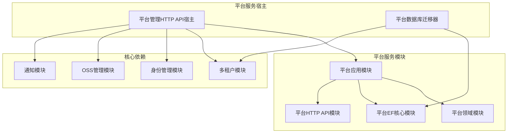
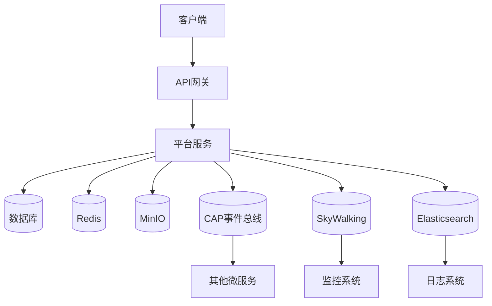
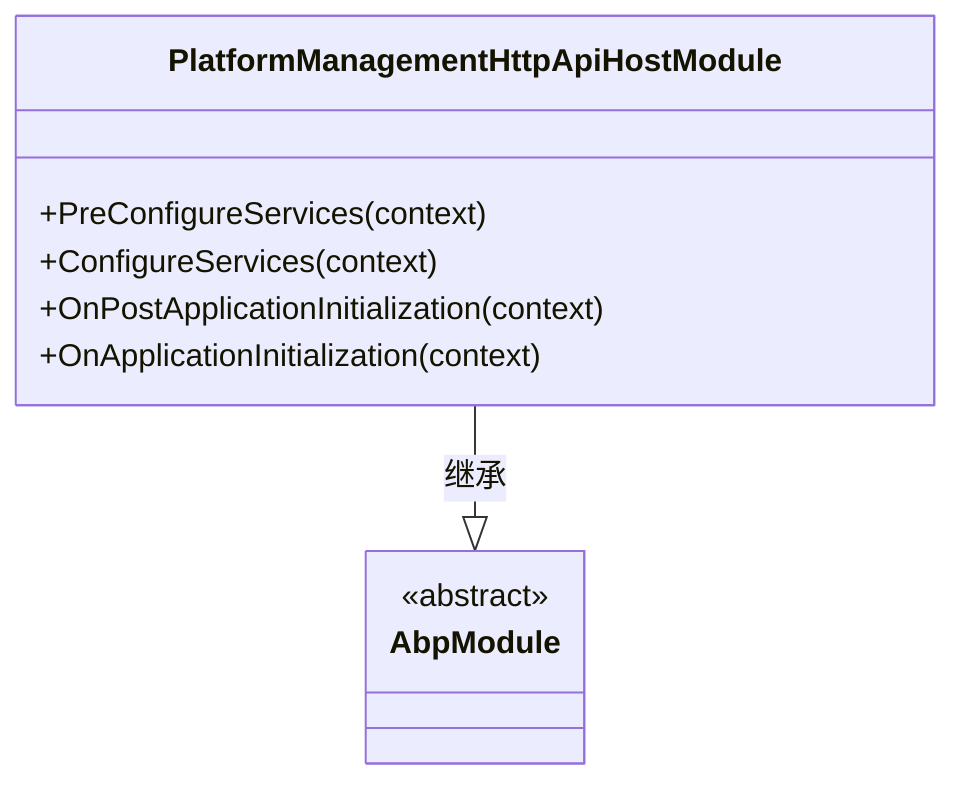
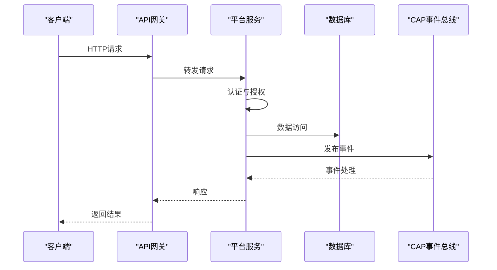
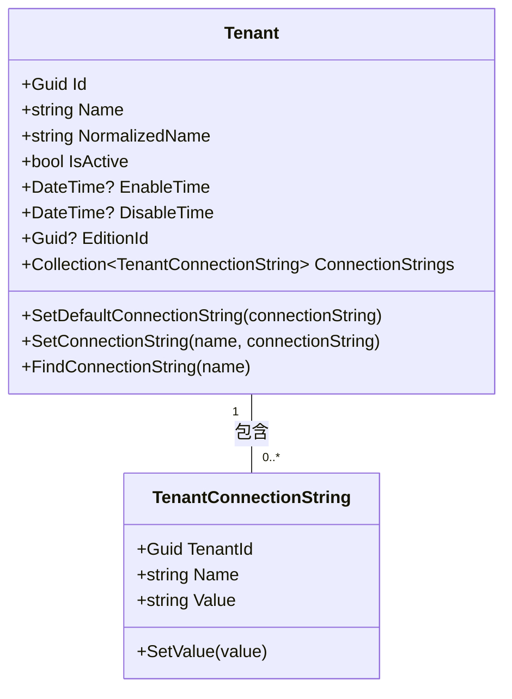

# 平台服务部署

<cite>
**本文档引用的文件**  
- [PlatformManagementHttpApiHostModule.cs](file://aspnet-core\services\LY.MicroService.PlatformManagement.HttpApi.Host\PlatformManagementHttpApiHostModule.cs)
- [Program.cs](file://aspnet-core\services\LY.MicroService.PlatformManagement.HttpApi.Host\Program.cs)
- [appsettings.json](file://aspnet-core\services\LY.MicroService.PlatformManagement.HttpApi.Host\appsettings.json)
- [PlatformDbMigrationService.cs](file://aspnet-core\migrations\LY.MicroService.Platform.EntityFrameworkCore\PlatformDbMigrationService.cs)
- [PlatformDbMigratorHostedService.cs](file://aspnet-core\migrations\LY.MicroService.Platform.DbMigrator\PlatformDbMigratorHostedService.cs)
- [Tenant.cs](file://aspnet-core\modules\saas\LINGYUN.Abp.Saas.Domain\LINGYUN\Abp\Saas\Tenants\Tenant.cs)
- [TenantConnectionString.cs](file://aspnet-core\modules\saas\LINGYUN.Abp.Saas.Domain\LINGYUN\Abp\Saas\Tenants\TenantConnectionString.cs)
- [ITenantAppService.cs](file://aspnet-core\modules\saas\LINGYUN.Abp.Saas.Application.Contracts\LINGYUN\Abp\Saas\Tenants\ITenantAppService.cs)
- [TenantCreateDto.cs](file://aspnet-core\modules\saas\LINGYUN.Abp.Saas.Application.Contracts\LINGYUN\Abp\Saas\Tenants\Dto\TenantCreateDto.cs)
- [TenantConnectionStringSetInput.cs](file://aspnet-core\modules\saas\LINGYUN.Abp.Saas.Application.Contracts\LINGYUN\Abp\Saas\Tenants\Dto\TenantConnectionStringSetInput.cs)
- [TenantStore.cs](file://aspnet-core\modules\saas\LINGYUN.Abp.MultiTenancy.Saas\LINGYUN\Abp\MultiTenancy\Saas\TenantStore.cs)
</cite>

## 目录
1. [简介](#简介)
2. [项目结构](#项目结构)
3. [核心组件](#核心组件)
4. [架构概述](#架构概述)
5. [详细组件分析](#详细组件分析)
6. [依赖分析](#依赖分析)
7. [性能考虑](#性能考虑)
8. [故障排除指南](#故障排除指南)
9. [结论](#结论)

## 简介
本文档详细说明了平台服务的部署配置，涵盖多租户支持的数据库配置、租户初始化流程、平台级配置管理，以及与其他核心服务（如认证、用户管理）的集成配置。文档还提供了平台服务特有的部署考虑，包括租户数据隔离策略、跨租户通信配置、平台级事件总线集成，以及服务的高可用性配置和灾难恢复方案。

## 项目结构
平台服务位于 `aspnet-core` 目录下的 `modules/platform` 和 `services/LY.MicroService.PlatformManagement.HttpApi.Host` 中。服务的数据库迁移模块位于 `migrations/LY.MicroService.Platform.DbMigrator` 和 `migrations/LY.MicroService.Platform.EntityFrameworkCore`。平台服务的宿主模块是 `LY.MicroService.PlatformManagement.HttpApi.Host`，它集成了平台应用、实体框架核心、OSS管理、通知、身份管理等多个模块。



**图源**
- [PlatformManagementHttpApiHostModule.cs](file://aspnet-core\services\LY.MicroService.PlatformManagement.HttpApi.Host\PlatformManagementHttpApiHostModule.cs)
- [LY.MicroService.Platform.EntityFrameworkCore.csproj](file://aspnet-core\migrations\LY.MicroService.Platform.EntityFrameworkCore\LY.MicroService.Platform.EntityFrameworkCore.csproj)

**本节来源**
- [PlatformManagementHttpApiHostModule.cs](file://aspnet-core\services\LY.MicroService.PlatformManagement.HttpApi.Host\PlatformManagementHttpApiHostModule.cs)
- [LY.MicroService.Platform.EntityFrameworkCore.csproj](file://aspnet-core\migrations\LY.MicroService.Platform.EntityFrameworkCore\LY.MicroService.Platform.EntityFrameworkCore.csproj)

## 核心组件
平台服务的核心组件包括平台应用模块、平台领域模块、平台HTTP API模块和平台实体框架核心模块。这些模块共同提供了平台级的功能，如配置管理、多租户支持、OSS管理、通知服务等。平台服务通过 `PlatformManagementHttpApiHost` 宿主模块启动，并集成了一系列中间件和第三方服务，如Serilog日志、CAP事件总线、SkyWalking监控等。

**本节来源**
- [PlatformManagementHttpApiHostModule.cs](file://aspnet-core\services\LY.MicroService.PlatformManagement.HttpApi.Host\PlatformManagementHttpApiHostModule.cs)
- [PlatformApplicationModule.cs](file://aspnet-core\modules\platform\LINGYUN.Platform.Application\PlatformApplicationModule.cs)

## 架构概述
平台服务采用微服务架构，基于ABP框架构建。服务通过 `PlatformManagementHttpApiHost` 模块启动，集成了多租户、身份认证、OSS管理、通知、日志、监控等多个功能模块。服务使用Entity Framework Core进行数据访问，支持MySQL、PostgreSQL等多种数据库。平台服务通过CAP事件总线与其他服务进行异步通信，确保系统的松耦合和高可用性。



**图源**
- [PlatformManagementHttpApiHostModule.cs](file://aspnet-core\services\LY.MicroService.PlatformManagement.HttpApi.Host\PlatformManagementHttpApiHostModule.cs)
- [appsettings.json](file://aspnet-core\services\LY.MicroService.PlatformManagement.HttpApi.Host\appsettings.json)

## 详细组件分析
### 平台服务宿主模块分析
平台服务宿主模块 `PlatformManagementHttpApiHostModule` 是服务的入口点，负责配置和初始化所有依赖模块。模块通过 `DependsOn` 特性声明了对多个功能模块的依赖，包括多租户、身份管理、OSS管理、通知、日志、监控等。在 `ConfigureServices` 方法中，模块配置了虚拟文件系统、缓存、身份认证、跨域、Swagger等服务。

#### 对象导向组件


**图源**
- [PlatformManagementHttpApiHostModule.cs](file://aspnet-core\services\LY.MicroService.PlatformManagement.HttpApi.Host\PlatformManagementHttpApiHostModule.cs)

#### API/服务组件


**图源**
- [PlatformManagementHttpApiHostModule.cs](file://aspnet-core\services\LY.MicroService.PlatformManagement.HttpApi.Host\PlatformManagementHttpApiHostModule.cs)
- [PlatformDbMigrationService.cs](file://aspnet-core\migrations\LY.MicroService.Platform.EntityFrameworkCore\PlatformDbMigrationService.cs)

### 多租户与数据库配置分析
平台服务通过ABP框架的多租户功能支持多租户架构。租户信息存储在 `Tenant` 实体中，每个租户可以配置独立的数据库连接字符串。租户的连接字符串通过 `TenantConnectionString` 实体管理，支持多个命名的连接字符串。

#### 对象导向组件


**图源**
- [Tenant.cs](file://aspnet-core\modules\saas\LINGYUN.Abp.Saas.Domain\LINGYUN\Abp\Saas\Tenants\Tenant.cs)
- [TenantConnectionString.cs](file://aspnet-core\modules\saas\LINGYUN.Abp.Saas.Domain\LINGYUN\Abp\Saas\Tenants\TenantConnectionString.cs)

#### 租户初始化流程
```mermaid
flowchart TD
    Start([开始]) --> CheckTenant["检查租户是否存在"]
    CheckTenant --> TenantExists{"租户存在?"}
    TenantExists -->|否| CreateTenant["