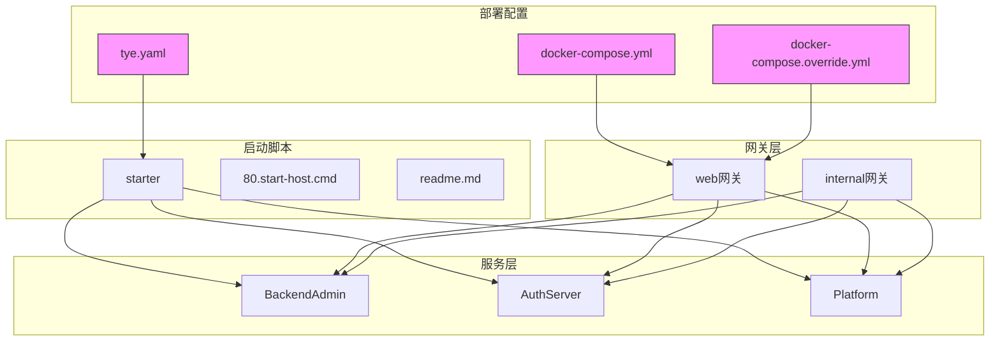
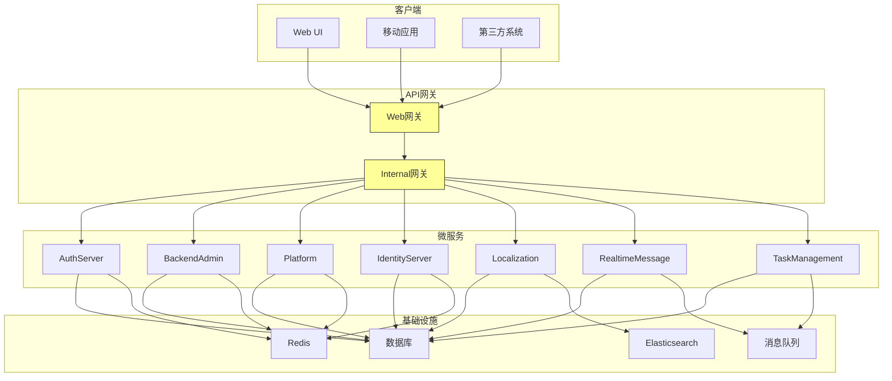
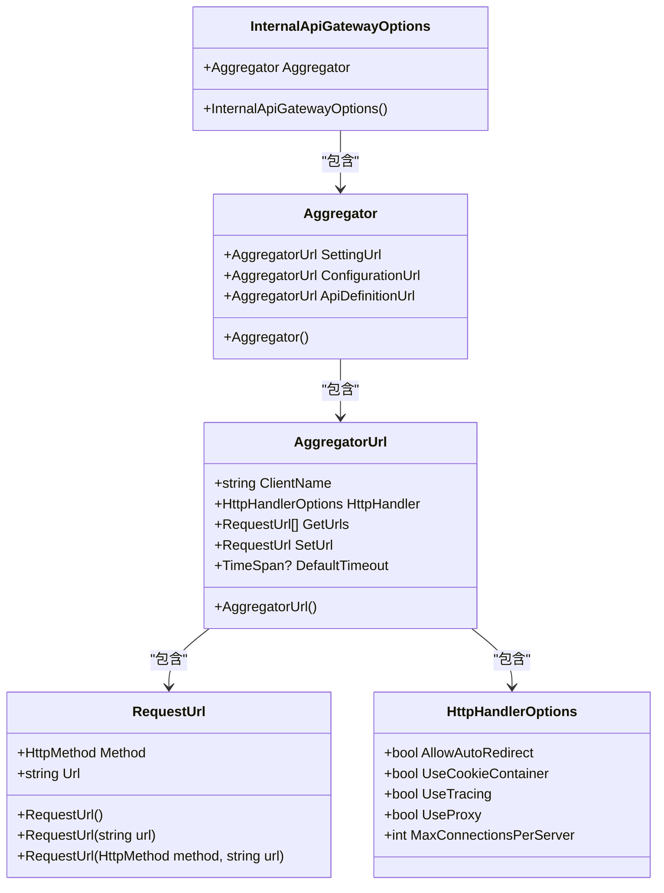
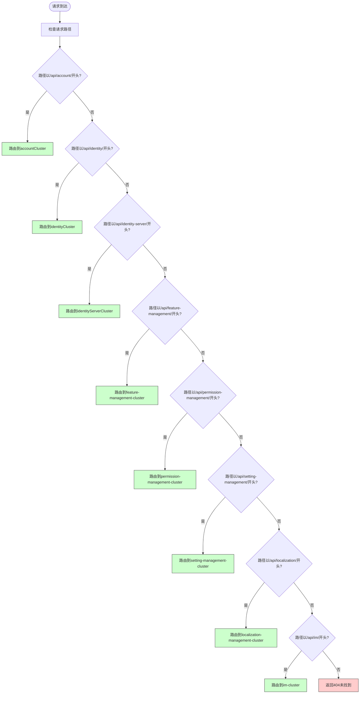
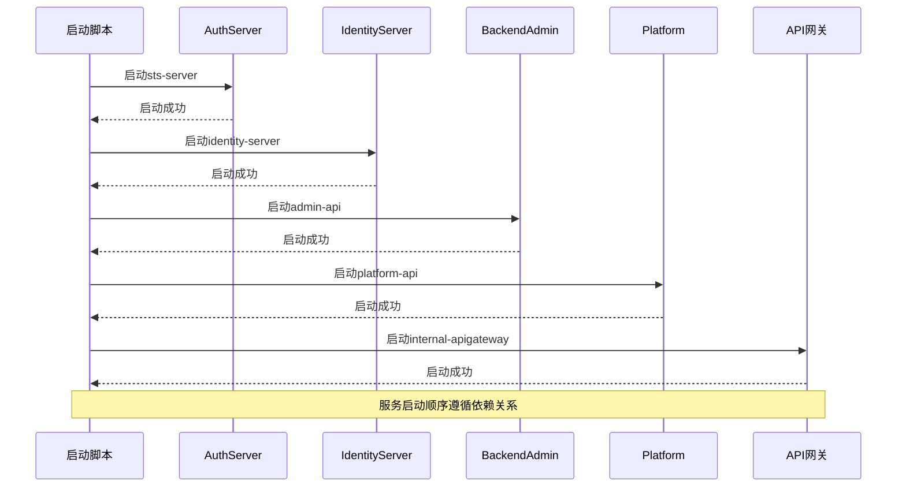
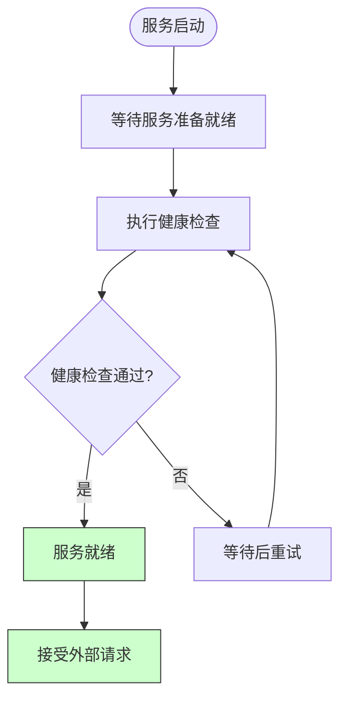
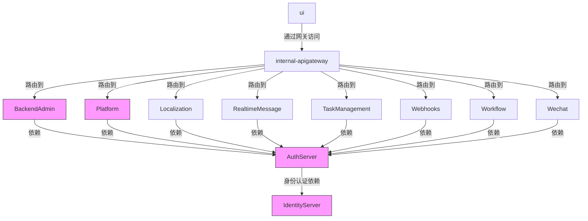

# 微服务部署

<cite>
**本文档引用的文件**  
- [tye.yaml](file://tye.yaml)
- [docker-compose.yml](file://docker-compose.yml)
- [docker-compose.override.yml](file://docker-compose.override.yml)
- [starter/readme.md](file://starter/readme.md)
- [starter/80.start-host.cmd](file://starter/80.start-host.cmd)
- [gateways/web/LY.MicroService.ApiGateway/Program.cs](file://gateways/web/LY.MicroService.ApiGateway/Program.cs)
- [gateways/web/LY.MicroService.ApiGateway/yarp.json](file://gateways/web/LY.MicroService.ApiGateway/yarp.json)
- [gateways/internal/LINGYUN.MicroService.Internal.ApiGateway/src/LINGYUN.MicroService.Internal.Gateway/Program.cs](file://gateways/internal/LINGYUN.MicroService.Internal.ApiGateway/src/LINGYUN.MicroService.Internal.Gateway/Program.cs)
- [aspnet-core/services/LY.MicroService.BackendAdmin.HttpApi.Host/appsettings.json](file://aspnet-core/services/LY.MicroService.BackendAdmin.HttpApi.Host/appsettings.json)
- [aspnet-core/services/LY.MicroService.IdentityServer.HttpApi.Host/appsettings.json](file://aspnet-core/services/LY.MicroService.IdentityServer.HttpApi.Host/appsettings.json)
- [gateways/web/LY.MicroService.ApiGateway/InternalApiGatewayOptions.cs](file://gateways/web/LY.MicroService.ApiGateway/InternalApiGatewayOptions.cs)
</cite>

## 目录
1. [简介](#简介)
2. [项目结构](#项目结构)
3. [核心组件](#核心组件)
4. [架构概述](#架构概述)
5. [详细组件分析](#详细组件分析)
6. [依赖分析](#依赖分析)
7. [性能考虑](#性能考虑)
8. [故障排除指南](#故障排除指南)
9. [结论](#结论)

## 简介
本文档全面介绍基于ABP框架的微服务架构部署策略。系统采用模块化设计，包含多个独立的微服务，通过API网关进行统一管理和路由。文档详细说明了服务发现、配置中心、熔断降级等关键组件的部署方法，以及各微服务的启动顺序依赖和健康检查机制。同时提供了基于Tye的本地开发环境部署方案和生产环境的Docker部署建议，包含服务间通信的安全配置、流量控制和版本管理策略。

## 项目结构
项目采用分层架构设计，主要包含以下几个部分：
- aspnet-core：核心服务和模块
- deploy：部署相关脚本和配置
- gateways：API网关实现
- starter：启动脚本集合
- docker-compose文件：容器编排配置
- tye.yaml：本地开发环境配置

**图示来源**  
- [docker-compose.yml](file://docker-compose.yml)
- [tye.yaml](file://tye.yaml)
- [starter/readme.md](file://starter/readme.md)

**本节来源**  
- [docker-compose.yml](file://docker-compose.yml)
- [tye.yaml](file://tye.yaml)
- [starter/readme.md](file://starter/readme.md)

## 核心组件
系统包含多个核心微服务组件：
- AuthServer：身份认证服务
- BackendAdmin：后台管理服务
- Platform：平台服务
- IdentityServer：身份服务器
- LocalizationManagement：本地化管理服务
- RealtimeMessage：实时消息服务
- TaskManagement：任务管理服务
- WebhooksManagement：Webhooks管理服务

每个服务都有独立的数据库迁移项目和实体框架核心实现，确保数据隔离和独立演进。服务间通过API网关进行通信，实现了松耦合的设计。

**本节来源**  
- [tye.yaml](file://tye.yaml)
- [docker-compose.yml](file://docker-compose.yml)
- [docker-compose.override.yml](file://docker-compose.override.yml)

## 架构概述
系统采用典型的微服务架构，包含服务提供者、API网关、配置中心等关键组件。API网关作为系统的入口，负责请求路由、负载均衡、安全验证等功能。各微服务独立部署，通过服务发现机制相互发现和通信。

**图示来源**  
- [docker-compose.yml](file://docker-compose.yml)
- [tye.yaml](file://tye.yaml)
- [gateways/web/LY.MicroService.ApiGateway/yarp.json](file://gateways/web/LY.MicroService.ApiGateway/yarp.json)

## 详细组件分析

### API网关分析
API网关是系统的入口点，负责请求路由、负载均衡、安全验证等功能。系统包含两个网关：Web网关和Internal网关，分别处理外部和内部请求。

#### 网关配置分析

**图示来源**  
- [gateways/web/LY.MicroService.ApiGateway/InternalApiGatewayOptions.cs](file://gateways/web/LY.MicroService.ApiGateway/InternalApiGatewayOptions.cs)

#### 网关路由分析

**图示来源**  
- [gateways/web/LY.MicroService.ApiGateway/yarp.json](file://gateways/web/LY.MicroService.ApiGateway/yarp.json)

**本节来源**  
- [gateways/web/LY.MicroService.ApiGateway/Program.cs](file://gateways/web/LY.MicroService.ApiGateway/Program.cs)
- [gateways/web/LY.MicroService.ApiGateway/yarp.json](file://gateways/web/LY.MicroService.ApiGateway/yarp.json)
- [gateways/web/LY.MicroService.ApiGateway/InternalApiGatewayOptions.cs](file://gateways/web/LY.MicroService.ApiGateway/InternalApiGatewayOptions.cs)

### 微服务分析
各微服务采用独立部署模式，通过API网关进行通信。每个服务都有独立的配置文件和健康检查机制。

#### 服务启动顺序分析

**图示来源**  
- [docker-compose.override.yml](file://docker-compose.override.yml)
- [starter/80.start-host.cmd](file://starter/80.start-host.cmd)

#### 健康检查机制

**图示来源**  
- [docker-compose.yml](file://docker-compose.yml)

**本节来源**  
- [docker-compose.yml](file://docker-compose.yml)
- [docker-compose.override.yml](file://docker-compose.override.yml)
- [starter/80.start-host.cmd](file://starter/80.start-host.cmd)

## 依赖分析
系统各组件之间存在明确的依赖关系，主要体现在服务启动顺序和运行时依赖上。

**图示来源**  
- [docker-compose.override.yml](file://docker-compose.override.yml)
- [gateways/web/LY.MicroService.ApiGateway/yarp.json](file://gateways/web/LY.MicroService.ApiGateway/yarp.json)

**本节来源**  
- [docker-compose.override.yml](file://docker-compose.override.yml)
- [docker-compose.yml](file://docker-compose.yml)
- [gateways/web/LY.MicroService.ApiGateway/yarp.json](file://gateways/web/LY.MicroService.ApiGateway/yarp.json)

## 性能考虑
系统在设计时考虑了多个性能优化点：

1. **配置缓存**：通过AgileConfig实现配置中心，减少配置读取开销
2. **日志优化**：使用Serilog进行结构化日志记录，支持多种输出格式
3. **连接池**：通过MaxConnectionsPerServer配置优化HTTP连接池
4. **超时控制**：设置合理的请求超时时间，避免资源长时间占用
5. **负载均衡**：API网关支持多种负载均衡策略，提高系统吞吐量

**本节来源**  
- [gateways/web/LY.MicroService.ApiGateway/InternalApiGatewayOptions.cs](file://gateways/web/LY.MicroService.ApiGateway/InternalApiGatewayOptions.cs)
- [aspnet-core/services/LY.MicroService.BackendAdmin.HttpApi.Host/appsettings.json](file://aspnet-core/services/LY.MicroService.BackendAdmin.HttpApi.Host/appsettings.json)

## 故障排除指南
当系统出现故障时，可以按照以下步骤进行排查：

1. 检查各服务的健康检查状态
2. 查看服务日志，定位错误信息
3. 验证服务间网络连通性
4. 检查配置文件是否正确
5. 验证数据库连接是否正常

常见问题及解决方案：
- 服务无法启动：检查端口占用情况和依赖服务状态
- 请求超时：检查网络延迟和后端服务性能
- 认证失败：验证令牌有效期和权限配置
- 数据库连接失败：检查连接字符串和数据库服务状态

**本节来源**  
- [docker-compose.yml](file://docker-compose.yml)
- [aspnet-core/services/LY.MicroService.BackendAdmin.HttpApi.Host/appsettings.json](file://aspnet-core/services/LY.MicroService.BackendAdmin.HttpApi.Host/appsettings.json)

## 结论
本文档详细介绍了基于ABP框架的微服务部署方案。系统采用现代化的微服务架构，通过API网关实现服务聚合和路由，各微服务独立部署、松耦合。部署方案支持本地开发和生产环境，提供了完整的启动脚本和配置文件。通过合理的依赖管理和健康检查机制，确保了系统的稳定性和可维护性。未来可以进一步优化服务发现机制，引入熔断降级策略，提高系统的容错能力。