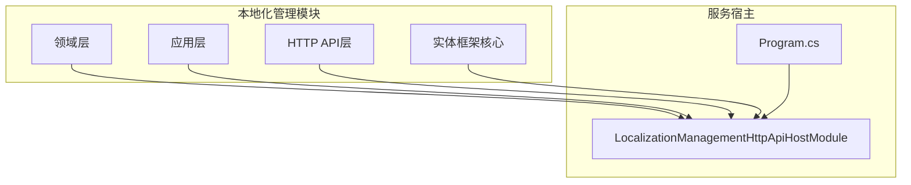
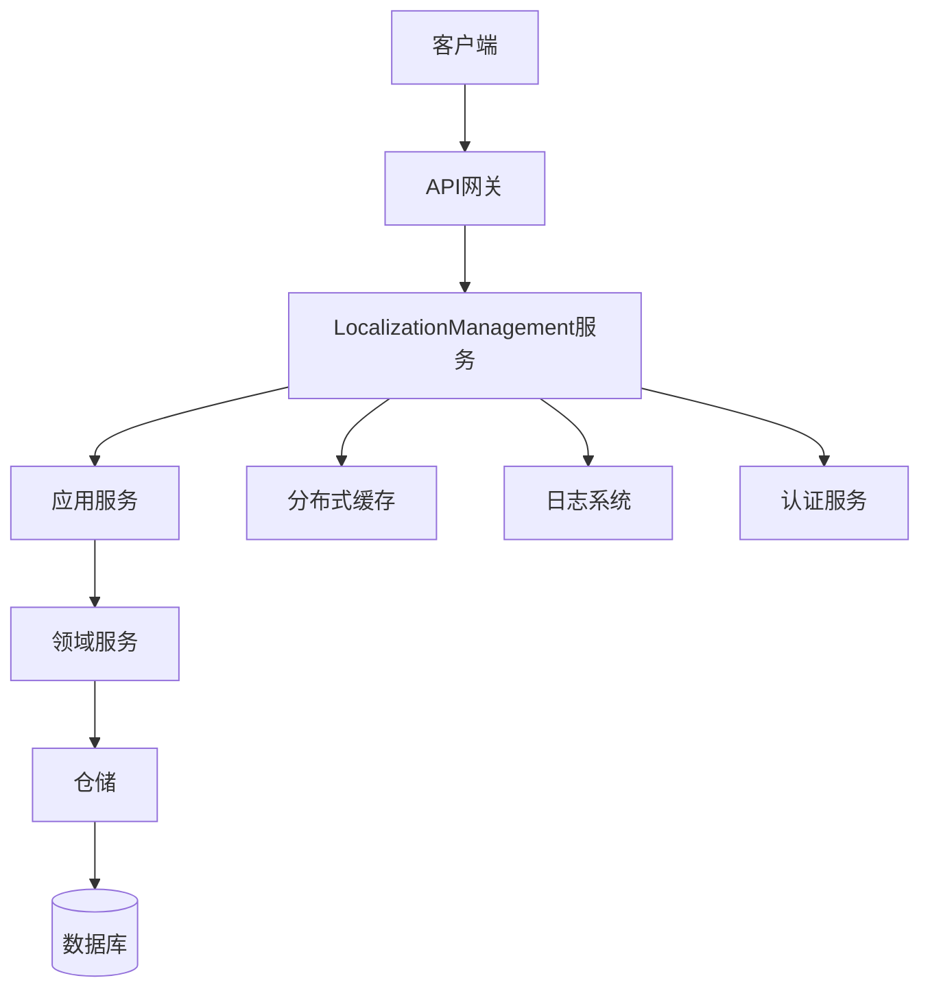
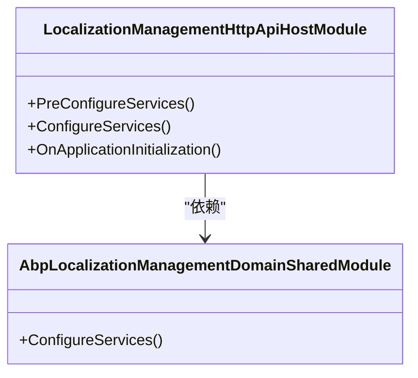
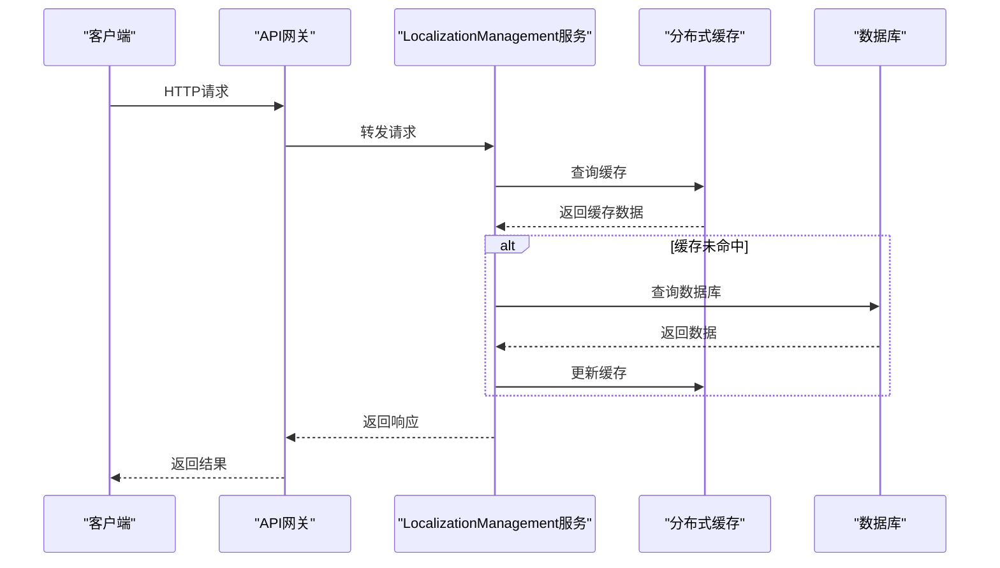
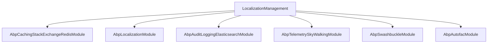

# 本地化管理服务部署

<cite>
**本文档引用的文件**  
- [LocalizationManagementHttpApiHostModule.cs](file://aspnet-core/services/LY.MicroService.LocalizationManagement.HttpApi.Host/LocalizationManagementHttpApiHostModule.cs)
- [Program.cs](file://aspnet-core/services/LY.MicroService.LocalizationManagement.HttpApi.Host/Program.cs)
- [appsettings.json](file://aspnet-core/migrations/LY.MicroService.LocalizationManagement.DbMigrator/appsettings.json)
- [AbpLocalizationManagementDomainSharedModule.cs](file://aspnet-core/modules/localization-management/LINGYUN.Abp.LocalizationManagement.Domain.Shared/LINGYUN/Abp/LocalizationManagement/AbpLocalizationManagementDomainSharedModule.cs)
- [README.EN.md](file://aspnet-core/modules/localization-management/README.EN.md)
</cite>

## 目录
1. [简介](#简介)
2. [项目结构](#项目结构)
3. [核心组件](#核心组件)
4. [架构概述](#架构概述)
5. [详细组件分析](#详细组件分析)
6. [依赖分析](#依赖分析)
7. [性能考虑](#性能考虑)
8. [故障排除指南](#故障排除指南)
9. [结论](#结论)

## 简介
本地化管理服务（LocalizationManagement）是ABP框架中的一个关键模块，负责动态管理多语言资源、语言配置、资源文件和文本内容。该服务支持CRUD操作、内存缓存、分布式缓存同步，并通过标准RESTful API接口与前端应用集成。本文档详细说明了该服务的部署流程、配置策略、缓存机制以及与其他微服务的集成方式。

## 项目结构
本地化管理服务位于`aspnet-core/modules/localization-management`目录下，包含多个子模块，分别处理应用层、领域层、HTTP API接口等职责。服务的主入口位于`aspnet-core/services/LY.MicroService.LocalizationManagement.HttpApi.Host`，通过模块化设计实现了高内聚低耦合。

**图示来源**  
- [LocalizationManagementHttpApiHostModule.cs](file://aspnet-core/services/LY.MicroService.LocalizationManagement.HttpApi.Host/LocalizationManagementHttpApiHostModule.cs)
- [AbpLocalizationManagementDomainSharedModule.cs](file://aspnet-core/modules/localization-management/LINGYUN.Abp.LocalizationManagement.Domain.Shared/LINGYUN/Abp/LocalizationManagement/AbpLocalizationManagementDomainSharedModule.cs)

**本节来源**  
- [LocalizationManagementHttpApiHostModule.cs](file://aspnet-core/services/LY.MicroService.LocalizationManagement.HttpApi.Host/LocalizationManagementHttpApiHostModule.cs)
- [README.EN.md](file://aspnet-core/modules/localization-management/README.EN.md)

## 核心组件
本地化管理服务的核心组件包括语言管理、资源管理和文本管理，支持动态创建、更新和删除操作。服务通过ABP框架的模块化机制进行组织，确保了良好的扩展性和可维护性。

**本节来源**  
- [README.EN.md](file://aspnet-core/modules/localization-management/README.EN.md)
- [AbpLocalizationManagementDomainSharedModule.cs](file://aspnet-core/modules/localization-management/LINGYUN.Abp.LocalizationManagement.Domain.Shared/LINGYUN/Abp/LocalizationManagement/AbpLocalizationManagementDomainSharedModule.cs)

## 架构概述
本地化管理服务采用典型的分层架构，包括表现层、应用层、领域层和基础设施层。服务通过依赖注入机制整合了缓存、数据库、认证授权等多个外部组件，实现了高可用性和可扩展性。

**图示来源**  
- [LocalizationManagementHttpApiHostModule.cs](file://aspnet-core/services/LY.MicroService.LocalizationManagement.HttpApi.Host/LocalizationManagementHttpApiHostModule.cs)
- [appsettings.json](file://aspnet-core/migrations/LY.MicroService.LocalizationManagement.DbMigrator/appsettings.json)

## 详细组件分析

### 本地化管理模块分析
本地化管理模块通过`LocalizationManagementHttpApiHostModule`进行配置和初始化，依赖多个ABP框架模块，如缓存、认证、日志等。模块在启动时注册了必要的服务，并配置了中间件管道。

#### 对象导向组件

**图示来源**  
- [LocalizationManagementHttpApiHostModule.cs](file://aspnet-core/services/LY.MicroService.LocalizationManagement.HttpApi.Host/LocalizationManagementHttpApiHostModule.cs)
- [AbpLocalizationManagementDomainSharedModule.cs](file://aspnet-core/modules/localization-management/LINGYUN.Abp.LocalizationManagement.Domain.Shared/LINGYUN/Abp/LocalizationManagement/AbpLocalizationManagementDomainSharedModule.cs)

#### API/服务组件

**图示来源**  
- [LocalizationManagementHttpApiHostModule.cs](file://aspnet-core/services/LY.MicroService.LocalizationManagement.HttpApi.Host/LocalizationManagementHttpApiHostModule.cs)
- [Program.cs](file://aspnet-core/services/LY.MicroService.LocalizationManagement.HttpApi.Host/Program.cs)

**本节来源**  
- [LocalizationManagementHttpApiHostModule.cs](file://aspnet-core/services/LY.MicroService.LocalizationManagement.HttpApi.Host/LocalizationManagementHttpApiHostModule.cs)
- [Program.cs](file://aspnet-core/services/LY.MicroService.LocalizationManagement.HttpApi.Host/Program.cs)

## 依赖分析
本地化管理服务依赖多个ABP框架模块和外部服务，包括数据库、缓存、日志、认证等。通过`DependsOn`特性声明了模块间的依赖关系，确保了正确的加载顺序。

**图示来源**  
- [LocalizationManagementHttpApiHostModule.cs](file://aspnet-core/services/LY.MicroService.LocalizationManagement.HttpApi.Host/LocalizationManagementHttpApiHostModule.cs)

**本节来源**  
- [LocalizationManagementHttpApiHostModule.cs](file://aspnet-core/services/LY.MicroService.LocalizationManagement.HttpApi.Host/LocalizationManagementHttpApiHostModule.cs)

## 性能考虑
本地化管理服务通过多级缓存策略优化性能，包括内存缓存和分布式缓存。配置文件中定义了缓存超时和过期时间，默认分别为2分钟和30分钟，可根据实际需求调整。

**本节来源**  
- [README.EN.md](file://aspnet-core/modules/localization-management/README.EN.md)
- [appsettings.json](file://aspnet-core/migrations/LY.MicroService.LocalizationManagement.DbMigrator/appsettings.json)

## 故障排除指南
在部署和运行本地化管理服务时，可能遇到数据库连接失败、缓存同步异常等问题。建议检查配置文件中的连接字符串、确保Redis服务正常运行，并查看日志文件以获取详细错误信息。

**本节来源**  
- [appsettings.json](file://aspnet-core/migrations/LY.MicroService.LocalizationManagement.DbMigrator/appsettings.json)
- [Program.cs](file://aspnet-core/services/LY.MicroService.LocalizationManagement.HttpApi.Host/Program.cs)

## 结论
本地化管理服务通过模块化设计和ABP框架的强大功能，实现了灵活、可扩展的多语言支持。通过合理的缓存策略和分布式架构，确保了高性能和高可用性。建议在生产环境中根据实际负载调整缓存配置，并定期监控服务状态。