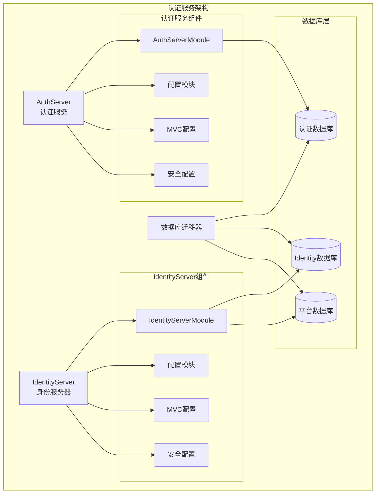
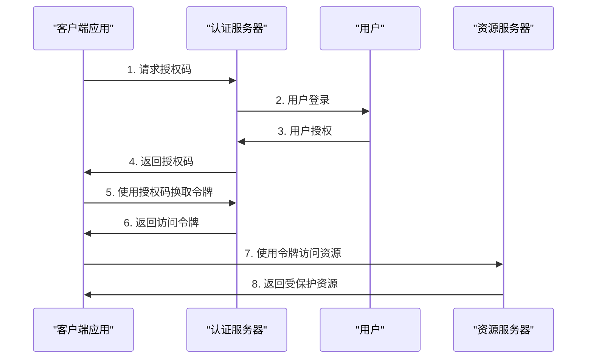
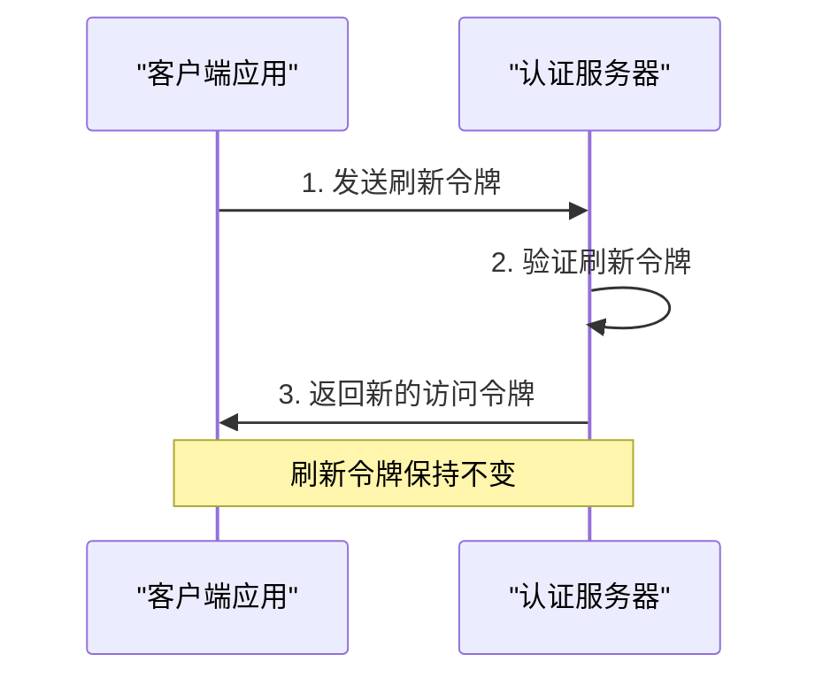
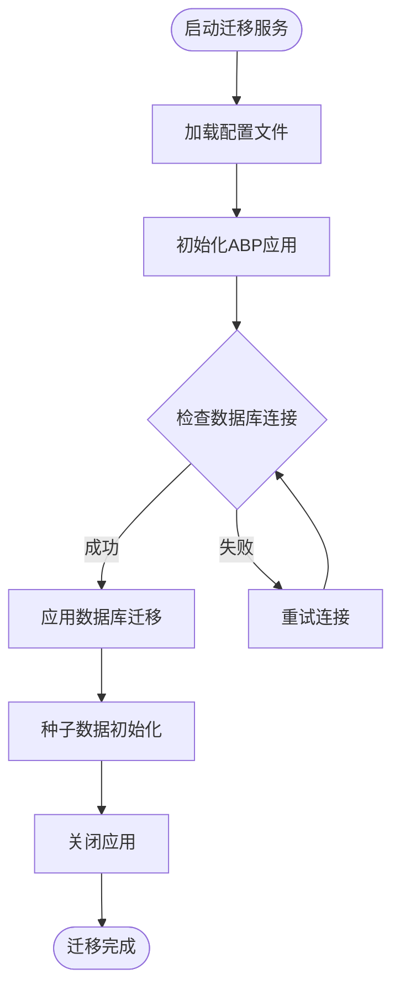

现在我已经收集了足够的信息来创建详细的认证服务部署文档。让我开始生成文档内容。

<docs>
# 认证服务部署文档

<cite>
**本文档中引用的文件**
- [appsettings.json](file://aspnet-core/services/LY.MicroService.AuthServer/appsettings.json)
- [AuthServerModule.cs](file://aspnet-core/services/LY.MicroService.AuthServer/AuthServerModule.cs)
- [AuthServerModule.Configure.cs](file://aspnet-core/services/LY.MicroService.AuthServer/AuthServerModule.Configure.cs)
- [AuthServerDbMigratorHostedService.cs](file://aspnet-core/migrations/LY.MicroService.AuthServer.DbMigrator/AuthServerDbMigratorHostedService.cs)
- [AuthServerDbMigratorModule.cs](file://aspnet-core/migrations/LY.MicroService.AuthServer.DbMigrator/AuthServerDbMigratorModule.cs)
- [IdentityServerDbMigratorHostedService.cs](file://aspnet-core/migrations/LY.MicroService.IdentityServer.DbMigrator/IdentityServerDbMigratorHostedService.cs)
- [IdentityServerDbMigratorModule.cs](file://aspnet-core/migrations/LY.MicroService.IdentityServer.DbMigrator/IdentityServerDbMigratorModule.cs)
- [appsettings.json](file://aspnet-core/migrations/LY.MicroService.AuthServer.DbMigrator/appsettings.json)
- [appsettings.json](file://aspnet-core/migrations/LY.MicroService.IdentityServer.DbMigrator/appsettings.json)
- [Program.cs](file://aspnet-core/migrations/LY.MicroService.AuthServer.DbMigrator/Program.cs)
- [Program.cs](file://aspnet-core/migrations/LY.MicroService.IdentityServer.DbMigrator/Program.cs)
</cite>

## 目录
1. [简介](#简介)
2. [项目架构概览](#项目架构概览)
3. [认证服务核心组件](#认证服务核心组件)
4. [IdentityServer4配置](#identityserver4配置)
5. [JWT令牌配置](#jwt令牌配置)
6. [OAuth2.0授权流程](#oauth20授权流程)
7. [数据库迁移服务](#数据库迁移服务)
8. [HTTPS配置与密钥管理](#https配置与密钥管理)
9. [服务健康检查与监控](#服务健康检查与监控)
10. [微服务集成配置](#微服务集成配置)
11. [部署最佳实践](#部署最佳实践)
12. [故障排除指南](#故障排除指南)

## 简介

本文档详细介绍了基于ABP框架的认证服务（AuthServer）的部署配置，包括IdentityServer4的客户端配置、JWT令牌颁发、OAuth2.0授权流程配置。该认证服务采用微服务架构设计，支持多租户、分布式缓存、数据保护等功能。

认证服务主要负责：
- 用户身份验证和授权
- JWT令牌的生成和验证
- OAuth2.0授权码流程
- 客户端凭据流程
- 资源所有者密码凭据流程
- 设备码流程
- 多种第三方登录集成

## 项目架构概览



**图表来源**
- [AuthServerModule.cs](file://aspnet-core/services/LY.MicroService.AuthServer/AuthServerModule.cs#L1-L157)
- [IdentityServerDbMigratorModule.cs](file://aspnet-core/migrations/LY.MicroService.IdentityServer.DbMigrator/IdentityServerDbMigratorModule.cs)
- [AuthServerDbMigratorModule.cs](file://aspnet-core/migrations/LY.MicroService.AuthServer.DbMigrator/AuthServerDbMigratorModule.cs)

**章节来源**
- [AuthServerModule.cs](file://aspnet-core/services/LY.MicroService.AuthServer/AuthServerModule.cs#L1-L157)

## 认证服务核心组件

### AuthServerModule 主模块

AuthServerModule是认证服务的核心模块，继承自AbpModule，负责整个认证服务的初始化和配置。

```csharp
[DependsOn(
    typeof(AbpSerilogEnrichersApplicationModule),
    typeof(AbpAccountApplicationModule),
    typeof(AbpAccountHttpApiModule),
    typeof(AbpAccountWebOpenIddictModule),
    typeof(AbpOpenIddictSmsModule),
    typeof(AbpOpenIddictWeChatModule),
    typeof(AbpIdentityOrganizaztionUnitsModule),
    typeof(AuthServerMigrationsEntityFrameworkCoreModule),
    typeof(AbpDataDbMigratorModule)
)]
public partial class AuthServerModule : AbpModule
{
    public override void PreConfigureServices(ServiceConfigurationContext context)
    {
        var configuration = context.Services.GetConfiguration();
        var hostingEnvironment = context.Services.GetHostingEnvironment();

        PreConfigureWrapper();
        PreConfigureFeature();
        PreConfigureAuthServer();
        PreConfigureApp(configuration);
        PreConfigureCAP(configuration);
        PreConfigureCertificate(configuration, hostingEnvironment);
    }
}
```

### 核心依赖模块

认证服务依赖以下关键模块：

1. **ABP核心模块**：提供基础框架功能
2. **OpenIddict模块**：OAuth2.0和OpenID Connect实现
3. **Identity模块**：ASP.NET Core Identity集成
4. **数据保护模块**：敏感数据加密保护
5. **缓存模块**：分布式缓存支持
6. **审计模块**：操作日志记录

**章节来源**
- [AuthServerModule.cs](file://aspnet-core/services/LY.MicroService.AuthServer/AuthServerModule.cs#L35-L157)

## IdentityServer4配置

### OpenIddict配置

认证服务使用OpenIddict作为IdentityServer4的替代方案，提供了更现代化的OAuth2.0和OpenID Connect实现。

```csharp
private void PreConfigureAuthServer()
{
    PreConfigure<OpenIddictBuilder>(builder =>
    {
        builder.AddValidation(options =>
        {
            options.UseLocalServer();
            options.UseAspNetCore();
            options.UseDataProtection();
        });
    });
}
```

### 客户端配置

系统预配置了多个客户端类型：

```json
{
  "IdentityServer": {
    "Clients": {
      "AuthVueAdmin": {
        "ClientId": "vue-admin-client",
        "RootUrl": "http://127.0.0.1:3100/"
      },
      "InternalService": {
        "ClientId": "InternalServiceClient"
      }
    }
  }
}
```

### 授权范围配置

```csharp
Configure<AbpOpenIddictAspNetCoreSessionOptions>(options =>
{
    options.PersistentSessionGrantTypes.Add(SmsTokenExtensionGrantConsts.GrantType);
    options.PersistentSessionGrantTypes.Add(PortalTokenExtensionGrantConsts.GrantType);
    options.PersistentSessionGrantTypes.Add(LinkUserTokenExtensionGrantConsts.GrantType);
    options.PersistentSessionGrantTypes.Add(WeChatTokenExtensionGrantConsts.OfficialGrantType);
    options.PersistentSessionGrantTypes.Add(WeChatTokenExtensionGrantConsts.MiniProgramGrantType);
    options.PersistentSessionGrantTypes.Add(AbpWeChatWorkGlobalConsts.GrantType);
});
```

**章节来源**
- [AuthServerModule.Configure.cs](file://aspnet-core/services/LY.MicroService.AuthServer/AuthServerModule.Configure.cs#L85-L120)
- [appsettings.json](file://aspnet-core/migrations/LY.MicroService.IdentityServer.DbMigrator/appsettings.json#L10-L25)

## JWT令牌配置

### 令牌生命周期配置

```csharp
Configure<OpenIddictServerOptions>(options =>
{
    var lifetime = configuration.GetSection("OpenIddict:Lifetime");
    options.AuthorizationCodeLifetime = lifetime.GetValue("AuthorizationCode", options.AuthorizationCodeLifetime);
    options.AccessTokenLifetime = lifetime.GetValue("AccessToken", options.AccessTokenLifetime);
    options.DeviceCodeLifetime = lifetime.GetValue("DeviceCode", options.DeviceCodeLifetime);
    options.IdentityTokenLifetime = lifetime.GetValue("IdentityToken", options.IdentityTokenLifetime);
    options.RefreshTokenLifetime = lifetime.GetValue("RefreshToken", options.RefreshTokenLifetime);
    options.RefreshTokenReuseLeeway = lifetime.GetValue("RefreshTokenReuseLeeway", options.RefreshTokenReuseLeeway);
    options.UserCodeLifetime = lifetime.GetValue("UserCode", options.UserCodeLifetime);
});
```

### JWT安全配置

```csharp
private void ConfigureSecurity(IServiceCollection services, IConfiguration configuration, bool isDevelopment = false)
{
    services.ForwardIdentityAuthenticationForBearer(OpenIddictValidationAspNetCoreDefaults.AuthenticationScheme);

    services
        .AddAuthentication()
        .AddCookie(CookieAuthenticationDefaults.AuthenticationScheme, options =>
        {
            options.ExpireTimeSpan = TimeSpan.FromDays(365);
        })
        .AddJwtBearer(options =>
        {
            configuration.GetSection("AuthServer").Bind(options);

            var validIssuers = configuration.GetSection("AuthServer:ValidIssuers").Get<List<string>>();
            if (validIssuers?.Count > 0)
            {
                options.TokenValidationParameters.ValidIssuers = validIssuers;
                options.TokenValidationParameters.IssuerValidator = TokenWildcardIssuerValidator.IssuerValidator;
            }
        });
}
```

### 令牌验证参数

- **有效发行人**：支持通配符域名验证
- **签名算法**：默认RSA-SHA256
- **密钥轮换**：支持动态密钥更新
- **过期时间**：可配置的访问令牌和刷新令牌有效期

**章节来源**
- [AuthServerModule.Configure.cs](file://aspnet-core/services/LY.MicroService.AuthServer/AuthServerModule.Configure.cs#L375-L418)

## OAuth2.0授权流程

### 授权码流程



**图表来源**
- [AuthServerModule.Configure.cs](file://aspnet-core/services/LY.MicroService.AuthServer/AuthServerModule.Configure.cs#L375-L418)

### 刷新令牌流程



**图表来源**
- [AuthServerModule.Configure.cs](file://aspnet-core/services/LY.MicroService.AuthServer/AuthServerModule.Configure.cs#L391-L418)

### 扩展授权流程

系统支持多种扩展授权流程：

1. **短信验证码授权**：`sms_token_extension`
2. **门户授权**：`portal_token_extension`
3. **用户关联授权**：`link_user_extension`
4. **微信公众号授权**：`wechat_official_grant`
5. **微信小程序授权**：`wechat_mini_program_grant`
6. **企业微信授权**：`work_wechat_grant`

**章节来源**
- [AuthServerModule.Configure.cs](file://aspnet-core/services/LY.MicroService.AuthServer/AuthServerModule.Configure.cs#L230-L250)

## 数据库迁移服务

### 迁移服务架构



**图表来源**
- [AuthServerDbMigratorHostedService.cs](file://aspnet-core/migrations/LY.MicroService.AuthServer.DbMigrator/AuthServerDbMigratorHostedService.cs#L20-L45)
- [IdentityServerDbMigratorHostedService.cs](file://aspnet-core/migrations/LY.MicroService.IdentityServer.DbMigrator/IdentityServerDbMigratorHostedService.cs#L20-L45)

### 认证数据库迁移

认证数据库迁移服务负责创建和更新认证相关的数据库表结构：

```csharp
public async Task StartAsync(CancellationToken cancellationToken)
{
    using var application = await AbpApplicationFactory
        .CreateAsync<AuthServerDbMigratorModule>(options =>
    {
        options.Configuration.UserSecretsId = Environment.GetEnvironmentVariable("APPLICATION_USER_SECRETS_ID");
        options.Configuration.UserSecretsAssembly = typeof(AuthServerDbMigratorHostedService).Assembly;
        options.Services.ReplaceConfiguration(_configuration);
        options.UseAutofac();
        options.Services.AddLogging(c => c.AddSerilog());
        options.AddDataMigrationEnvironment();
    });
    
    await application.InitializeAsync();
    
    await application
        .ServiceProvider
        .GetRequiredService<AuthServerDbMigrationService>()
        .CheckAndApplyDatabaseMigrationsAsync();
    
    await application.ShutdownAsync();
    _hostApplicationLifetime.StopApplication();
}
```

### Identity数据库迁移

Identity数据库迁移服务负责IdentityServer相关的数据库初始化：

```csharp
public async Task StartAsync(CancellationToken cancellationToken)
{
    using var application = await AbpApplicationFactory
        .CreateAsync<IdentityServerDbMigratorModule>(options =>
    {
        options.Configuration.UserSecretsId = Environment.GetEnvironmentVariable("APPLICATION_USER_SECRETS_ID");
        options.Configuration.UserSecretsAssembly = typeof(IdentityServerDbMigratorHostedService).Assembly;
        options.Services.ReplaceConfiguration(_configuration);
        options.UseAutofac();
        options.Services.AddLogging(c => c.AddSerilog());
        options.AddDataMigrationEnvironment();
    });
    
    await application.InitializeAsync();
    
    await application
        .ServiceProvider
        .GetRequiredService<IdentityServerDbMigrationService>()
        .CheckAndApplyDatabaseMigrationsAsync();
    
    await application.ShutdownAsync();
    _hostApplicationLifetime.StopApplication();
}
```

### 迁移执行顺序

为了确保认证系统的正常运行，必须按照以下顺序执行数据库迁移：

1. **Identity数据库迁移**：先创建IdentityServer所需的数据库结构
2. **认证数据库迁移**：创建认证服务专用的数据库结构
3. **平台数据库迁移**：创建平台管理相关的数据库结构

**章节来源**
- [AuthServerDbMigratorHostedService.cs](file://aspnet-core/migrations/LY.MicroService.AuthServer.DbMigrator/AuthServerDbMigratorHostedService.cs#L20-L45)
- [IdentityServerDbMigratorHostedService.cs](file://aspnet-core/migrations/LY.MicroService.IdentityServer.DbMigrator/IdentityServerDbMigratorHostedService.cs#L20-L45)

## HTTPS配置与密钥管理

### SSL证书配置

认证服务支持多种SSL证书配置方式：

```json
{
  "App": {
    "SslFile": "openiddict.pfx",
    "SslPassword": "e1c48393-0c43-11f0-9582-4aecacda42db"
  }
}
```

### 开发环境配置

在开发环境中，系统会自动创建开发证书：

```csharp
PreConfigure<OpenIddictServerBuilder>(builder =>
{
    builder.AddProductionEncryptionAndSigningCertificate(
        configuration["App:SslFile"], 
        configuration["App:SslPassword"]);
});

// 禁用HTTPS要求
PreConfigure<OpenIddictServerBuilder>(builder =>
{
    builder.UseAspNetCore()
        .DisableTransportSecurityRequirement();
});
```

### 密钥管理

系统使用数据保护API进行密钥管理：

```csharp
if (!isDevelopment)
{
    var redis = ConnectionMultiplexer.Connect(configuration["Redis:Configuration"]);
    services
        .AddDataProtection()
        .SetApplicationName("LINGYUN.ABP.Application")
        .PersistKeysToStackExchangeRedis(redis, "LINGYUN.ABP.Application:DataProtection:Protection-Keys");
}
```

### 密钥轮换策略

- **数据保护密钥**：存储在Redis中，支持集群部署
- **JWT签名密钥**：支持动态轮换
- **证书密钥**：支持PFX文件导入导出

**章节来源**
- [appsettings.json](file://aspnet-core/services/LY.MicroService.AuthServer/appsettings.json#L5-L7)
- [AuthServerModule.Configure.cs](file://aspnet-core/services/LY.MicroService.AuthServer/AuthServerModule.Configure.cs#L100-L120)
- [AuthServerModule.Configure.cs](file://aspnet-core/services/LY.MicroService.AuthServer/AuthServerModule.Configure.cs#L410-L425)

## 服务健康检查与监控

### 健康检查端点

认证服务集成了ASP.NET Core健康检查功能：

```csharp
private void ConfigureMvc(IServiceCollection services, IConfiguration configuration)
{
    Configure<AbpEndpointRouterOptions>(options =>
    {
        options.EndpointConfigureActions.Add((builder) =>
        {
            builder.Endpoints.MapHealthChecks(configuration["App:HealthChecks"] ?? "/healthz");
        });
    });

    services.AddHealthChecks();
}
```

### 监控指标配置

系统支持多种监控技术：

#### SkyWalking监控

```json
{
  "SkyWalking": {
    "Enable": false
  }
}
```

#### OpenTelemetry监控

```json
{
  "OpenTelemetry": {
    "Otlp": {
      "IsEnabled": false,
      "Endpoint": "http://localhost:4317",
      "Protocol": "Grpc"
    }
  }
}
```

### 日志配置

认证服务使用Serilog进行结构化日志记录：

```json
{
  "Serilog": {
    "MinimumLevel": {
      "Default": "Information",
      "Override": {
        "System": "Warning",
        "Microsoft": "Warning",
        "DotNetCore": "Information"
      }
    },
    "WriteTo": [
      {
        "Name": "Console",
        "Args": {
          "restrictedToMinimumLevel": "Debug",
          "outputTemplate": "{Timestamp:yyyy-MM-dd HH:mm:ss} [{Level:u3}] [{SourceContext}] [{ProcessId}] [{ThreadId}] - {Message:lj}{NewLine}{Exception}"
        }
      },
      {
        "Name": "File",
        "Args": {
          "path": "Logs/Debug-.log",
          "restrictedToMinimumLevel": "Debug",
          "rollingInterval": "Day"
        }
      }
    ]
  }
}
```

### 性能监控

- **响应时间监控**：跟踪API调用性能
- **内存使用监控**：监控内存泄漏和使用情况
- **数据库连接池监控**：监控数据库连接状态
- **缓存命中率监控**：监控分布式缓存性能

**章节来源**
- [AuthServerModule.Configure.cs](file://aspnet-core/services/LY.MicroService.AuthServer/AuthServerModule.Configure.cs#L130-L145)
- [appsettings.json](file://aspnet-core/services/LY.MicroService.AuthServer/appsettings.json#L25-L95)

## 微服务集成配置

### CORS配置

认证服务支持跨域资源共享配置：

```csharp
private void ConfigureCors(IServiceCollection services, IConfiguration configuration)
{
    services.AddCors(options =>
    {
        options.AddDefaultPolicy(builder =>
        {
            var corsOrigins = configuration.GetSection("App:CorsOrigins").Get<List<string>>();
            if (corsOrigins == null || corsOrigins.Count == 0)
            {
                corsOrigins = configuration["App:CorsOrigins"]?
                    .Split(",", StringSplitOptions.RemoveEmptyEntries)
                    .Select(o => o.RemovePostFix("/"))
                    .ToList() ?? new List<string>();
            }
            builder
                .WithOrigins(corsOrigins.Select(o => o.RemovePostFix("/")).ToArray())
                .WithAbpExposedHeaders()
                .WithAbpWrapExposedHeaders()
                .SetIsOriginAllowedToAllowWildcardSubdomains()
                .AllowAnyHeader()
                .AllowAnyMethod()
                .AllowCredentials();
        });
    });
}
```

### 应用程序URL配置

```csharp
Configure<AppUrlOptions>(options =>
{
    var applicationConfiguration = configuration.GetSection("App:Urls:Applications");
    foreach (var appConfig in applicationConfiguration.GetChildren())
    {
        options.Applications[appConfig.Key].RootUrl = appConfig["RootUrl"];
        foreach (var urlsConfig in appConfig.GetSection("Urls").GetChildren())
        {
            options.Applications[appConfig.Key].Urls[urlsConfig.Key] = urlsConfig.Value;
        }
    }
});
```

### 多租户配置

```csharp
Configure<AbpMultiTenancyOptions>(options =>
{
    options.IsEnabled = true;
});

var tenantResolveCfg = configuration.GetSection("App:Domains");
if (tenantResolveCfg.Exists())
{
    Configure<AbpTenantResolveOptions>(options =>
    {
        var domains = tenantResolveCfg.Get<string[]>();
        foreach (var domain in domains)
        {
            options.AddDomainTenantResolver(domain);
        }
    });
}
```

### 服务发现集成

认证服务支持多种服务发现机制：

1. **Consul**：支持Consul服务注册和发现
2. **Eureka**：支持Netflix Eureka集成
3. **Kubernetes**：支持Kubernetes原生服务发现
4. **DNS**：支持DNS服务发现

**章节来源**
- [AuthServerModule.Configure.cs](file://aspnet-core/services/LY.MicroService.AuthServer/AuthServerModule.Configure.cs#L430-L470)
- [AuthServerModule.Configure.cs](file://aspnet-core/services/LY.MicroService.AuthServer/AuthServerModule.Configure.cs#L340-L370)

## 部署最佳实践

### 环境配置

#### 生产环境配置

```json
{
  "ConnectionStrings": {
    "Default": "Server=prod-db-server;Database=Platform-v70;User Id=prod-user;Password=prod-password;",
    "Identity": "Server=prod-db-server;Database=AuthServer-V70;User Id=prod-user;Password=prod-password;",
    "Redis": "redis-cluster:6379"
  },
  "App": {
    "SslFile": "/etc/ssl/certs/auth-server.pfx",
    "SslPassword": "production-cert-password"
  },
  "Redis": {
    "Configuration": "redis-cluster:6379"
  }
}
```

#### 开发环境配置

```json
{
  "ConnectionStrings": {
    "Default": "Server=localhost;Database=Platform-v70;User Id=root;Password=123456;",
    "Identity": "Server=localhost;Database=AuthServer-V70;User Id=root;Password=123456;",
    "Redis": "localhost:6379"
  },
  "App": {
    "ShowPii": true
  }
}
```

### Docker部署

#### Docker Compose配置

```yaml
version: '3.8'
services:
  auth-server:
    image: abp-next-admin/auth-server:latest
    ports:
      - "5000:80"
    environment:
      - ASPNETCORE_ENVIRONMENT=Production
      - ConnectionStrings__Default=${DB_CONNECTION_STRING}
      - Redis__Configuration=${REDIS_CONNECTION_STRING}
    volumes:
      - ./certificates:/app/certificates
    depends_on:
      - postgres
      - redis
  
  postgres:
    image: postgres:13
    environment:
      - POSTGRES_DB=platform
      - POSTGRES_USER=admin
      - POSTGRES_PASSWORD=password
    volumes:
      - postgres_data:/var/lib/postgresql/data
  
  redis:
    image: redis:6-alpine
    command: redis-server --appendonly yes
    volumes:
      - redis_data:/data

volumes:
  postgres_data:
  redis_data:
```

### Kubernetes部署

#### Deployment配置

```yaml
apiVersion: apps/v1
kind: Deployment
metadata:
  name: auth-server-deployment
spec:
  replicas: 3
  selector:
    matchLabels:
      app: auth-server
  template:
    metadata:
      labels:
        app: auth-server
    spec:
      containers:
      - name: auth-server
        image: abp-next-admin/auth-server:latest
        ports:
        - containerPort: 80
        env:
        - name: ASPNETCORE_ENVIRONMENT
          value: "Production"
        - name: ConnectionStrings__Default
          valueFrom:
            secretKeyRef:
              name: db-secrets
              key: connection-string
        - name: Redis__Configuration
          valueFrom:
            secretKeyRef:
              name: redis-secrets
              key: connection-string
        livenessProbe:
          httpGet:
            path: /healthz
            port: 80
          initialDelaySeconds: 30
          periodSeconds: 10
        readinessProbe:
          httpGet:
            path: /healthz
            port: 80
          initialDelaySeconds: 5
          periodSeconds: 5
```

#### Service配置

```yaml
apiVersion: v1
kind: Service
metadata:
  name: auth-server-service
spec:
  selector:
    app: auth-server
  ports:
  - protocol: TCP
    port: 80
    targetPort: 80
  type: LoadBalancer
```

### 负载均衡配置

#### Nginx配置

```nginx
upstream auth_server_backend {
    server auth-server-1:80 weight=1 max_fails=3 fail_timeout=30s;
    server auth-server-2:80 weight=1 max_fails=3 fail_timeout=30s;
    server auth-server-3:80 weight=1 max_fails=3 fail_timeout=30s;
}

server {
    listen 443 ssl http2;
    server_name auth.example.com;
    
    ssl_certificate /etc/nginx/ssl/auth-server.crt;
    ssl_certificate_key /etc/nginx/ssl/auth-server.key;
    
    location / {
        proxy_pass http://auth_server_backend;
        proxy_set_header Host $host;
        proxy_set_header X-Real-IP $remote_addr;
        proxy_set_header X-Forwarded-For $proxy_add_x_forwarded_for;
        proxy_set_header X-Forwarded-Proto $scheme;
        
        proxy_connect_timeout 60s;
        proxy_send_timeout 60s;
        proxy_read_timeout 60s;
    }
    
    location /healthz {
        access_log off;
        return 200 "healthy\n";
        add_header Content-Type text/plain;
    }
}
```

### 安全加固

#### 防火墙配置

```bash
# 允许HTTPS流量
iptables -A INPUT -p tcp --dport 443 -j ACCEPT

# 允许HTTP健康检查
iptables -A INPUT -p tcp --dport 80 -j ACCEPT

# 允许内部网络访问
iptables -A INPUT -s 10.0.0.0/8 -j ACCEPT

# 拒绝其他所有流量
iptables -P INPUT DROP
```

#### 容器安全

```dockerfile
FROM mcr.microsoft.com/dotnet/aspnet:8.0 AS base
USER app
WORKDIR /app
EXPOSE 80

FROM mcr.microsoft.com/dotnet/sdk:8.0 AS build
WORKDIR /src
COPY ["aspnet-core/services/LY.MicroService.AuthServer/", "LY.MicroService.AuthServer/"]
RUN dotnet restore "LY.MicroService.AuthServer/LY.MicroService.AuthServer.csproj"
COPY . .
WORKDIR "/src/LY.MicroService.AuthServer"
RUN dotnet build "LY.MicroService.AuthServer.csproj" -c Release -o /app/build

FROM build AS publish
RUN dotnet publish "LY.MicroService.AuthServer.csproj" -c Release -o /app/publish

FROM base AS final
WORKDIR /app
COPY --from=publish /app/publish .
ENTRYPOINT ["dotnet", "LY.MicroService.AuthServer.dll"]
```

## 故障排除指南

### 常见问题诊断

#### 数据库连接问题

**症状**：应用启动时出现数据库连接错误

**诊断步骤**：
1. 检查连接字符串配置
2. 验证数据库服务是否可用
3. 检查网络连通性
4. 验证数据库用户权限

**解决方案**：
```bash
# 测试数据库连接
telnet database-server 5432

# 检查数据库服务状态
systemctl status postgresql

# 验证连接字符串
echo $CONNECTION_STRING | jq .
```

#### 证书验证失败

**症状**：HTTPS请求返回证书验证错误

**诊断步骤**：
1. 检查SSL证书文件路径
2. 验证证书文件格式
3. 检查证书密码配置
4. 验证证书有效期

**解决方案**：
```bash
# 验证PFX证书
openssl pkcs12 -info -in openiddict.pfx

# 检查证书有效期
openssl x509 -in certificate.crt -noout -dates

# 更新证书配置
dotnet user-secrets set "App:SslFile" "/new/path/to/certificate.pfx"
```

#### JWT令牌验证失败

**症状**：访问受保护资源时返回401未授权错误

**诊断步骤**：
1. 检查令牌格式和有效期
2. 验证签名密钥配置
3. 检查发行人配置
4. 验证受众配置

**解决方案**：
```csharp
// 启用PII显示以获取详细错误信息
{
  "App": {
    "ShowPii": true
  }
}
```

#### CORS配置问题

**症状**：前端应用无法访问认证服务API

**诊断步骤**：
1. 检查CORS配置中的允许域名
2. 验证预检请求处理
3. 检查凭证配置
4. 验证暴露头部配置

**解决方案**：
```json
{
  "App": {
    "CorsOrigins": [
      "http://localhost:3000",
      "https://your-app-domain.com"
    ]
  }
}
```

### 性能优化

