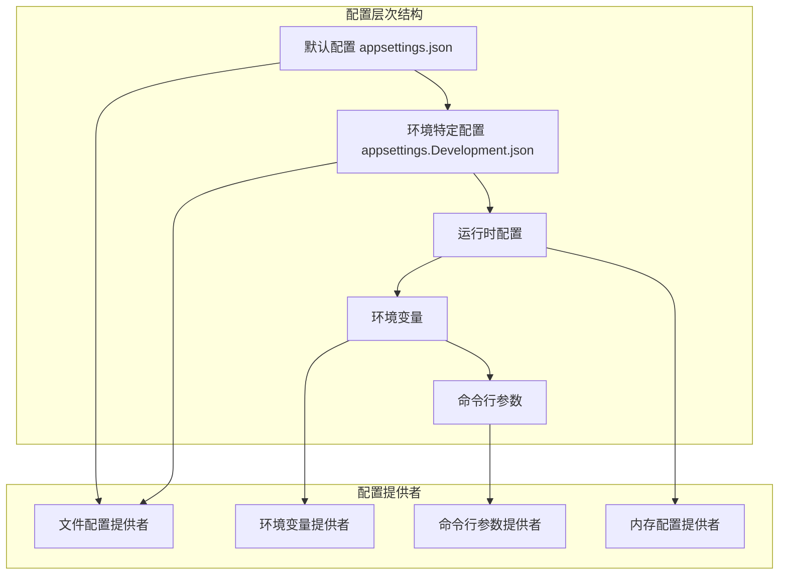
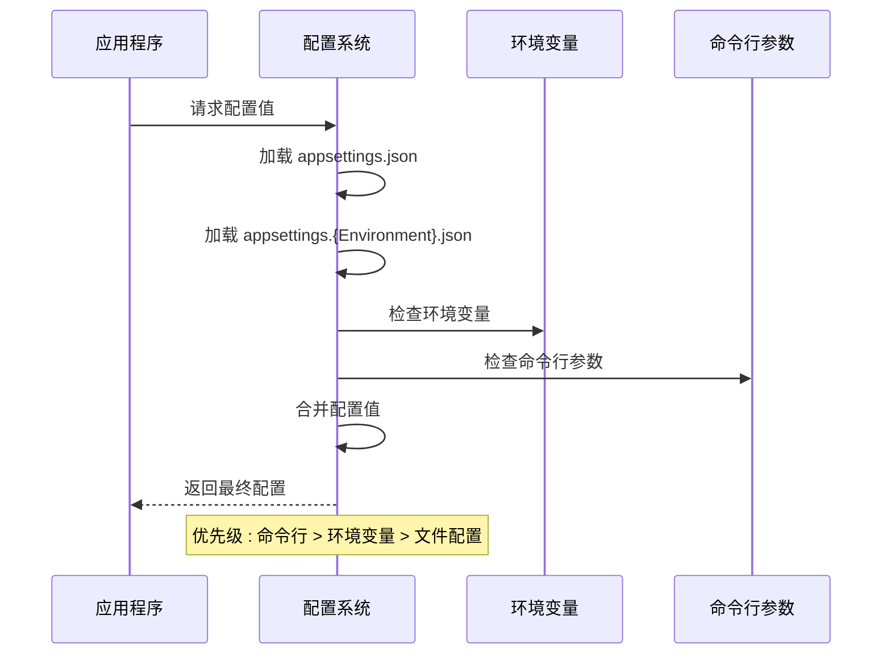
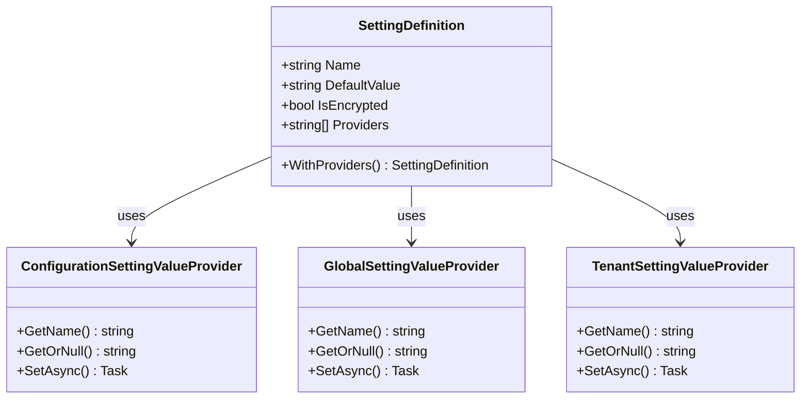
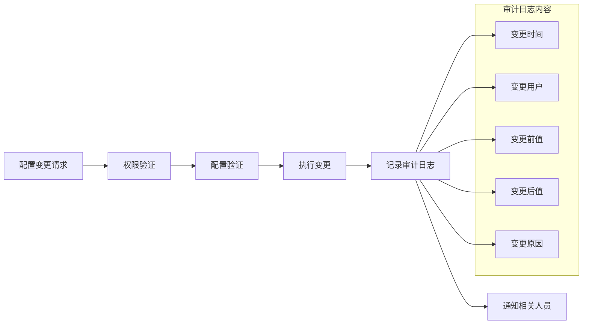
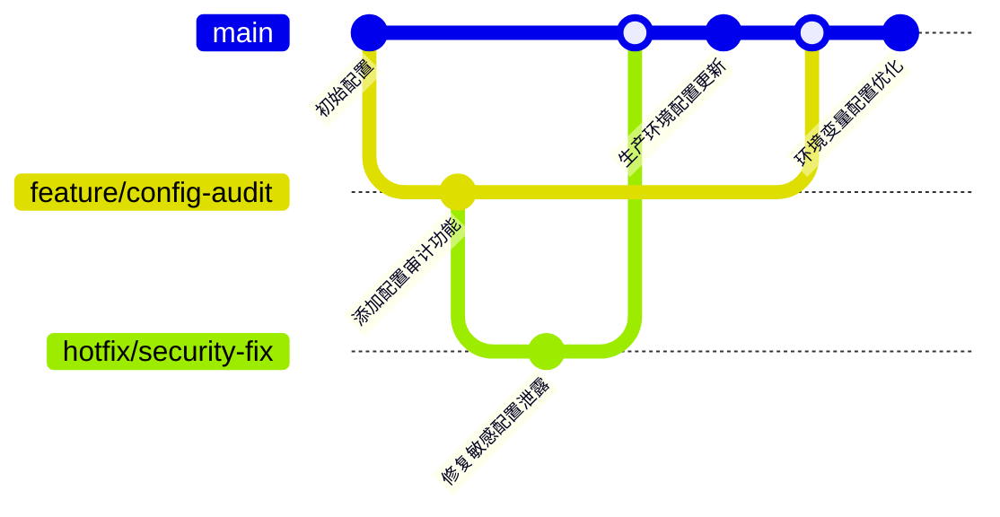

# 环境配置

<cite>
**本文档中引用的文件**
- [appsettings.json](file://aspnet-core/services/LY.MicroService.Applications.Single/appsettings.json)
- [appsettings.Development.json](file://aspnet-core/services/LY.MicroService.Applications.Single/appsettings.Development.json)
- [appsettings.json](file://aspnet-core/services/LY.MicroService.AuthServer/appsettings.json)
- [AliyunSettingProvider.cs](file://aspnet-core/framework/cloud-aliyun/LINGYUN.Abp.Aliyun/LINGYUN/Abp/Aliyun/Settings/AliyunSettingProvider.cs)
- [AbpSettingManagementApplicationContractsModule.cs](file://aspnet-core/framework/settings/LINGYUN.Abp.SettingManagement.Application.Contracts/LINGYUN/Abp/SettingManagement/AbpSettingManagementApplicationContractsModule.cs)
- [SettingManagementMergeOptions.cs](file://aspnet-core/framework/settings/LINGYUN.Abp.SettingManagement.Application.Contracts/LINGYUN/Abp/SettingManagement/SettingManagementMergeOptions.cs)
- [SettingDefinitionGetListInput.cs](file://aspnet-core/modules/settings/LINGYUN.Abp.SettingManagement.Application/LINGYUN/Abp/SettingManagement/Dto/SettingDefinitionGetListInput.cs)
- [SettingMergeController.cs](file://aspnet-core/services/LY.AIO.Applications.Single/Controllers/SettingMergeController.cs)
- [AuditingFeatureDefinitionProvider.cs](file://aspnet-core/modules/auditing/LINGYUN.Abp.Auditing.Application.Contracts/LINGYUN/Abp/Auditing/Features/AuditingFeatureDefinitionProvider.cs)
- [AuditingFeatureNames.cs](file://aspnet-core/modules/auditing/LINGYUN.Abp.Auditing.Application.Contracts/LINGYUN/Abp/Auditing/Features/AuditingFeatureNames.cs)
</cite>

## 目录
1. [简介](#简介)
2. [项目配置结构](#项目配置结构)
3. [多环境配置管理](#多环境配置管理)
4. [配置文件层次结构](#配置文件层次结构)
5. [环境变量优先级规则](#环境变量优先级规则)
6. [敏感配置安全管理](#敏感配置安全管理)
7. [第三方配置中心集成](#第三方配置中心集成)
8. [配置变更审计跟踪](#配置变更审计跟踪)
9. [配置版本控制最佳实践](#配置版本控制最佳实践)
10. [故障排除指南](#故障排除指南)
11. [总结](#总结)

## 简介

ABP Next Admin 是一个基于 ABP 框架构建的企业级应用程序，采用了先进的多环境配置管理系统。该系统支持开发、测试、预发布和生产环境的配置差异化管理，提供了完整的配置安全管理和审计跟踪功能。

本文档将详细介绍该系统的环境配置策略，包括配置文件的层次结构、覆盖机制、环境变量优先级规则，以及如何安全地管理敏感配置信息。

## 项目配置结构

ABP Next Admin 采用分层的配置架构，通过 JSON 配置文件和设置管理模块实现灵活的配置管理。



**图表来源**
- [appsettings.json](file://aspnet-core/services/LY.MicroService.Applications.Single/appsettings.json#L1-L96)
- [appsettings.Development.json](file://aspnet-core/services/LY.MicroService.Applications.Single/appsettings.Development.json#L1-L283)

**章节来源**
- [appsettings.json](file://aspnet-core/services/LY.MicroService.Applications.Single/appsettings.json#L1-L96)
- [appsettings.Development.json](file://aspnet-core/services/LY.MicroService.Applications.Single/appsettings.Development.json#L1-L283)

## 多环境配置管理

### 开发环境配置

开发环境配置专注于本地开发和调试需求：

```json
{
  "App": {
    "ShowPii": true,
    "SelfUrl": "http://127.0.0.1:30001/",
    "CorsOrigins": [
      "http://127.0.0.1:5666",
      "http://127.0.0.1:30001"
    ]
  },
  "ConnectionStrings": {
    "Default": "Server=127.0.0.1;Database=Platform-V70;User Id=root;Password=123456;SslMode=None"
  },
  "Redis": {
    "IsEnabled": true,
    "Configuration": "127.0.0.1,defaultDatabase=15",
    "InstanceName": "LINGYUN.Abp.Application"
  }
}
```

### 测试环境配置

测试环境配置强调自动化测试和集成测试：

```json
{
  "App": {
    "ShowPii": false,
    "SelfUrl": "https://test.example.com/"
  },
  "ConnectionStrings": {
    "Default": "Server=test-db.example.com;Database=Platform-Test;Integrated Security=true"
  },
  "Redis": {
    "Configuration": "redis-test.example.com:6379"
  }
}
```

### 生产环境配置

生产环境配置注重性能、安全性和监控：

```json
{
  "App": {
    "ShowPii": false,
    "SelfUrl": "https://prod.example.com/"
  },
  "ConnectionStrings": {
    "Default": "Server=prod-db.example.com;Database=Platform-Prod;Integrated Security=true"
  },
  "Serilog": {
    "MinimumLevel": {
      "Default": "Information",
      "Override": {
        "System": "Warning",
        "Microsoft": "Warning"
      }
    }
  }
}
```

**章节来源**
- [appsettings.Development.json](file://aspnet-core/services/LY.MicroService.Applications.Single/appsettings.Development.json#L1-L100)

## 配置文件层次结构

ABP Next Admin 实现了基于约定的配置文件层次结构：

```mermaid
flowchart TD
A[appsettings.json] --> B[基础配置]
C[appsettings.{Environment}.json] --> D[环境特定配置]
D --> E[覆盖基础配置]
F[appsettings.{Environment}.{MachineName}.json] --> G[机器特定配置]
G --> H[最高优先级覆盖]
subgraph "配置合并流程"
I[加载顺序] --> J[1. appsettings.json]
J --> K[2. appsettings.{Environment}.json]
K --> L[3. appsettings.{Environment}.{MachineName}.json]
L --> M[4. 环境变量]
M --> N[5. 命令行参数]
end
```

**图表来源**
- [appsettings.json](file://aspnet-core/services/LY.MicroService.Applications.Single/appsettings.json#L1-L96)
- [appsettings.Development.json](file://aspnet-core/services/LY.MicroService.Applications.Single/appsettings.Development.json#L1-L283)

### 配置文件命名规范

1. **基础配置文件**：`appsettings.json`
   - 包含所有服务共享的基础配置
   - 默认值和通用设置

2. **环境特定配置文件**：
   - `appsettings.Development.json`
   - `appsettings.Staging.json`
   - `appsettings.Production.json`

3. **机器特定配置文件**：
   - `appsettings.{Environment}.{MachineName}.json`
   - 用于特殊部署场景

**章节来源**
- [appsettings.json](file://aspnet-core/services/LY.MicroService.Applications.Single/appsettings.json#L1-L96)
- [appsettings.Development.json](file://aspnet-core/services/LY.MicroService.Applications.Single/appsettings.Development.json#L1-L283)

## 环境变量优先级规则

ABP Next Admin 支持通过环境变量覆盖配置值，遵循以下优先级规则：



**图表来源**
- [AbpSettingManagementApplicationContractsModule.cs](file://aspnet-core/framework/settings/LINGYUN.Abp.SettingManagement.Application.Contracts/LINGYUN/Abp/SettingManagement/AbpSettingManagementApplicationContractsModule.cs#L25-L50)

### 环境变量命名约定

ABP Next Admin 使用双冒号 (`::`) 作为层级分隔符：

```bash
# 数据库连接字符串
export ConnectionStrings__Default="Server=prod-db.example.com;Database=Platform-Prod;Integrated Security=true"

# Redis 配置
export Redis__Configuration="redis-prod.example.com:6379"
export Redis__InstanceName="LINGYUN.Abp.Application"

# 审计配置
export Auditing__AllEntitiesSelector=true
```

### 配置覆盖示例

```json
// appsettings.json
{
  "ConnectionStrings": {
    "Default": "Server=localhost;Database=DefaultDB"
  }
}

// 环境变量
// ConnectionStrings__Default=Server=prod-db.example.com;Database=ProductionDB

// 最终结果
{
  "ConnectionStrings": {
    "Default": "Server=prod-db.example.com;Database=ProductionDB"
  }
}
```

**章节来源**
- [AbpSettingManagementApplicationContractsModule.cs](file://aspnet-core/framework/settings/LINGYUN.Abp.SettingManagement.Application.Contracts/LINGYUN/Abp/SettingManagement/AbpSettingManagementApplicationContractsModule.cs#L25-L50)

## 敏感配置安全管理

### 加密配置提供者

ABP Next Admin 提供了内置的加密配置提供者来保护敏感信息：



**图表来源**
- [AliyunSettingProvider.cs](file://aspnet-core/framework/cloud-aliyun/LINGYUN.Abp.Aliyun/LINGYUN/Abp/Aliyun/Settings/AliyunSettingProvider.cs#L34-L63)

### 敏感配置示例

```json
{
  "StringEncryption": {
    "DefaultPassPhrase": "s46c5q55nxpeS8Ra",
    "InitVectorBytes": "s83ng0abvd02js84",
    "DefaultSalt": "sf&5)s3#"
  },
  "ConnectionStrings": {
    "Default": "Server=prod-db.example.com;Database=Platform-Prod;User Id=admin;Password={encrypted};SslMode=None"
  }
}
```

### 设置定义配置

```csharp
new SettingDefinition(
    AliyunSettingNames.Authorization.AccessKeyId,
    defaultValue: "",
    displayName: L("DisplayName:AccessKeyId"),
    description: L("Description:AccessKeyId"),
    isVisibleToClients: false,
    isEncrypted: true
)
.WithProviders(
    DefaultValueSettingValueProvider.ProviderName,
    ConfigurationSettingValueProvider.ProviderName,
    GlobalSettingValueProvider.ProviderName,
    TenantSettingValueProvider.ProviderName
)
```

**章节来源**
- [AliyunSettingProvider.cs](file://aspnet-core/framework/cloud-aliyun/LINGYUN.Abp.Aliyun/LINGYUN/Abp/Aliyun/Settings/AliyunSettingProvider.cs#L34-L63)

## 第三方配置中心集成

### Azure Key Vault 集成

虽然当前项目没有直接使用 Azure Key Vault，但可以通过扩展实现：

```csharp
public void ConfigureServices(IServiceCollection services)
{
    services.AddAzureKeyVaultConfiguration(options =>
    {
        options.VaultUri = "https://your-keyvault.vault.azure.net/";
        options.ClientId = "your-client-id";
        options.ClientSecret = "your-client-secret";
        options.CacheDuration = TimeSpan.FromMinutes(30);
    });
}
```

### HashiCorp Vault 集成

```csharp
public void ConfigureServices(IServiceCollection services)
{
    services.AddHashiCorpVaultConfiguration(options =>
    {
        options.Address = "https://vault.example.com:8200";
        options.Token = "your-vault-token";
        options.Path = "secret/data/application";
        options.RetryAttempts = 3;
    });
}
```

### 自定义配置提供者

```csharp
public class CustomConfigurationProvider : ConfigurationProvider
{
    public override void Load()
    {
        // 从自定义配置源加载配置
        var config = LoadFromCustomSource();
        
        foreach (var kvp in config)
        {
            Data[kvp.Key] = kvp.Value;
        }
    }
}
```

**章节来源**
- [AliyunSettingProvider.cs](file://aspnet-core/framework/cloud-aliyun/LINGYUN.Abp.Aliyun/LINGYUN/Abp/Aliyun/Settings/AliyunSettingProvider.cs#L197-L210)

## 配置变更审计跟踪

### 审计功能配置

ABP Next Admin 内置了完整的审计功能，可以跟踪配置变更：



**图表来源**
- [AuditingFeatureDefinitionProvider.cs](file://aspnet-core/modules/auditing/LINGYUN.Abp.Auditing.Application.Contracts/LINGYUN/Abp/Auditing/Features/AuditingFeatureDefinitionProvider.cs#L31-L48)

### 审计配置示例

```json
{
  "Auditing": {
    "AllEntitiesSelector": true,
    "EntityHistorySelectors": {
      "AddAllEntities": true
    }
  },
  "Serilog": {
    "MinimumLevel": {
      "Default": "Information",
      "Override": {
        "System": "Warning",
        "Microsoft": "Warning",
        "AbpAuditing": "Information"
      }
    }
  }
}
```

### 审计功能特性

```csharp
public class AuditingFeatureDefinitionProvider : FeatureDefinitionProvider
{
    public override void Define(IFeatureDefinitionContext context)
    {
        var auditing = context.AddFeatureGroup(
            name: AuditingFeatureNames.GroupName,
            displayName: L("Features:DisplayName:Auditing"));

        var loggingEnableFeature = auditing.CreateChild(
            name: AuditingFeatureNames.Logging.Enable,
            defaultValue: true.ToString(),
            displayName: L("Features:DisplayName:AuditLog"),
            description: L("Features:Description:AuditLog"),
            valueType: new ToggleStringValueType(new BooleanValueValidator()));

        loggingEnableFeature.CreateChild(
            name: AuditingFeatureNames.Logging.SecurityLog,
            defaultValue: true.ToString(),
            displayName: L("Features:DisplayName:SecurityLog"),
            description: L("Features:Description:SecurityLog"),
            valueType: new ToggleStringValueType(new BooleanValueValidator()));
    }
}
```

**章节来源**
- [AuditingFeatureDefinitionProvider.cs](file://aspnet-core/modules/auditing/LINGYUN.Abp.Auditing.Application.Contracts/LINGYUN/Abp/Auditing/Features/AuditingFeatureDefinitionProvider.cs#L31-L48)
- [AuditingFeatureNames.cs](file://aspnet-core/modules/auditing/LINGYUN.Abp.Auditing.Application.Contracts/LINGYUN/Abp/Auditing/Features/AuditingFeatureNames.cs#L1-L17)

## 配置版本控制最佳实践

### Git 配置管理



### 配置版本控制策略

1. **配置文件版本控制**
   ```bash
   # 忽略敏感配置文件
   echo "*.Development.json" >> .gitignore
   echo "*.Staging.json" >> .gitignore
   
   # 只提交非敏感配置模板
   git add appsettings.json
   git add appsettings.Production.json
   ```

2. **配置变更审查流程**
   ```yaml
   # .github/workflows/config-review.yml
   name: 配置变更审查
   on:
     pull_request:
       paths:
         - '**.json'
   
   jobs:
     review:
       runs-on: ubuntu-latest
       steps:
         - uses: actions/checkout@v2
         - name: 检查敏感配置
           run: |
             grep -r "password\|secret\|key" .
             if [ $? -eq 0 ]; then
               echo "错误：检测到敏感配置，请使用加密或外部配置中心"
               exit 1
             fi
   ```

3. **配置回滚机制**
   ```bash
   # 创建配置快照
   cp appsettings.json appsettings.backup.json
   
   # 执行配置更新
   dotnet run --configuration update-config
   
   # 如果出现问题，快速回滚
   mv appsettings.backup.json appsettings.json
   ```

### 配置模板化

```json
{
  "ConnectionStrings": {
    "Default": "${DATABASE_CONNECTION_STRING}"
  },
  "Redis": {
    "Configuration": "${REDIS_HOST}:${REDIS_PORT}",
    "InstanceName": "${APPLICATION_NAME}"
  },
  "Serilog": {
    "MinimumLevel": {
      "Default": "${LOG_LEVEL:-Information}"
    }
  }
}
```

## 故障排除指南

### 常见配置问题

1. **配置未生效**
   ```bash
   # 检查配置加载顺序
   dotnet run --configuration show-config
   
   # 验证环境变量设置
   echo $ASPNETCORE_ENVIRONMENT
   
   # 检查配置文件语法
   jq . appsettings.json
   ```

2. **敏感配置泄露**
   ```bash
   # 搜索敏感配置关键字
   grep -r "password\|key\|secret" .
   
   # 检查配置文件权限
   ls -la appsettings.*
   
   # 验证加密配置
   dotnet run --configuration validate-encryption
   ```

3. **配置冲突**
   ```bash
   # 显示最终配置
   dotnet run --configuration debug-config
   
   # 比较不同环境配置
   diff appsettings.json appsettings.Development.json
   ```

### 调试工具

```csharp
public class ConfigurationDebugger
{
    public void DebugConfiguration(IConfiguration configuration)
    {
        Console.WriteLine("=== 配置调试信息 ===");
        
        foreach (var section in configuration.GetChildren())
        {
            Console.WriteLine($"Section: {section.Key}");
            
            foreach (var property in section.GetChildren())
            {
                Console.WriteLine($"  {property.Key}: {property.Value}");
            }
        }
        
        Console.WriteLine("==================");
    }
}
```

**章节来源**
- [SettingManagementMergeOptions.cs](file://aspnet-core/framework/settings/LINGYUN.Abp.SettingManagement.Application.Contracts/LINGYUN/Abp/SettingManagement/SettingManagementMergeOptions.cs#L1-L12)

## 总结

ABP Next Admin 的环境配置系统提供了完整而灵活的解决方案，支持：

1. **多环境配置管理**：开发、测试、预发布和生产环境的差异化配置
2. **配置文件层次结构**：基于约定的配置文件组织和加载机制
3. **环境变量优先级**：清晰的配置覆盖和优先级规则
4. **敏感配置安全**：内置加密和安全配置管理
5. **第三方集成**：支持 Azure Key Vault、HashiCorp Vault 等配置中心
6. **审计跟踪**：完整的配置变更审计和监控功能
7. **版本控制**：最佳实践的配置版本控制和回滚机制

通过遵循本文档中的指导原则和最佳实践，开发团队可以建立健壮、安全且可维护的配置管理系统，确保应用程序在各种环境中稳定运行。