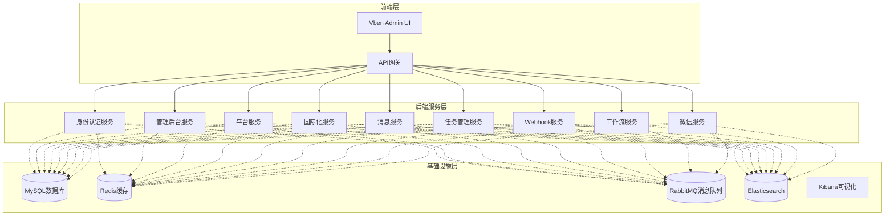
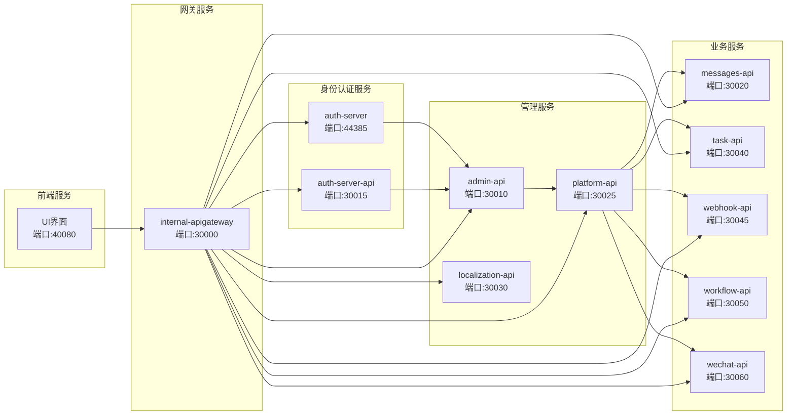
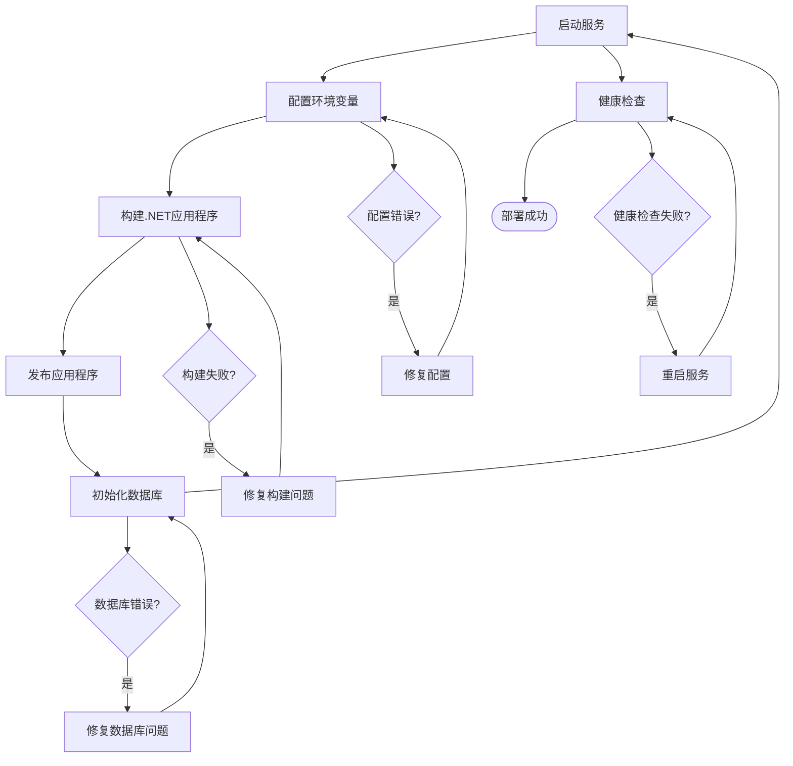
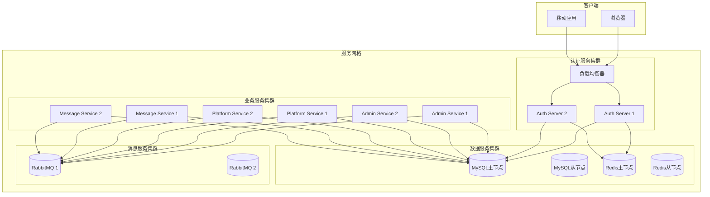
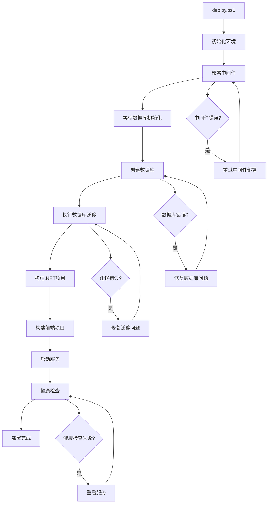
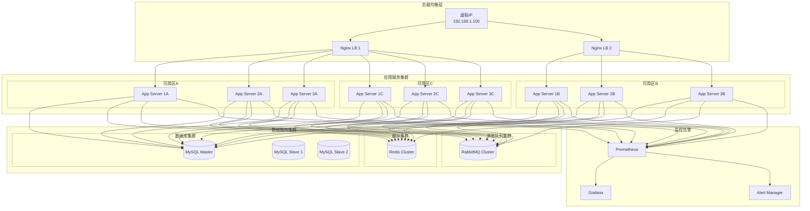
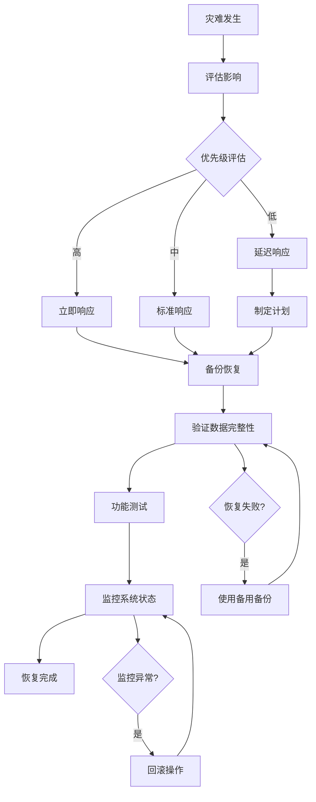

现在我已经收集了足够的信息来创建部署指南文档。让我开始编写详细的部署指南：

<docs>
# 部署指南

<cite>
**本文档中引用的文件**
- [deploy/README.md](file://deploy/README.md)
- [deploy/deploy.ps1](file://deploy/deploy.ps1)
- [docker-compose.yml](file://docker-compose.yml)
- [docker-compose.override.yml](file://docker-compose.override.yml)
- [docker-compose.middleware.yml](file://docker-compose.middleware.yml)
- [docker-compose.override.configuration.yml](file://docker-compose.override.configuration.yml)
- [docker-compose.override.agile.yml](file://docker-compose.override.agile.yml)
- [tye.yaml](file://tye.yaml)
- [starter/readme.md](file://starter/readme.md)
- [apps/react-admin/docker-compose.yaml](file://apps/react-admin/docker-compose.yaml)
</cite>

## 目录
1. [简介](#简介)
2. [项目架构概览](#项目架构概览)
3. [部署方案](#部署方案)
4. [Docker容器化部署](#docker容器化部署)
5. [单体部署](#单体部署)
6. [微服务部署](#微服务部署)
7. [环境配置管理](#环境配置管理)
8. [自动化部署脚本](#自动化部署脚本)
9. [高可用性部署](#高可用性部署)
10. [灾难恢复](#灾难恢复)
11. [监控与日志](#监控与日志)
12. [故障排除](#故障排除)
13. [总结](#总结)

## 简介

本文档提供了ABP Next Admin项目的全面部署指南，涵盖从开发环境到生产环境的各种部署方案。该项目采用微服务架构，基于ABP框架构建，支持多种部署模式，包括Docker容器化部署、单体部署和微服务部署。

项目的主要特点：
- 基于ABP框架的微服务架构
- 支持多种数据库（MySQL、PostgreSQL、SQL Server）
- 完整的前后端分离架构
- 多种身份认证方式（OpenIddict、IdentityServer）
- 完善的中间件支持（Redis、RabbitMQ、Elasticsearch）

## 项目架构概览



**图表来源**
- [docker-compose.yml](file://docker-compose.yml#L1-L244)
- [docker-compose.middleware.yml](file://docker-compose.middleware.yml#L1-L115)

## 部署方案

### 部署模式对比

| 部署模式 | 适用场景 | 复杂度 | 维护成本 | 性能 | 可扩展性 |
|---------|---------|--------|----------|------|----------|
| Docker容器化 | 开发、测试、小型生产环境 | 中等 | 低 | 中等 | 高 |
| 单体部署 | 小型应用、原型开发 | 低 | 中等 | 中等 | 低 |
| 微服务部署 | 大型应用、企业级环境 | 高 | 高 | 高 | 最高 |

### 部署前准备

在开始部署之前，请确保满足以下要求：

1. **系统要求**
   - Windows 10/11 或 Linux/MacOS
   - Docker Desktop (Windows/Mac) 或 Docker Engine (Linux)
   - PowerShell 5.1+ (Windows)
   - Node.js 16+ (前端构建)
   - .NET 6.0+ SDK

2. **网络要求**
   - 端口开放：30000-30060（服务端口）
   - 网络连接：能够访问外部镜像仓库
   - DNS解析：正确配置主机名映射

3. **硬件要求**
   - CPU：至少4核心
   - 内存：8GB以上
   - 存储：50GB以上可用空间

## Docker容器化部署

### 快速开始

#### 方法一：使用预置脚本

```powershell
# 1. 自动配置Docker环境
.\00.auto-config-docker.cmd

# 2. 创建数据库
.\01.create database.cmd

# 3. 迁移数据库
.\02.migrate-db.cmd

# 4. 启动所有服务
.\80.start-host.cmd

# 5. 启动前端UI
.\99.start-ui.cmd
```

#### 方法二：使用Docker Compose

```powershell
# 启动中间件服务
docker-compose -f docker-compose.middleware.yml up -d --build

# 等待30秒让数据库初始化
Start-Sleep -Seconds 30

# 创建数据库
cd aspnet-core
cmd.exe /c create-database.bat

# 执行数据库迁移
cd build
foreach ($solution in $migrationArray) {  
    cd $solution.Path
    dotnet run --no-build
}

# 启动应用服务
docker-compose -f docker-compose.yml -f docker-compose.override.yml -f docker-compose.override.configuration.yml up -d --build
```

### 服务组件详解



**图表来源**
- [docker-compose.yml](file://docker-compose.yml#L1-L244)

### Docker Compose配置详解

#### 核心服务配置

每个服务都包含以下关键配置：

1. **环境变量配置**
   ```yaml
   environment:
     - ASPNETCORE_ENVIRONMENT=Development
     - ASPNETCORE_HTTP_PORTS=80
     - TZ=Asia/Shanghai
   ```

2. **健康检查**
   ```yaml
   healthcheck:
     test: ["CMD-SHELL", "wget --spider http://localhost/healthz || exit"]
     interval: 10s
     timeout: 5s
     retries: 5
   ```

3. **网络配置**
   ```yaml
   networks:
     - abp-next-admin
   ```

4. **主机名映射**
   ```yaml
   extra_hosts:
     - "host.docker.internal:host-gateway"
     - "auth-server:host-gateway"
   ```

**章节来源**
- [docker-compose.yml](file://docker-compose.yml#L1-L244)
- [docker-compose.override.yml](file://docker-compose.override.yml#L1-L135)

## 单体部署

### 单体部署架构

单体部署将所有服务打包成一个单一的应用程序，适合小型项目或开发环境。



### 部署步骤

#### 1. 准备工作

```bash
# 克隆项目
git clone https://github.com/your-repo/abp-next-admin.git
cd abp-next-admin

# 安装依赖
cd apps/vue
pnpm install
```

#### 2. 配置环境

创建 `.env` 文件：

```env
# 数据库连接
DB_CONNECTION_STRING=Server=localhost;Database=AbpNextAdmin;User Id=root;Password=yourpassword

# Redis配置
REDIS_CONNECTION=127.0.0.1:6379

# 身份认证
AUTH_SERVER_URL=http://localhost:44385
CLIENT_ID=vue-admin-client
CLIENT_SECRET=your-secret

# CORS配置
CORS_ORIGINS=http://localhost:3000,http://localhost:3100
```

#### 3. 构建和启动

```bash
# 构建前端
cd apps/vue
pnpm build

# 启动后端
cd ../../aspnet-core
dotnet run --project services/LY.MicroService.BackendAdmin.HttpApi.Host
```

**章节来源**
- [starter/readme.md](file://starter/readme.md#L1-L11)

## 微服务部署

### 微服务架构设计

微服务部署将每个功能模块独立部署，实现高内聚、低耦合的架构。



### Kubernetes部署

#### 1. 创建命名空间

```yaml
apiVersion: v1
kind: Namespace
metadata:
  name: abp-next-admin
  labels:
    name: abp-next-admin
```

#### 2. 部署配置

```yaml
apiVersion: apps/v1
kind: Deployment
metadata:
  name: backend-admin-api
  namespace: abp-next-admin
  labels:
    app: backend-admin-api
spec:
  replicas: 3
  selector:
    matchLabels:
      app: backend-admin-api
  template:
    metadata:
      labels:
        app: backend-admin-api
    spec:
      containers:
      - name: backend-admin-api
        image: abp-next-admin/backend-admin:latest
        ports:
        - containerPort: 8080
        env:
        - name: ASPNETCORE_ENVIRONMENT
          value: Production
        - name: ConnectionStrings__Default
          valueFrom:
            secretKeyRef:
              name: db-secrets
              key: connection-string
        resources:
          requests:
            memory: "512Mi"
            cpu: "500m"
          limits:
            memory: "1Gi"
            cpu: "1000m"
        livenessProbe:
          httpGet:
            path: /healthz
            port: 8080
          initialDelaySeconds: 30
          periodSeconds: 10
        readinessProbe:
          httpGet:
            path: /healthz
            port: 8080
          initialDelaySeconds: 5
          periodSeconds: 5
```

#### 3. 服务暴露

```yaml
apiVersion: v1
kind: Service
metadata:
  name: backend-admin-api
  namespace: abp-next-admin
spec:
  selector:
    app: backend-admin-api
  ports:
  - port: 80
    targetPort: 8080
  type: LoadBalancer
```

#### 4. Ingress配置

```yaml
apiVersion: networking.k8s.io/v1
kind: Ingress
metadata:
  name: abp-next-admin-ingress
  namespace: abp-next-admin
  annotations:
    nginx.ingress.kubernetes.io/rewrite-target: /
    nginx.ingress.kubernetes.io/ssl-redirect: "true"
spec:
  tls:
  - hosts:
    - api.example.com
    secretName: tls-secret
  rules:
  - host: api.example.com
    http:
      paths:
      - path: /
        pathType: Prefix
        backend:
          service:
            name: backend-admin-api
            port:
              number: 80
```

**章节来源**
- [aspnet-core/templates/micro/content/deploy/deployment.yaml](file://aspnet-core/templates/micro/content/deploy/deployment.yaml#L1-L49)

## 环境配置管理

### 开发环境配置

开发环境主要用于本地开发和调试，配置相对简单。

#### 开发环境特点

- **数据库**：使用本地MySQL实例
- **缓存**：使用本地Redis实例
- **消息队列**：使用本地RabbitMQ实例
- **日志**：控制台输出和本地文件
- **监控**：基本健康检查

#### 开发环境配置示例

```yaml
services:
  admin-api:
    environment:
      - ASPNETCORE_ENVIRONMENT=Development
      - ConnectionStrings__Default=Server=localhost;Database=AbpNextAdmin_Dev;User Id=root;Password=devpassword
      - Redis__Configuration=localhost:6379
      - CAP__RabbitMQ__HostName=localhost
      - Elasticsearch__NodeUris=http://localhost:9200
```

### 测试环境配置

测试环境模拟生产环境，但资源有限。

#### 测试环境特点

- **数据库**：独立的测试数据库实例
- **缓存**：独立的Redis实例
- **消息队列**：独立的消息队列实例
- **日志**：集中式日志收集
- **监控**：完整的监控体系

#### 测试环境配置示例

```yaml
services:
  admin-api:
    environment:
      - ASPNETCORE_ENVIRONMENT=Testing
      - ConnectionStrings__Default=Server=test-db;Database=AbpNextAdmin_Test;User Id=testuser;Password=testpass
      - Redis__Configuration=test-redis:6379
      - CAP__RabbitMQ__HostName=test-rabbitmq
      - Elasticsearch__NodeUris=http://test-es:9200
      - Serilog__WriteTo__1__Name=Elasticsearch
      - Serilog__WriteTo__1__Args__nodeUris=http://test-es:9200
```

### 生产环境配置

生产环境需要考虑高可用性、安全性和性能。

#### 生产环境特点

- **数据库**：主从复制、读写分离
- **缓存**：集群模式、持久化
- **消息队列**：集群模式、持久化
- **日志**：分布式日志收集、分析
- **监控**：APM监控、告警系统
- **安全**：SSL/TLS加密、访问控制

#### 生产环境配置示例

```yaml
services:
  admin-api:
    environment:
      - ASPNETCORE_ENVIRONMENT=Production
      - ConnectionStrings__Default=Server=prod-db-cluster;Database=AbpNextAdmin_Prod;User Id=produser;Password=prodpass
      - Redis__Configuration=prod-redis-cluster:6379
      - CAP__RabbitMQ__HostName=prod-rabbitmq-cluster
      - Elasticsearch__NodeUris=https://prod-es-cluster:9200
      - Serilog__WriteTo__1__Name=Elasticsearch
      - Serilog__WriteTo__1__Args__nodeUris=https://prod-es-cluster:9200
      - AuthServer__RequireHttpsMetadata=true
      - App__SelfUrl=https://api.example.com
```

**章节来源**
- [docker-compose.override.configuration.yml](file://docker-compose.override.configuration.yml#L1-L614)

## 自动化部署脚本

### 部署脚本架构



### 脚本功能详解

#### 1. 环境初始化

```powershell
# 设置根目录
$rootFolder = (Get-Item -Path "../" -Verbose).FullName
$deployPath = $rootFolder + "/deploy"
$buildPath = $rootFolder + "/build"
$aspnetcorePath = $rootFolder + "/aspnet-core"
$vuePath = $rootFolder + "/apps/vue"
```

#### 2. 中间件部署

```powershell
# 部署中间件服务
Write-host "deploy middleware..."
Set-Location $rootFolder
docker-compose -f .\docker-compose.middleware.yml up -d --build
```

#### 3. 数据库初始化

```powershell
# 等待30秒，数据库初始化完成
Write-host "initial database..."
Start-Sleep -Seconds 30

# 创建数据库
Write-host "create database..."
Set-Location $aspnetcorePath
cmd.exe /c create-database.bat
```

#### 4. 应用程序构建

```powershell
# 发布.NET项目
Write-host "release .net project..."
Set-Location $buildPath
foreach ($solution in $serviceArray) {  
    $publishPath = $rootFolder + "/aspnet-core/services/Publish/" + $solution.Service + "/"
    dotnet publish -c Release -o $publishPath $solution.Path --no-cache
    $dockerFile = Join-Path $solution.Path "Dockerfile"
    if ((Test-Path $dockerFile)) {
        Copy-Item $dockerFile -Destination $publishPath
    }
}

# 构建前端项目
Write-host "build front project..."
Set-Location $vuePath
pnpm install
pnpm build
```

#### 5. 服务启动

```powershell
# 运行应用程序
Write-host "running application..."
Set-Location $rootFolder
docker-compose -f .\docker-compose.yml -f .\docker-compose.override.yml -f .\docker-compose.override.configuration.yml up -d --build
```

**章节来源**
- [deploy/deploy.ps1](file://deploy/deploy.ps1#L1-L60)

### 自定义部署选项

#### 1. 指定部署环境

```powershell
# 开发环境部署
.\deploy.ps1 -Environment Development

# 测试环境部署
.\deploy.ps1 -Environment Testing

# 生产环境部署
.\deploy.ps1 -Environment Production
```

#### 2. 选择部署服务

```powershell
# 只部署核心服务
.\deploy.ps1 -Services "admin,platform,auth"

# 排除某些服务
.\deploy.ps1 -ExcludeServices "wechat,workflow"
```

#### 3. 自定义配置

```powershell
# 使用自定义配置文件
.\deploy.ps1 -ConfigPath "./custom-config.yml"

# 指定镜像仓库
.\deploy.ps1 -Registry "myregistry.com"
```

## 高可用性部署

### 集群架构设计



### 高可用配置

#### 1. 负载均衡配置

```nginx
upstream backend_admin {
    least_conn;
    server 192.168.1.10:30010 max_fails=3 fail_timeout=30s;
    server 192.168.1.11:30010 max_fails=3 fail_timeout=30s;
    server 192.168.1.12:30010 max_fails=3 fail_timeout=30s;
}

server {
    listen 80;
    server_name api.example.com;
    
    location / {
        proxy_pass http://backend_admin;
        proxy_set_header Host $host;
        proxy_set_header X-Real-IP $remote_addr;
        proxy_set_header X-Forwarded-For $proxy_add_x_forwarded_for;
        proxy_set_header X-Forwarded-Proto $scheme;
        
        # 健康检查
        proxy_connect_timeout 5s;
        proxy_send_timeout 60s;
        proxy_read_timeout 60s;
        
        # 错误处理
        error_page 500 502 503 504 @error;
    }
    
    location @error {
        return 502;
    }
}
```

#### 2. 数据库高可用

```yaml
# MySQL主从复制配置
master:
  image: mysql:8.0
  environment:
    - MYSQL_ROOT_PASSWORD=master_password
    - MYSQL_REPLICATION_MODE=master
    - MYSQL_REPLICATION_USER=repl_user
    - MYSQL_REPLICATION_PASSWORD=repl_password
  volumes:
    - mysql_master_data:/var/lib/mysql

slave1:
  image: mysql:8.0
  environment:
    - MYSQL_ROOT_PASSWORD=slave_password
    - MYSQL_REPLICATION_MODE=slave
    - MYSQL_MASTER_HOST=master
    - MYSQL_REPLICATION_USER=repl_user
    - MYSQL_REPLICATION_PASSWORD=repl_password
  depends_on:
    - master
  volumes:
    - mysql_slave_data:/var/lib/mysql
```

#### 3. 缓存高可用

```yaml
# Redis哨兵配置
redis-sentinel:
  image: redis:6-alpine
  command: >
    sh -c "
      echo 'sentinel monitor mymaster redis-master 6379 2' > /etc/redis/sentinel.conf &&
      echo 'sentinel down-after-milliseconds mymaster 5000' >> /etc/redis/sentinel.conf &&
      echo 'sentinel failover-timeout mymaster 10000' >> /etc/redis/sentinel.conf &&
      echo 'sentinel parallel-syncs mymaster 1' >> /etc/redis/sentinel.conf &&
      redis-sentinel /etc/redis/sentinel.conf
    "
  depends_on:
    - redis-master
  volumes:
    - redis_sentinel_data:/var/lib/redis
```

#### 4. 消息队列高可用

```yaml
# RabbitMQ集群配置
rabbitmq-cluster:
  image: rabbitmq:3.9-management
  environment:
    - RABBITMQ_CLUSTER_NODES=rabbit@rabbitmq1,rabbit@rabbitmq2,rabbit@rabbitmq3
    - RABBITMQ_ERLANG_COOKIE=cluster_cookie
  volumes:
    - rabbitmq_data:/var/lib/rabbitmq
  ports:
    - "15672:15672"
```

## 灾难恢复

### 灾难恢复策略



### 备份策略

#### 1. 数据库备份

```bash
#!/bin/bash
# 数据库备份脚本

BACKUP_DIR="/backup/db"
DATE=$(date +%Y%m%d_%H%M%S)
DB_NAME="abp_next_admin"

# 创建备份目录
mkdir -p $BACKUP_DIR

# 执行备份
mysqldump -h localhost -u root -p$MYSQL_ROOT_PASSWORD \
  --single-transaction \
  --routines \
  --triggers \
  --events \
  $DB_NAME > $BACKUP_DIR/$DB_NAME-$DATE.sql

# 压缩备份文件
gzip $BACKUP_DIR/$DB_NAME-$DATE.sql

# 清理旧备份（保留7天）
find $BACKUP_DIR -name "*.sql.gz" -mtime +7 -delete

echo "Database backup completed: $DATE"
```

#### 2. 文件备份

```bash
#!/bin/bash
# 文件备份脚本

SOURCE_DIR="/opt/abp-next-admin"
BACKUP_DIR="/backup/files"
DATE=$(date +%Y%m%d_%H%M%S)

# 创建备份目录
mkdir -p $BACKUP_DIR

# 备份配置文件和日志
tar -czf $BACKUP_DIR/config-$DATE.tar.gz \
  $SOURCE_DIR/config \
  $SOURCE_DIR/logs

# 清理旧备份
find $BACKUP_DIR -name "*.tar.gz" -mtime +30 -delete

echo "File backup completed: $DATE"
```

#### 3. 容器镜像备份

```bash
#!/bin/bash
# 容器镜像备份脚本

IMAGE_NAME="abp-next-admin"
TAG="latest"
BACKUP_DIR="/backup/images"
DATE=$(date +%Y%m%d_%H%M%S)

# 导出镜像
docker save $IMAGE_NAME:$TAG | gzip > $BACKUP_DIR/$IMAGE_NAME-$DATE.tar.gz

# 验证导出的镜像
docker load < $BACKUP_DIR/$IMAGE_NAME-$DATE.tar.gz

echo "Image backup completed: $DATE"
```

### 恢复流程

#### 1. 数据库恢复

```bash
#!/bin/bash
# 数据库恢复脚本

BACKUP_FILE=$1
DB_NAME="abp_next_admin"

if [ -z "$BACKUP_FILE" ]; then
    echo "Usage: $0 <backup_file>"
    exit 1
fi

# 解压备份文件
gunzip -c $BACKUP_FILE | mysql -u root -p$MYSQL_ROOT_PASSWORD $DB_NAME

echo "Database restored from: $BACKUP_FILE"
```

#### 2. 应用服务恢复

```bash
#!/bin/bash
# 应用服务恢复脚本

SERVICE_NAME=$1
BACKUP_IMAGE=$2

if [ -z "$SERVICE_NAME" ] || [ -z "$BACKUP_IMAGE" ]; then
    echo "Usage: $0 <service_name> <backup_image>"
    exit 1
fi

# 停止当前服务
docker-compose stop $SERVICE_NAME

# 删除现有容器
docker-compose rm -f $SERVICE_NAME

# 启动备份镜像
docker-compose up -d $SERVICE_NAME

echo "$SERVICE_NAME restored from: $BACKUP_IMAGE"
```

#### 3. 完整系统恢复

```bash
#!/bin/bash
# 完整系统恢复脚本

BACKUP_DATE=$1
RESTORE_DIR="/restore"

if [ -z "$BACKUP_DATE" ]; then
    echo "Usage: $0 <backup_date>"
    exit 1
fi

# 停止所有服务
docker-compose down

# 恢复数据库
./restore_db.sh $RESTORE_DIR/db/abp_next_admin-$BACKUP_DATE.sql.gz

# 恢复配置文件
tar -xzf $RESTORE_DIR/files/config-$BACKUP_DATE.tar.gz -C /

# 恢复应用服务
./restore_service.sh admin-api $RESTORE_DIR/images/admin-api-$BACKUP_DATE.tar.gz
./restore_service