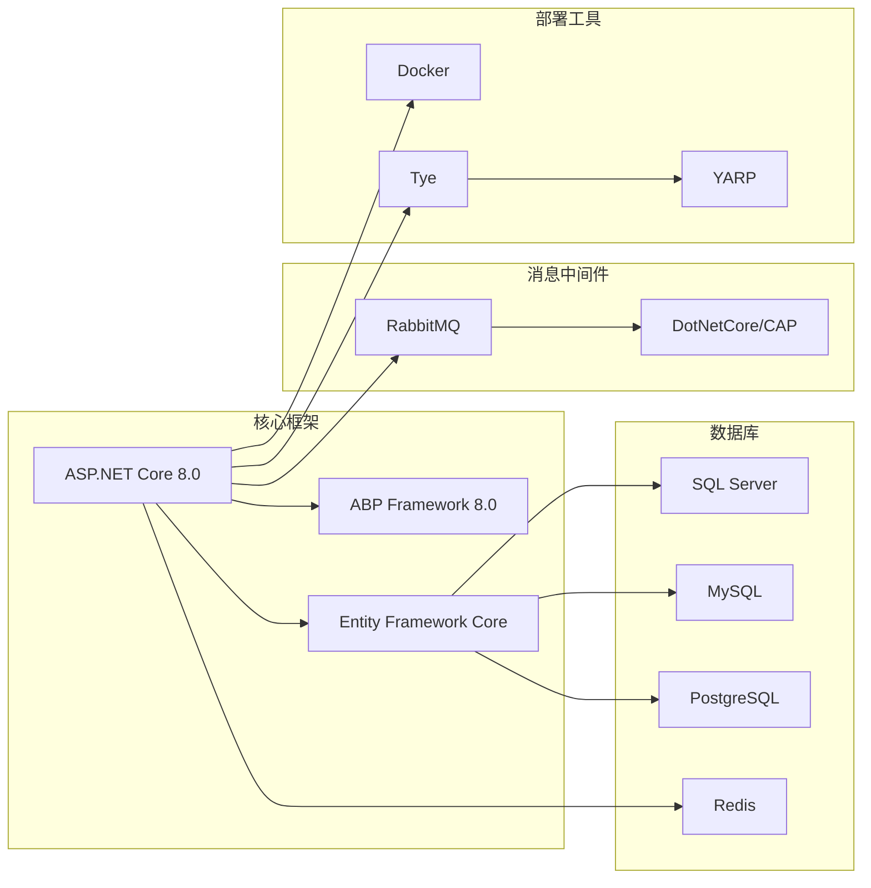

# abp-next-admin 项目概述

<cite>
**本文档中引用的文件**
- [README.md](file://README.md)
- [RELEASE.md](file://RELEASE.md)
- [Program.cs](file://aspnet-core/services/LY.MicroService.BackendAdmin.HttpApi.Host/Program.cs)
- [appsettings.json](file://aspnet-core/services/LY.MicroService.BackendAdmin.HttpApi.Host/appsettings.json)
- [package.json](file://apps/vben5/apps/web-antd/package.json)
- [vite.config.ts](file://apps/vue/vite.config.ts)
- [Startup.cs](file://aspnet-core/tests/LINGYUN.Abp.AspNetCore.Tests/LINGYUN/Abp/AspNetCore/Startup.cs)
- [BackendAdminHttpApiHostModule.Configure.cs](file://aspnet-core/services/LY.MicroService.BackendAdmin.HttpApi.Host/BackendAdminHttpApiHostModule.Configure.cs)
</cite>

## 目录
1. [项目简介](#项目简介)
2. [项目定位与目标](#项目定位与目标)
3. [核心技术架构](#核心技术架构)
4. [双架构支持](#双架构支持)
5. [核心功能模块](#核心功能模块)
6. [技术栈概览](#技术栈概览)
7. [项目发展历程](#项目发展历程)
8. [部署方案](#部署方案)
9. [项目优势](#项目优势)
10. [总结](#总结)

## 项目简介

abp-next-admin 是一个基于 ABP 框架的企业级全栈后台管理系统解决方案，它巧妙地结合了 ASP.NET Core 微服务架构与 Vue.js 前端框架，为现代企业应用开发提供了完整的开箱即用解决方案。

该项目不仅仅是一个简单的后台管理系统，而是一个经过精心设计的企业级应用平台，旨在帮助开发团队快速构建高质量、可扩展、可维护的现代化企业应用。

## 项目定位与目标

### 核心定位

abp-next-admin 定位于**企业级全栈应用解决方案提供商**，致力于为企业用户提供：

- **完整的企业级后台管理功能**
- **现代化的微服务架构支持**
- **开箱即用的开发体验**
- **高度可定制化的业务扩展能力**

### 设计目标

1. **企业级标准**：遵循企业级应用开发的最佳实践
2. **技术先进性**：采用最新的技术栈和架构模式
3. **开发效率**：提供高效的开发工具和流程
4. **可扩展性**：支持从小型项目到大型企业的各种规模需求
5. **维护友好**：确保代码质量和长期可维护性

## 核心技术架构

### 整体架构设计


**图表来源**
- [Program.cs](file://aspnet-core/services/LY.MicroService.BackendAdmin.HttpApi.Host/Program.cs#L1-L74)
- [vite.config.ts](file://apps/vue/vite.config.ts#L1-L135)

### 后端架构特点

1. **模块化设计**：基于 ABP 框架的模块化架构
2. **微服务支持**：原生支持微服务部署模式
3. **多数据库支持**：兼容 SQL Server、MySQL、PostgreSQL
4. **分布式缓存**：集成 Redis 分布式缓存
5. **消息队列**：支持 RabbitMQ 分布式事件通信

**章节来源**
- [Program.cs](file://aspnet-core/services/LY.MicroService.BackendAdmin.HttpApi.Host/Program.cs#L20-L50)
- [BackendAdminHttpApiHostModule.Configure.cs](file://aspnet-core/services/LY.MicroService.BackendAdmin.HttpApi.Host/BackendAdminHttpApiHostModule.Configure.cs#L119-L151)

## 双架构支持

### 单体服务架构

单体服务架构适合中小型项目或初期开发阶段，具有以下特点：

- **部署简单**：单一应用程序包，易于部署和维护
- **开发效率高**：无需处理微服务间的复杂交互
- **运维成本低**：减少基础设施复杂度
- **适合场景**：初创项目、小型企业、原型验证

### 微服务架构

微服务架构适合大型企业项目，提供更高的可扩展性和灵活性：

- **服务独立**：每个服务独立开发、部署和扩展
- **技术多样性**：不同服务可以采用不同的技术栈
- **高可用性**：单个服务故障不影响整体系统
- **适合场景**：大型企业、高并发场景、复杂业务逻辑


## 核心功能模块

### 后端核心模块

基于 ABP 框架的丰富模块生态，abp-next-admin 提供了以下核心功能模块：

1. **身份认证与授权**
   - OAuth2/OpenID Connect 支持
   - JWT Token 认证
   - 基于角色的访问控制
   - 组织机构权限管理

2. **多租户支持**
   - 租户隔离机制
   - 租户域名解析
   - 租户数据隔离

3. **审计与日志**
   - 实体变更跟踪
   - 操作审计日志
   - 系统异常监控

4. **任务管理**
   - 分布式任务调度
   - 后台作业处理
   - 任务状态监控

5. **通知与消息**
   - 实时消息推送
   - 邮件通知
   - 短信通知
   - 微信公众号集成

### 前端核心功能

基于 vue-vben-admin 框架，提供现代化的前端体验：

1. **响应式设计**
   - 自适应多设备屏幕
   - 移动端友好界面
   - 暗黑主题支持

2. **权限管理**
   - 菜单权限控制
   - 按钮级权限
   - 动态路由生成

3. **国际化支持**
   - 多语言切换
   - 动态语言加载
   - 本地化资源管理

4. **数据可视化**
   - 图表组件库
   - 数据看板
   - 实时数据展示

**章节来源**
- [appsettings.json](file://aspnet-core/services/LY.MicroService.BackendAdmin.HttpApi.Host/appsettings.json#L1-L92)

## 技术栈概览

### 前端技术栈


**图表来源**
- [package.json](file://apps/vben5/apps/web-antd/package.json#L1-L51)
- [vite.config.ts](file://apps/vue/vite.config.ts#L1-L135)

### 后端技术栈



**图表来源**
- [Program.cs](file://aspnet-core/services/LY.MicroService.BackendAdmin.HttpApi.Host/Program.cs#L1-L74)

**章节来源**
- [package.json](file://apps/vben5/apps/web-antd/package.json#L25-L45)
- [vite.config.ts](file://apps/vue/vite.config.ts#L25-L50)

## 项目发展历程

### 版本演进历程

根据 RELEASE.md 文件记录，项目经历了以下重要版本迭代：

#### 2021年12月重大更新
- **升级 ABP Framework 5.0.0 RC-2**
- **模块化重构**：移除 vueJs 模块，整合 vue-vben-admin
- **功能增强**：工作流增加 Elasticsearch 持久层扩展
- **Bug 修复**：修复 SignalR 序列化协议不一致问题

#### 2021年12月里程碑版本
- **架构升级**：从 RC-1 升级到 RC-2
- **模块精简**：移除 Identity 模块 API ChangePassword
- **技术更新**：移除分布式锁模块，使用 Volo.Abp.DistributedLocking
- **性能优化**：加入 Fody 统一配置 ConfigureAwait

#### 2021年3月功能增强
- **本地化管理**：增加动态本地化组件支持
- **配置管理**：增加 dotnet-compose 配置文件
- **用户体验**：vueJs 增加本地化管理组件视图
- **稳定性提升**：修复 HttpProxy 模块参数传递问题

### 发展趋势

1. **技术栈现代化**：持续跟进最新技术发展
2. **模块化程度加深**：逐步拆分和优化模块结构
3. **企业级功能完善**：不断增加企业级应用场景支持
4. **开发体验优化**：不断提升开发者的使用体验

**章节来源**
- [RELEASE.md](file://RELEASE.md#L1-L56)

## 部署方案

### 单体服务部署

单体服务部署是最简单直接的部署方式，适合以下场景：

#### 部署步骤

1. **环境准备**
   ```bash
   # 安装 .NET SDK
   # 安装 Node.js 和 npm/yarn
   
   # 安装 ABP CLI 工具
   dotnet tool install --global LINGYUN.Abp.Cli
   ```

2. **项目初始化**
   ```bash
   # 创建项目
   labp create MyCompanyName.MyProjectName \
     -pk MyPackageName \
     -o "D:\Project" \
     --dbms sqlserver \
     --cs "Server=127.0.0.1;Database=MyProject;User Id=sa;Password=123456" \
     --no-random-port
   ```

3. **数据库迁移**
   ```bash
   cd D:\Project\host\MyPackageName.MyCompanyName.MyProjectName.HttpApi.Host
   dotnet ef database update
   ```

4. **启动服务**
   ```bash
   dotnet run
   ```

### 微服务部署

微服务部署提供了更高的可扩展性和灵活性：

#### 部署架构


#### 部署流程

1. **基础环境配置**
   ```bash
   # 修改 hosts 文件
   echo "127.0.0.1 host.docker.internal" >> /etc/hosts
   
   # 安装 Docker 和 Docker Compose
   ```

2. **启动依赖服务**
   ```bash
   # 启动 RabbitMQ
   docker run -d --name rabbitmq \
     -p 5672:5672 -p 15672:15672 \
     rabbitmq:3-management
   
   # 启动 Redis
   docker run -d --name redis \
     -p 6379:6379 redis
   ```

3. **启动各个微服务**
   ```bash
   # 启动认证服务
   cd aspnet-core/services/LY.MicroService.AuthServer.HttpApi.Host
   dotnet run
   
   # 启动管理服务
   cd aspnet-core/services/LY.MicroService.BackendAdmin.HttpApi.Host
   dotnet run
   
   # 启动平台服务
   cd aspnet-core/services/LY.MicroService.PlatformManagement.HttpApi.Host
   dotnet run
   ```

4. **启动前端应用**
   ```bash
   cd apps/vue
   yarn install
   yarn dev
   ```

### 容器化部署

对于生产环境，建议使用 Docker 容器化部署：

#### 部署步骤

1. **构建后端服务**
   ```bash
   # 构建 ASP.NET Core 服务
   ./build/build-aspnetcore-release.ps1
   ```

2. **构建前端应用**
   ```bash
   # 构建 Vue 前端
   ./build/build-vue-apps.ps1
   ```

3. **启动容器编排**
   ```bash
   sudo docker-compose down
   sudo docker-compose -f docker-compose.yml -f docker-compose.override.yml up --build -d
   ```

**章节来源**
- [README.md](file://README.md#L20-L100)

## 项目优势

### 技术优势

1. **架构先进性**
   - 基于 ABP Framework 8.0 最新技术栈
   - 支持单体和微服务两种架构模式
   - 完整的企业级应用架构设计

2. **开发效率**
   - 开箱即用的功能模块
   - 完善的代码生成工具
   - 丰富的示例和文档

3. **可扩展性**
   - 模块化设计，易于扩展
   - 插件化架构支持
   - 多种数据库和缓存支持

4. **维护友好**
   - 清晰的代码结构
   - 完善的错误处理机制
   - 详细的日志记录

### 商业价值

1. **降低开发成本**
   - 减少重复造轮子的工作
   - 提供成熟的企业级功能
   - 缩短项目开发周期

2. **提高产品质量**
   - 遵循最佳实践
   - 内置安全机制
   - 完善的测试覆盖

3. **支持业务发展**
   - 从小项目到大企业的平滑过渡
   - 支持业务快速增长
   - 适应技术演进需求

### 社区支持

1. **活跃的开源社区**
   - 定期更新和维护
   - 及时的技术支持
   - 丰富的学习资源

2. **完善的文档体系**
   - 中英文双语文档
   - 详细的 API 文档
   - 实用的教程和示例

3. **广泛的适用性**
   - 适用于各种规模的企业
   - 支持多种业务场景
   - 良好的国际化支持

## 总结

abp-next-admin 作为一个基于 ABP 框架的企业级全栈后台管理系统解决方案，成功地将 ASP.NET Core 的强大功能与 Vue.js 的现代化前端体验相结合。它不仅提供了完整的企业级后台管理功能，更重要的是为企业应用开发提供了一套完整的架构解决方案。

### 核心价值体现

1. **技术前瞻性**：采用最新的技术栈和架构模式，确保项目的长期价值
2. **实用性导向**：提供开箱即用的功能模块，大大缩短开发周期
3. **灵活性设计**：支持单体和微服务两种架构，适应不同规模的项目需求
4. **企业级标准**：遵循企业级应用开发的最佳实践，确保系统的稳定性和可维护性

### 适用场景

- **初创企业**：快速搭建基础管理系统
- **中小企业**：满足日常运营管理需求
- **大型企业**：支持复杂的业务场景和高并发需求
- **技术团队**：提供标准化的开发框架和最佳实践

### 发展前景

随着企业数字化转型的深入，对高效、可靠、可扩展的后台管理系统的需求将持续增长。abp-next-admin 作为这一领域的优秀解决方案，将继续在技术创新、功能完善、社区建设等方面不断进步，为更多企业提供优质的企业级应用开发服务。

无论是初学者还是经验丰富的开发者，abp-next-admin 都能提供有价值的参考和实用的解决方案，是现代企业应用开发的理想选择。